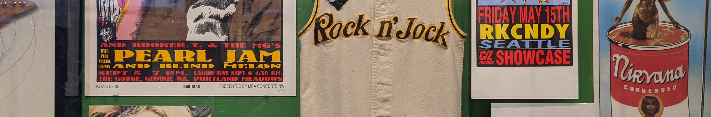
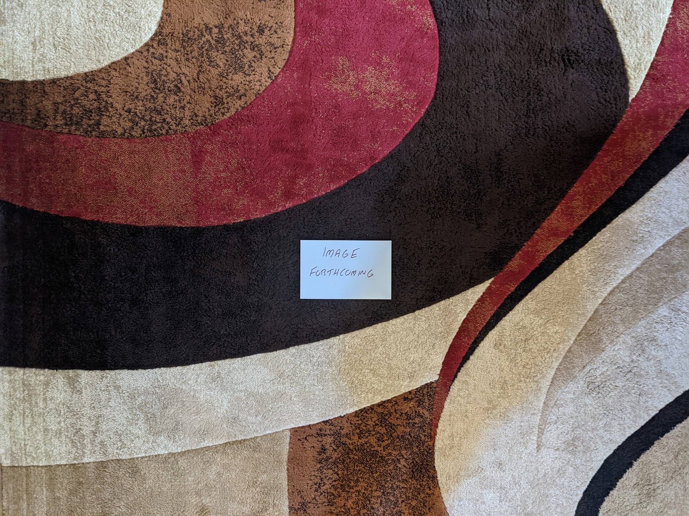
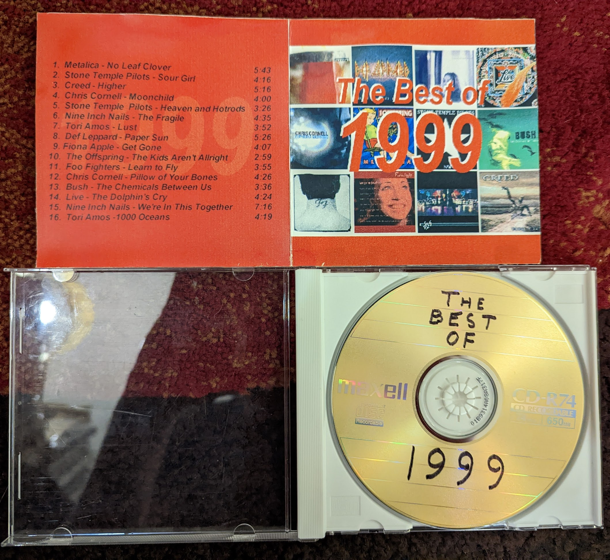
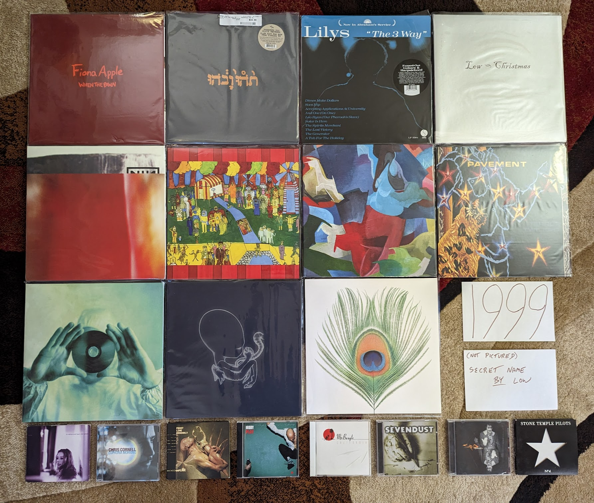

1990s
=====

1990s Overview
--------------
TBD

1990s Stats/Favorites
---------------------
*Section started*: 2 January 2023

*Section complete*: TBD

*Latest update*: 2 January 2023

*Total Albums*: TBD

*Top Artists*:

TBD

*Favorite album*:

TBD

*Favorite Song*:

TBD

1997
----

I have mentioned this several times, but it is important to know that I worked
on this project starting in 2020 and moving backwards in time. As a result,
milestones were observed in reverse. When I look at the records below, I can see
the influence of three very big factors for the very first time. First, this was
the year that I would have my first jobs that would bring in money that I could
use to purchase albums of my own choosing. Second, I got my drivers license
which allowed me to transport myself to the mall or Best Buy/Circuit City where
I could personally select the music I was interested in. This means for the
first time there are quite a few records on the list that were something that I
purchased with my own money in the year of release.

The third big event was something the whole world was going through at the same
time, the Internet. We didn't yet have MP3s for music discovery, but static
webpages of dial-up and Web 1.0 were a wealth of information about the latest
activity and releases from my favorite artists. We had recently subscribed to
AOL at home, and it opened my eyes to a range of information about pop music and
a variety of other topics. 

1998
----

This was the year that I graduated from high school and started college. I feel
like this is a time in life when I was supposed to be paying very close
attention to pop music, but I just wasn't. My interests were more about classic
rock and the alternative acts of the recent past. That said a few of these
records were something I was into at the time, but the large majority were
discovered in the last two decades of my life. In retrospect it was a
diverse and memorable year for music. The late 90s were a crazy anything goes
time for music and the below list is very much in that spirit. 

.. raw:: html

  <iframe style="border-radius:12px" 
  src="https://open.spotify.com/embed/playlist/39l6zc5XJAv4JkewueKMpG?utm_source=generator&theme=0" 
  width="100%" height="352" frameBorder="0" allowfullscreen="" allow="autoplay;
  clipboard-write; 
  encrypted-media; fullscreen; picture-in-picture" loading="lazy"></iframe>

- *Moon Safari* by **Air** - Some bands go on for years, and always seem like
  they are trying to live up to a massive debut record. This is one of those
  cases. It's not that they haven't made some amazing records in the meantime,
  but this one is so original and definitive it almost feels unfair to hold them
  to this standard again. Such a dreamy and chill mood, there have been many
  imitators of this kind of down-tempo psychedelic, electronica, but none match
  this effort. A nice mix of instrumentals and vocal "pop songs", I've listened
  to this hundreds of times and am not the least bit sick of it. [*Memory*: As
  much as I like this now, I was very resistant to it at the time. My co-worker
  was listening to it non-stop in the months after its release, but I really
  didn't connect with it for some reason. It was when I heard it played before a
  **Creed** concert (of all places!) a year or so later I realized that I
  actually love it. That remains true today.]

- *From the Choirgirl Hotel* by **Tori Amos** - The creative peak of her early
  period, this is a fantastic record. I still prefer the rawness of **Pele**
  ever so slightly, but this is definitely my second favorite of her albums.
  This managed to both turn up the rock band elements, while adding in strong
  elements of electronic music. The top rate vocals and piano are are still
  there of course along with some of the last songwriting in the original **Tori
  Amos** style that we would hear for quite some time. The one two sequence of
  "Jackie's Strength" and "Iieee" is one of my favorite in music history.
  [*Memory*: I was already interested in this album pre-release due to her
  contributions to the excellent **Great Expectations: Soundtrack**. I was out
  washing my car on a beautiful early summer day and heard "Spark" on WMMR. That
  was my entry point to one of my lifelong favorite artists.]

- *The Three EPs* by **The Beta Band** - So much more than "Dry The Rain" (as
  heard in Hollywood's version of "High Fidelity"). Admittedly the selection of
  this band, record, and that specific song was perfect for the scene, as this
  is exactly the kind of thing you would hear play in a late 90s independent
  record store. Really interesting long-form, high rhythmic folk-inspired indie
  rock songs. They didn't last long as a band, but they left some great records
  behind, and this is the best of them all. [*Memory*: Like 99% of the world, I
  did find out about this from the movie "High Fidelity". I didn't track down a
  copy of the record until a year or two later. This was one of the last
  (perhaps the very last) record to become part of the "original 400" CDs in my
  collection.]

- *Music Has the Right to Children* by **Boards of Canada** - Electronic music
  that manages to separate itself by its originality and uncompromising quality.
  A mysterious band, these guys have released music sparingly over their career.
  While there have been other high-points, this is still the definitive
  statement. Much of the best from this record manages to sound like music from
  a highly damaged children's TV show (see "Roygbiv" and "Aquarius"). [*Memory*:
  One of those records I can thank the early RateYourMusic for. I had actually
  downloaded several of the tracks several years before I actually had the funds
  to track down a copy of this somewhat expensive (at the time) release.]

- *Gran Turismo* by **The Cardigans** - This dark and moody record was quite a
  shock after the sugary pop of their first two records, and the big hits that
  came with them. Still fantastic pop music, but this time with a more
  introspective and atmospheric electronic backdrop. Lead vocalist Nina
  Peerson's sweet, somewhat slight voice is the perfect counterpoint for the all
  the fuzzy darkness. A lost classic of sorts. [*Memory*: Of all the albums that
  came out that year, this is the one I most associate with my freshman year in
  college. Mostly because of "My Favorite Game" serving as the intro song for
  the PlayStation classic game Gran Tursimo II. I played a lot of PS1 my
  freshman year in college.]

- *Before These Crowded Streets* by **The Dave Matthews Band** - I feel
  validated that there seems to be a growing consensus that this was their best
  work. Certainly the most complex and jazz inspired record, it holds my
  interest in a way the other records that came before and after does not.
  "Crush" is by far the finest track they have produced. [*Memory*: I was very
  resistant of these guys. They always seemed like a cliche of college aged guys
  in the late 90s, a demographic that I had recently joined. This was the album
  that grabbed me, but I would never connect with them again.]

- *And you Think You Know What Life's About* by **Dishwalla** - A few of the
  post-grunge bands were doing something different, and these guys certainly
  were. Inspired by shoegaze and the Britpop sounds of the day, this is an
  interesting second record from a unique American band. "Once In A While" was a
  minor alt rock radio hit at the time, but this album is much more interesting
  in whole. [*Memory*: I really liked this record when it came out, and it
  probably is because I was connecting with the sounds they were borrowing from
  other, more British acts I would discover later.]

- *Fin De Siecle* by **The Divine Comedy** - It can be really difficult to pick
  a best album from an artist that is this consistently great. It has a little
  bit of everything, the jokey fun tracks, the serious slice of life stories,
  presented both as little pop songs, and chamber epics. It even has his biggest
  UK hit in "National Express" which is a terrific little track. There isn't
  really a weak point here either. Top class. [*Memory*: I discoverd and
  absorbed all of his records in two relatively short periods of time. This one
  was something that I spent a lot of time with towards the end of my first
  window of obsession. Why I stopped with this terrific record I am not sure.]

- *Electro-Shock Blues* by **Eels** - A very sad record that manages to not be
  terribly depressing. I think it is because it is a story of managing how one
  deals with bad things happening and the path to a brighter place. Still his
  finest work. [*Memory*: I had been looking for a vinyl copy of this for years,
  when I finally found one that I could import from Germany at a good price in
  early 2023.]

- *Is This Desire?* by **PJ Harvey** - A transitionary work and a great one.
  This was the pivot in her catalog from the aggression of the early records to
  a more subtle and diverse approach that continues to this day. We still have
  some of the growling early Polly Jean here, but the gentler more mature voice
  becomes the dominant sound as things progress. [*Memory*: I didn't really get
  into her music until the more folk inspired records of the 2000s, but when I
  took a look at the back catalog, this was my clear favorite from the more pure
  rock era of her career.]

- *Hooray For Tuesday* by **The Minders** - A pure pop classic from the E6
  folks. As much a triumph of Robert Schneider's production as the musicians
  writing and playing the music. It always feels like **Dr. Dog** and a bunch of
  other pop-revivalists are continuously trying to make a version of this record
  and falling short. "Comfortably Tucked Up Inside" is  remarkable song.
  [*Memory*: This is an album that was always on the best of E6 lists that I was
  consulting around 2006-07, but was much more difficult to source. There was
  eventually a CD reissue that allowed me to experience this gem.]

- *Big Calm* by **Morcheeba** - In its final form, trip-hop started to take on
  qualities similar to vocal jazz. This is the definitive record of the form.
  That lounge scene on the cover definitely captures the general mood here.
  [*Memory*: Other record that I burned from my friend at my job at the time. I
  found a lot of favorites that way evidently.]

- *In the Aeroplane Over the Sea* by **Neutral Milk Hotel** - I find both the
  ridiculously high praise this album got the the early 2000s, and the backlash
  it is experiencing in the early 2020s to both be a bit absurd. This is a
  humble little lowfi psych pop record, no more, no less. Admittedly it is a
  very good one, but the extremely high and low opinions expressed in thought
  pieces published over the last 20 years, make me thing that I am missing
  something or everyone else is. [*Memory*: I didn't really connect with this
  one until I listened to it on a run around a cinder track at my Junior High
  School on a trip back to my hometown around 2010.]

- *Aquemeni* by **Outkast** - Their last album that is still a clear product of
  the rap sounds of that time. After this they would completely go off the map.
  That said, this is one of the best records in late 90s rap, and the entire
  genre's history. If it wasn't for some nonsense filler interludes, this might
  be perfection. [*Memory*: It is hard to listen to this record and not think
  about driving to and from State College, PA. I listened to this on my portable
  CD player on many of those trips.]

- *Yield* by **Pearl Jam** - This was where they were starting to become better
  at ballads like "Wishlist" and gentle rockers like "Given to Fly" than the
  uptempo rockers of their youth. Though this record does contain "Push Me, Pull
  Me" which is one of the more underrated rock songs in their catalog.
  [*Memory*: My co-worker bought this album and played it repeatedly after it
  came out. Over time it completely reversed my opinion of their late 90s output
  and would trigger my era of peak interest in the band.]

- *XO* by **Elliot Smith** - A master of smartly written pop gems, on this
  record, he finally had the production values to really put everything
  together. One of those records that I always forget how amazing it is until I
  put it on. [*Memory*: This was one of the first records that I remember
  listening to on my brand new iPod Nano in 2005.]

- *Trading with the Enemy* by **Tuatara** - Somewhat of an indie super-group who
  specialized in world music influence jazz fusion. The kind of thing that could
  only happen in the 90s. They produced exactly this one great record, with the
  rest of their catalog sorely lacking. [*Memory*: Yet another find from the
  CD-R exchange at work. This was how I found music after commercial radio and
  before the rise of the MP3.]

1999
----

I guess if this project had a very beginning it would be this year. Sometime in
early 2000 I would assemble a mix CD of what I considered to be the best songs
of the prior year. I had recently bought my first CD burner, and one application
I was very excited about was the ability to create compilations that I could
listen to on the Sony Discman that was hooked into a casette adapter in my car.
It was a highly manual process that required me to insert and remove twelve
different albums as each track was added to the CD-R. So what was on
this disc, and how does it hold up 23 years later?

It could be way worse! Nine of the sixteen tracks come off of five albums that
are still among my favorites from the year. A further four songs make the list
of my favorite tracks off of records that are not on my album list. That means
that only three tracks have dropped off my radar completely, and they are a
study in how my taste has changed over time.

- "No Leaf Clover" by **Metallica** - I don't know that any other band has aged
  less gracefully than these guys. What used to seem so edgy and hard, now comes
  across as tacky and commercial. At the time I liked this track enough for it
  to kick off the whole comp, but today it feels dated and boring.

- "Higher" by **Creed** - This isn't awful by any means, and it probably still
  ranks as one of their best songs. In general I have no taste for the post
  grunge sound anymore. There are a few selections on the list below that are
  adjacent to this kind of thing, but I just can't take all those distorted
  droning guitars anymore.

- "The Chemicals Between Us" by **Bush** - Listening to this song again, it is a
  bit more interesting than I remember. The structure is fairly ambitious for a
  late 90s alt rock song, and it seems to be alluding to break beats in its
  rhythms. That said, this band suffers from a bad case of crappy 90s guy
  vocalist.

I didn't even own all the albums and had to borrow two of them from a friend to
complete the playlist. This revealed to me another use of the CD burner, piracy.
For the next several years I would use this means to expand my collection beyond
what my current wealth could achieve. It was the age of music piracy after-all.
I had been experimenting with MP3 downloads for the last year or so when
high-speed internet all of a sudden made them way more practical. I remember
sitting in the computer lab of Penn State Berks campus filling up a 100 MB zip
disk a couple dozen tracks from Napster. Looking back, I wasn't really
interested in pirating music, I just wanted a sample top make informed
decisions. We were using Napster like we use Spotify today. Regardless, by 2003
legal music downloads were finally a thing and I went completely legit. It isn't
true of everyone, but I think the download era made me into the music consumer I
am today. I own 4000+ albums in different formats after-all.

Why was 1999 the first year when I decided to make a summing up of my favorites?
This was the dawn of the internet age, and there were a couple hand-crafted
websites out there already doing the same thing that surely were an
inspiration. For me though, it was something deeper. In late 1998 I had moved
out of my parents house. My summer internship was providing me a small amount of
discretionary income, and my discretion was to buy music. Specifically it was my
discretion to buy the music that interested me, all the music that interested
me for the first time in my life. Growing up in a conservative religious cult,
large swaths of pop music were considered evil, the work of "the Devil". I was
mentally out of that mindset for some years, but the physical separation gave me
the freedom to explore my genuine self. Nowhere was this more tangibly evident
than the music I was consuming. Is this why pop music is so important to me? Because
in many ways it was the first medium through which I expressed and explored my
genuine self? I'm glad that so many of my favorites from that time are still
something I enjoy today. They have however been joined by quite a few others.

.. raw:: html

  <iframe style="border-radius:12px" 
  src="https://open.spotify.com/embed/playlist/18oMDAaIvwvgfQcI6dq76I?utm_source=generator&theme=0" 
  width="100%" height="380" frameBorder="0" allowfullscreen="" allow="autoplay; 
  clipboard-write; encrypted-media; fullscreen; picture-in-picture"
  loading="lazy"></iframe>
  
- *To Venus and Back* by **Tori Amos** - Her last album of the 90s and the end
  of a period of massive artistic growth. It's not that Tori has stopped
  innovating after this one, but the rate of growing ambition slowed down a bit.
  The originals on disc 1 take the electronic infused sounds from *Choirgirl* to
  their logical and fulfilling conclusion. Some of the most exciting deep tracks
  that still show up at live shows are here, like "Josephine", "Suede", and
  especially "Lust". The closing track "1000 Oceans" seems to point towards the
  more straight ahead singer-songwriter material that would feature on the next
  few records. Disc 2 is a stunning capture of Tori at her live best. At the
  time it felt a little unnecessary, but today I'm glad we have this record of
  the earliest days of full band Tori Amos performance practice. [*Memory*: This
  is the first of three records on this list that came out the same exact day:
  September 21, 1999. I'll never forget heading to the Best Buy by my college
  with a list of records to pick up. I was particularly interested in this one
  as I had been buying the CD singles that had been released in advance of this
  record. Each one seemed to be better than the one that came before. I remember
  leaving the Wyomissing Boarders with a CD single of "1000 Oceans" and having
  it unwrapped and ready to go in the discman by the time I got to my car. The
  album did not disappoint. Soon after Tori would go on her dual headlining tour
  with Alanis. I remember discussing with one of my work colleagues a plan to
  somehow split the ticket to the Philly show, since we each only cared about
  one of the artists.]

- *When the Pawn...* by **Fiona Apple** - Still my favorite record by her. The
  eccentricity that would define her later work is starting to form, but has yet
  to become grating. Certainly not a commercial record by any means, and it
  pretty much destroyed her career for almost two decades. [*Memory*: This is
  one of those records that I assumed that I would never own on vinyl. Thanks to
  the success of *Fetch the Bolt Cutters* we got a really nice repress on Vinyl
  Me Please in 2021. It cracks me up that they left the pretentiously long title
  off the cover this time. I have to assume she is mildly embarrassed about that
  as an adult.]

- *Euphoria Morning* by **Chris Cornell** - A bit of a lost classic. After the
  horrors of **Audioslave** and his later solo career it can be easy to forget
  about this nice little 60s rock inspired record. In the late 90s it seemed
  like every aging alt-rocker was leaning heavily on the psych-rock of their
  youth. This was a nice showcase of his voice in a set of more low key
  material. If only we had gotten more of this. [*Memory*: The second record on
  this list from 21 September 1999. I was a fan of **Soundgarden** and enjoyed
  his contribution to the **Great Expectations Soundtrack** and was very
  interested in what his solo career would hold. I was very pleased with this
  disc and the solo show I caught later in 1999 at the Tower Theater. After
  that, I can't say I enjoyed his work.]

- *Implode* by **Front Line Assembly** - The beginning of their second phase.
  Elements of techno and other modern electronic music are really starting to
  creep in. This is massively danceable. The world music sounds of their other
  act **Delerium** are also showing up more often. As an adult this is probably
  my favorite of theirs. [*Memory*: I bought this on a bit of a whim during a
  period of high interest in the **Delerium** project. In many ways, this was my
  point of entry to the goth sounds.]

- *Slow Riot for Zero Kanada* by **Godspeed You! Black Emperor** - Very much in
  the sound of their debut LP, this EP is the perfect fit for when you want just
  a taste of the **Godspeed**. Yeah it all sounds very much the same in
  retrospect, but I like that sound. [*Memory*: IN 2021, when I was chasing down my
  favorites from the past to make my vinyl collection as complete as I could, I
  waffled on how much I really needed this. It ended up being the last record I
  bought during that project.]

- *The 3 Way* by **Lilys** - An interesting band that did a bunch of different
  things, and released a ton of albums very quickly. I sought them all out, but
  my favorite will always be this **Kinks** homage. The way that it fuses the
  sounds from those late 60s records with the spirit of 90s indie is a magic
  combination. [*Memory*: This was fairly obscure when I became aware of it in
  the mid-2000s. I remember buying a used copy off of Amazon that didn't even
  have the front cover booklet. I now own an amazing 2019 vinyl pressing that I
  am amazed got made.]

- *Christmas* by **Low** - A remarkable holiday album that feels like an
  incredibly natural thing for this band to create. It is warm and sad, and
  complicated. It really captures the feeling of the holiday season for me and a
  lot of other folks who consider it their seasonal favorite. [*Memory*: Around
  2019 I started to compile a playlist of holiday music that captured the way
  the season felt to me. I discovered this record when researching potential
  candidates to add.]

- *Secret Name* by **Low** - I don't know that any other album lives up to the
  genre of "slowcore" quite like this one. Beautiful music that moves along a
  glacial pace. They hadn't yet mastered their vocal harmonies (that would come
  on the next one) but this has a delightful smallness they would never have
  again. [*Memory*: I was listening to this a lot when I moved into the first
  apartment I lived in alone. Everything was so quiet, and it felt a bit lonely.
  This music really fit with that.]

- *Play* by **Moby** - This guy was everywhere in the late 90s. This guy "is"
  the late 90s. He might not be in fashion anymore, and actually is a bit hated
  today, but this is still some really enjoyable pop-electronica. In fact, with
  its break-beats, world music sounds, and epic production values, this might
  sound more like the late 90s than anything else out there. [*Memory*: In the
  summer of 1999 I took a trip to Niagara Falls with my brother, sister, and a
  high school friend. As we waiting in traffic to get back to the hotel after a
  fireworks show, I heard two songs I didn't know on Edge102. They struck me so
  much that I would start an email exchange with the station to find out what
  they were. I would only have to wait a matter of days to find one of them
  "Porcelain" from this record, when one of my coworkers brought it in and was
  listening to it.]

- *California* by **Mr. Bungle** - The last a best record from these guys. Their
  throw everything at the wall approach didn't generally create cohesive albums
  that were enjoyable from beginning to end, but this one is. Heavy on the
  doo-wap and surf rock genres, it also throws in bits of metal, noise and
  rockabilly. The high points are the eclectic opener "Sweet Charity" and the
  sweet pop of "Retrovertigo". [*Memory*: Another record that makes me think of
  the apartment I lived in by myself around 2005-07. This was my peak era for
  listening to things that were highly rated on RateYourMusic.com. I think this
  was one of the last CDs I ever bough from the Columbia House music club.]

- *The Fragile* by **Nine Inch Nails** - It is wild to think how big of a
  production a hard rock record could be in the late 90s. We still have massive
  overproduced albums, but they are by mainstream pop artists now, not outsider
  electro-industrial outfits. This is one of those double albums that delivers
  on its promise. You get the sense that Trent is no longer as lost or angry as
  he is posturing to be, but man this is compelling stuff. The song "Please" is
  an all time classic blistering NIN track, but once again many of the best
  moments are quieter like the title track, "I'm Looking Forward to Joining You,
  Finally", and especially "The Great Below". His finest work, and a top 5 all
  time record for me. [*Memory*: This is the third of the records to come out
  on 21 September 1999 to make my list. I actually didn't buy this one on the
  day of release, as I only had so much money to throw around. One of my good
  friends did buy it, and put it on at a house party that weekend. I can
  remember clearly listening to it on a boom box on the kitchen table and being
  blown away. I ran out and got my own copy.]

- *The Gay Parade* by **Of Montreal** - I really miss the early incarnation of
  Kevin Barnes making weird little psych pop gems. This is the peak of that
  sound, and a subtly profound mediation on the nature of happiness. The Songs
  that close out the albums are especially profound. "My Friend Will Be Me" is
  about finding the inner strength to fight back the darkness of loneliness. "My
  Favorite Boxer" a set piece exploring the dangers of finding fulfillment and
  meaning in a "relationship" with a media figure. The cynical "Advice From a
  Divorced Gentleman to His Bachelor Friend Considering Marriage" calls out the
  draining trap of negative thinking. The stunningly beautiful "A Man's Life
  Flashing Before His Eyes While He and His Wife Drive Off a Cliff into the
  Ocean" shows how we often only realize how good we have it when we are faced
  with it all being taken away. Then we have "Nickee Coco and the Invisible
  Tree" who's message is complex and completely unclear. A young girl who
  becomes separated from her community seems to find a place of peace and calm.
  Should we feel good when Nickee is found, or did she really belong in that
  tree? [*Memory*: This was the first album I ever spent a little more for a
  used copy of. For several months I watched eBay and eventually put down $35
  plus shipping for my own copy of the 1999 pressing. It is funny to think about
  that as a lot of money now, since that is pretty much the going rate for new
  albums. I remember a group of us were listening to records on my old crappy
  Sony turntable in the basement game room of my apartment in those days, and I
  dropped the disc on the floor! It survived.]

- *Black Foliage Animation Music: Volume I* by **The Olivia Tremor Control** -
  My favorite of the albums by the core Elephant6 bands. A fascinating, dark
  sound collage, this is music of a particular mood. It makes very little sense
  in daylight, or overly happy times. They only released two records, but they
  were one of the greatest bands of the 90s. [*Memory*: I listened to this a lot
  during the period where I was moving to Rochester around 2008/09. I remember
  jamming it in a mostly empty office while I worked late into the night. It was
  perfect for that environment. In 2010 the E6 bands played a holiday show in
  Buffalo, and I enjoyed getting to hear several of my favorites off of this,
  including the amazing "I Have Been Floated".]

- *Terror Twilight* by **Pavement** - For their last statement, they did
  something a bit more refined, but not that refined. Given the change in
  direction it isn't surprising this was the end. A strong collection of songs
  from one of the defining groups of the decade, and a blueprint that many of
  the 2000s indie bands would mine for content. [*Memory*: I actually didn't
  know very much about this one when Matador released the vinyl reissues in
  2010. I bought it to complete the set, and I'm glad I did.] 
  
- *Stupid Dream* by **Porcupine Tree** - The definitive statement of their mid
  period, alt rock days. Some really interesting long-form rock songs with light
  prog elements. The focus here was definitely the song-writing, and we got some
  standouts, especially "Piano Lessons" and "Stop Swimming". Mostly somber and
  reflective in tone, this isn't happy music, but it isn't depressing.
  [*Memory*: They were still and unknown band in the states when this came out,
  and I only knew about it because of one of my friends from work who got it
  from a friend back in his native Poland. I burned a CD-R off of him, and that
  was my copy until I got the first official US release in the mid-aughts.]

- *Home* by **Sevendust** - I listened to a lot of this kind of NuMetal thing
  back in the day, but most of it hasn't held up. The reason I keep coming back
  to this is the vocals are a step above anything else in the genre. In addition
  to the usual growling we have some really pretty **Deftones**-esque vocal
  harmonies. This shows that a much maligned genre could be better. [*Memory*:
  Every time I see that this album is on my list of favorites I question that
  and think that it can't be true. Then I listen to it, and realize that yeah, I
  do actually like it quite a bit.]

- *Agaetis Byrjun* by **Sigur Ros** - Ethereal beauty is the cliche way to
  describe this one, but it is accurate. They feel like they have spent the rest
  of their career trying to recapture this sound, and as a result have pretty
  much kept duplicating this record. A dreamy atmospheric record for a winters
  day. [*Memory*: I discovered this during a CD-R swap at my summer job in 2002.
  I didn't listen to it until I was back at my college apartment for the next
  year, and I can still picture sitting in my basement room, listening on my PC
  completely blown away by what I was hearing.]

- *Dysfunction* by **Staind** - Wow, what a time capsule of what music sounded
  like back then. The rumbling low tunings, the growling. Oh yeah, this is
  dated, and I have no idea why I am still listening to it almost 25 year later,
  but I am. [*Memory*: I don't believe in the concept of guilty pleasures, but
  this one pushes that boundary. I thought long and hard about whether I could
  put this on the list, but here we are.]

- *No. 4* by **Stone Temple Pilots** - A remarkable record that includes some
  of the better grunge tunes these guys ever made (especially "Down") while
  continuing their development into more subtle territory with pop songs like
  "Sour Girl" and "I Got You". I don't think these guys were appreciated in
  their time, and this album really shows off their range. [*Memory*: This
  album really makes me think of the Penn State Berks Campus that I attended
  from 1998-2000. I was listening to this a lot on my rides into school.]

- *Apple Venus Volume 1* by **XTC** - A truly exceptional record that feels like
  the culmination of the 20+ year journey by these guys. A collection of ornate
  pop gems, its not surprising they decided to stop here. This might the best
  this kind of chamber pop can be done. Andy Partridge was writing 10 great
  songs before breakfast in those days, and even Colin Moulding came up with his
  ultimate statement in the stunner "Frivolous Tonight". [*Memory*: When I
  started to really get into these guys around 2005, this album had already
  almost reached mythical status. Shortly thereafter I was able to actually buy
  a copy when the *Apple Box* set was released.]
