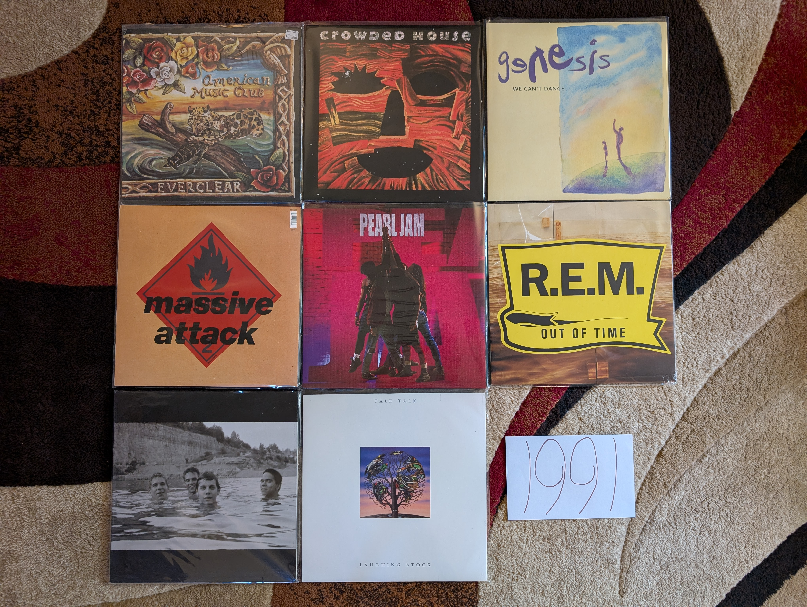

1991
----

This will always been remembered as the year of grunge, and the first real shots
fired for the sounds of the new decade. With the exception of the debut by
**Pearl Jam**, my interest lie in different territory. I certainly remember the
video for "Smells Like Teen Spirit" constantly playing on MTV, but it didn't
resonate with me then, and today I feel that it is a touch overrated because of
Kurt Cobain's untimely death. 

I was an elementary school student in 1991 who wasn't really listening to the
music of the day. I was definitely a fan of the singles off of the **R.E.M.**
record and I believe that one of my siblings had a copy of that not long after
release. I definitely was very into the singles from the **Genesis** release,
but I wouldn't hear the full album until I was in my mid 20s! It is strange to
think how different things were back in the era of physical media, when you
couldn't instantly stream anything that interested you. Outside of the three
artists mentioned above, I can confidently say that I didn't hear any of these
other records until the next millennium.

.. raw:: html

  <iframe style="border-radius:12px"
  src="https://open.spotify.com/embed/playlist/5vezk9QFF9pMsvdEdS69RG?utm_source=generator&theme=0"
  width="100%" height="352" frameBorder="0" allowfullscreen="" allow="autoplay;
  clipboard-write; encrypted-media; fullscreen; picture-in-picture"
  loading="lazy"></iframe>

- *Everclear* by **American Music Club** - I have never listened any of the
  other work by **Mark Eitzel**, but I really enjoy this mellow collection of
  sad rock songs. I have to be in a certain mood to listen to something this
  slow and dreary, but it is the finest work in this kind of genre. [*Memory*: I
  came to this record via an exploration of the largely imaginary genre of
  "Slowcore". Very early in my vinyl collecting hobby I came across a LP of this
  that I decided to pick up. I'm glad I did, as I have never seen it again
  since.]

- *Woodface* by **Crowded House** - These guys just make stunning pop songs.
  Every time I put this record on, I am always shocked by how great these tracks
  are. All their albums are worth listening to, but somehow this one is the best
  summary of what makes them great, such that I don't need the others? The
  one-two punch of "Four Seasons In One Day" and "There Goes God" is made up of
  two of my all time favorite songs. I really like **Split Enz** keeps popping
  out in songs like " Fame Is". [*Memory*: around 2007 I became interested in
  artists that were massively popular in other parts of the world, but less
  known in the USA. While they are perceived as a one hit wonder here, they are
  international superstars. While working through their catalog, this was always
  the record that spoke to me the most.]

- *We Can't Dance* by **Genesis** - This was the perfect end for this legendary
  band, and I don't know why they had to ruin things and release a sub-par
  record with a different singer after this. We have the atmospheric pop-rock of
  the 80s Genesis in songs like "No Son of Mine" and "Way of The World". We have
  sugary ballads that could have been solo **Phil Collins** gems like "Tell Me
  Why" and "Hold on My Heart". They once again reinvented themselves with a pair
  of novelty tunes with videos that would run constantly on TV in "Jesus He
  Knows Me" and especially "I Can't Dance". We even got two prog epics to
  aknowlege where they started out. The historical drama of "Driving the Last
  Spike" is an underrated gem that combines the prog bombast with the gentle
  beauty of the Collins solo works. Then the slow build and closing grandeur of
  "Fading Lights" creates perhaps the greatest "getting of the stage" moment a
  group has ever made for itself. [*Memory*: In 2002-03 I bought most of the
  Genesis albums. This was the last one that I acquired in that initial
  exploration, and I remember listening to "Fading Lights" for the first time in
  my rented room in Cleveland. It felt like such a final period to their career,
  and it would be years before I sought out the early 80s albums that I didn't
  explore in my first tour through their catalog.]

- *Blue Lines* by **Massive Attack** - This debut wasn't quite as swampy and
  atmospheric as what would come later. It also is the only record to feature
  the one of a kind rapping by **Tricky**. They were a different group on this
  one, in a way that I very much prefer. This is the sound of a collection of
  artists creating a new sound that would eventually become trip-hop, but hadn't
  yet completely reached that form. The combination of electronics, break-beats,
  rapping, and soul singing on "Safe From Harm" feels like a template for how to
  make a great track in that genre. For me, it is the brilliant "Unfinished
  Sympathy" with its combination of strings and electronics that is the finest
  moment of their career. [*Memory*: I remember listening to this repeatedly
  towards the end of my first summer in Cleveland working at the NASA Glenn
  Research Center. I had purchased the record at one of the CD and Tape Exchange
  locations, and would play it on my work PC while I worked on the thermal model
  I was making that summer.]

- *Ten* by **Pearl Jam** - It is hard to get more 1991 than this. This briliant
  record will always feel a little different from their other work. While it is
  now seen as a major work in the dawn of grunge, there is something a bit 80s
  about the production values that we would never see again. That said, from the
  opening moment of Eddie's lyrics on "Once", this is very much a Pearl Jam
  record. It just feels a little more arena ready than what would come later.
  Anthemic tracks like "Evenflow", "Alive", and "Jeremy" would become a central
  part of their live shows for decades to come. It is the dark epic "Black" that
  is the high point for me, and a sound they they would really never do again.
  This is one of those albums I sometimes underrate because of how ubiquitous it
  has become, but this is stellar work. [*Memory*: I came to these guys a little
  later than most men my age. It wasn't until 1998 or so that I finally started
  to listen to their 90s records. I started here, and for quite a while it was
  the only record I had. It was so good, I assumed it was all I needed.]
  
- *Out of Time* by **R.E.M.** - Always the innovators, R.E.M. were early
  adopters of the eclecticism that would define the music of the 1990s. We have
  early combination of rock and rap on "Radio Song" (which feels way more
  successful today than it did then for some reason). We have a whole lot of
  flirtations with alt-country throughout. This is where they started to go soft
  for a bit with tracks like "Low", "Half a World Away" and the massive hit
  "Losing my Religion". For the last time in a while we would get the tightly
  constructed jangly, alt-rock that filled their 80s albums in songs like "Near
  Wild Heaven" and "Texarkana". [*Memory*: They were the only modern band I was
  actually interested in at the dawn of the 90s. I certainly was aware of and
  interested in this release. I had already listened to the prior album *Green*
  extensively, and loved their back catalog via my exposure to the *Eponymous*
  collection. Then there was the video for "Shiny Happy People" that featured
  Kate Pierson (from one of my other favorites, **The B-52s**). The way my life
  worked at 11, I would never dream of acquiring a rock album myself, so I
  didn't hear it until one of my siblings did acquire it later in the year. I
  was onboard immediately, but my young ears were a bit confused by the rap
  elements in the opening track. This record really takes me back to my younger
  days when I hear it. I can imagine myself in the bedroom I shared with my
  older brother, listening on his Kenwood hi-fi with the 6-CD clip changer. This
  music is so fundamental to the taste I would develop.]

- *Spiderland* by **Slint** - [**1991 FAVORITE**] - This has been my favorite
  album for the better part of 20 years at this point. While it gets lumped in
  with the ill-defined "post-rock" genre, this is far more crunchy and punk that
  most of the music that gets put in that catch-all bin. So moody and
  atmospheric, this mysterious band never made anything like this again. These
  guys never really made anything else again. This is the adventurous sounds of
  a band pushing the boundaries at a time in their life when they only partially
  knew what they were doing. The album is so structurally and rhythmically
  unique that you can always tell when someone is trying to imitate it, yet no
  one has ever come close to replicating how this music feels. The combination
  of spoken word and screamed vocals creates a harsh, claustrophobic atmosphere.
  I can't always listen to this, but when I can, it hits hard. This is the kind
  of work that only makes sense in whole, and it demands a complete listen from
  start to end. The greatest album of all time in my opinion. [*Memory*: I liked
  this record from the moment I first heard it in 2006, but I wouldn't recognize
  it as my favorite of all time until two years later when I first listened to
  my vinyl copy. I remember sitting in the dark in the living room of my
  Woodycrest apartment with a glass of cognac watching the record spin, and for
  the first time really engaging with the work in whole. I especially remember
  the spare, clanging chords at the start of "Don,Aman" and fully appreciating
  for the first time how important that moment is structurally to the impact of
  the whole experience. The experience really drove home the role of physical
  media for engagement, and the superiority of vinyl as my preferred format.
  Every couple years I find myself pulling out one of my vinyl copies of this
  record and having a similarly profound experience. It is an album so good, I
  don't want to ruin it by overindulging or bringing it out when I am not in a
  place to fully engage with it.]

- *Laughing Stock* by **Talk Talk** - For what I generally consider to be an
  imaginary, non-useful classification, the "post-rock" genre has two definitive
  landmarks in 1991. Perhaps it is a useful label to describe music that
  attempts to use the instrumentation and general spirit of rock music to create
  atmospheric compositions that have more in common with more abstract artistic
  expression. This is very much on the jazz influenced side of that catch-all
  genre, and in fact is the definitive work of the sort. This builds directly
  off of their preceding album, but goes to an even more impressionistic
  territory. The songs make little sense in isolation but work together to
  create a stunning whole. Such a pleasant yet unsettling record. It is always
  interesting to think about what they would have done next had this
  non-commercial work not destroyed their career. [*Memory*: This was another
  record where vinyl really changed my perception. I had always far preferred
  "Spirit of Eden" which was of the very first vinyl records I acquired, and
  listened to predominantly on that format. This album was super rare and
  expensive on vinyl, and it wasn't until a reissue in 2011 that I would have
  this as well. It wasn't until I engaged with it in that whole form that I
  fully appreciated how great this was as well.]