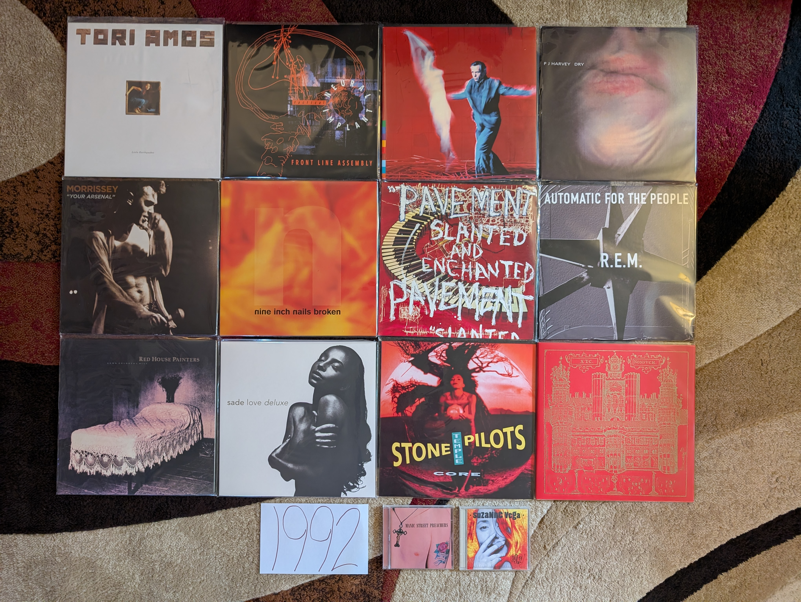

1992 Albums
-----------

As I have mentioned multiple times, this project was done working backward from
the current day (in the 2020s) and I encounter major milestones in reverse. This
is the point where things become almost exclusively a retrospective discovery
process. Of the albums on my 1992 list, the only one I actually heard that year
was the one from **R.E.M.** and at the time I didn't like it nearly as much as
their 1980s work that I was already a big fan of. As for the remainder, I heard
the singles from the **Peter Gabriel** and **Sade** records but they made little
impact on me at the time. This list would be assembled slowly over the last
three plus decades.

This year was very much a part of the "80s hangover" when most of the popular
music was being made by the dominant artists of the prior decade, but we are
also seeing the first indications of what the 90s would be. It was becoming
clear that more stripped back, acoustic sounds were going to dominate and that
women would play a far larger role in rock music. Some of the albums on my list
feel like a blueprint for how to make rock music in the 90s. I think it would
have been an exciting time to be following the trends closely, but alas, I was
just a kid.

.. raw:: html

  <iframe style="border-radius:12px"
  src="https://open.spotify.com/embed/playlist/5hbqdrOiTeHindDJVPUjHM?utm_source=generator&theme=0"
  width="100%" height="352" frameBorder="0" allowfullscreen="" allow="autoplay;
  clipboard-write; encrypted-media; fullscreen; picture-in-picture"
  loading="lazy"></iframe>

- *Little Earthquakes* by **Tori Amos** - [**1992 FAVORITE**] - There is a lot
  of discussion and disagreement about the artistic value of the body of work by
  Myra Ellen [Tori] Amos, but few will try to say that this is anything less
  than one of the greatest debut records ever made. This is the kind of album
  that someone makes when they have been bursting with ideas since they were a
  child, but only had the opportunity to put them to record properly at the age
  of 28. Listening today, the most striking thing might be a kind of 70s/80s
  singer-songwriter vibe on tracks like "Leather", "China" and especially "Tear
  in Your Hand" that we would never really hear from her again. Then there is
  the blueprint for the kind of brilliant chamber pop that she has continued to
  make on an off for decades since ("Crucify", "Girl", "Silent All These Years",
  "Mother"). We also see the first indications of the aggressive art-rock of her
  mid-career in the outstanding "Precious Things". Of course, there is also one
  of the greatest songs of all time in the timeless classic "Winter". [*Memory*:
  It is impossible to pick just one memory to associate with this record, so I
  will try to keep it to a few short paragraphs. In 1993 I became a massive fan
  of the solo work of **Paul McCartney**. Around this time, I recorded a
  documentary about his career of of VH1. It was a BBC program with different
  timing from American cable TV, and they needed to show videos to fill out the
  last half hour slot. They played the video to "Silent All These Years". I
  remember being confused and fascinated by the video with the red haired woman
  spinning in a box in the white room. I remember thinking it was the latest
  **Cyndi Lauper** song (LOL!).  I filed away the name Tori Amos, but didn't dig
  any further at the time. This would be the second of her records that I would
  pickup in the summer of 1998. It would nearly instantly become one of my
  all-time favorites. I remember trying to introduce my male friends to the
  record, who thought I was crazy to be so excited to what they could only see
  as "Lilith Fair Material". I remember burning a CD of MP3 files that my
  brother borrowed and played in the machine shop at work. It was a bit
  embarrassing to have the song "Winter" associated with me in such a den of
  conventional masculinity. I don't know if any record makes me think more
  strongly of my transition into young adulthood. These tracks remind me of my
  first taste of real independence and the newfound opportunity to establish my
  own personal identity. My relationship with the Tori Amos catalog has always
  felt highly coupled with my rejection of the traditional definition of
  masculinity.]

- *Tactical Neural Implant* by **Front Line Assembly** - The only one of their
  early records that I really need at this point in my life. All the usual
  elements are here: danceable electro-industrial beats, half-growled vocals,
  and clips of classic science fiction films. For me, this is by far the most
  successful iteration of the formula, and it renders a half dozen other albums
  as redundant. [*Memory*: This reminds me of my first year living in State
  College, PA. I had a tiny little room in shared college housing with three
  other students who had transferred from the same Penn State satellite campus.
  I wasn't happy, and this record often fit well with my state of mind at the
  time.]

- *Us* by **Peter Gabriel** -  The last of his "classic period" records feels
  like it gets stronger and stronger as the years pass. Closer to its release
  this felt a bit too much like *So*. Over time its themes of loss and change
  give this depth that wasn't evident to me immediately. The best moments are
  the gentler songs like "Come Talk to Me", "Blood of Eden", and especially
  "Washing of the Water". Yes the singles "Steam" and "Digging in the Dirt" are
  highly derivative of the hits from the preceding record, but in retrospect
  they provide some nice textural variation to a record that should be
  celebrated mostly for its quieter tracks. [*Memory*: The videos for the
  singles on this album used the same kinds of stop motion tricks as those from
  the album *So*. As a result of this apparent artistic stagnation, I didn't
  give this album a proper listen until much later. I think a lot of people made
  this mistake at the time, and this never got its proper respect until the next
  century.]

- *Dry* by **PJ Harvey** - No one has mixed punk with the blues quite like Polly
  Jean. "Oh My Lover" is one of the most striking career openers of all time.
  One of the greatest rock vocalists arrives in full force on tracks like
  "Dress", "Sheela-Na-Gig", and the closer "Water". She would never make an
  album this straightforward again, and over a dozen records later it still
  feels absolutely essential. [*Memory*: It is interesting to realize that two
  of my favorite artists of all time released their debuts in the same year. It
  took me a while to make it to this record, as it was probably the very last
  one that I connected with. It would take over 20 years after release for me to
  really connect with the raw brilliance of this album.]

- *Generation Terrorists* by **Manic Street Preachers** - It is fascinating in
  retrospect how much this sounds like the contemporary hair metal. I can't see
  this as a work on the same level of what they would soon do, but heck if it
  isn't a fun, glammy affair. We also get a peak at the more substantial work to
  come with the classic "Motorcycle Emptiness". [*Memory*: perhaps the only
  reason I consider this a minor classic is the fact that "Motorcycle Emptiness"
  was one of the two songs (along with "A Design for Life") that introduced me
  to these guys during a Glastonbury highlight film on HDNet. Also, I am a
  sucker for well done glam metal.]

- *Your Arsenal* by **Morrissey** - The best work from his rockabilly era. The
  best tracks are the eccentric, highly stylized ones like: "Glamorous Glue",
  "Certain People I Know", and "I Know It's Gonna Happen Someday". The more
  straightforward rockers like "We Hate It When Our Friends Become Successful"
  and the closer "Tomorrow"have held up better than most of his work of this
  sort. Not among his very best records, but a very strong effort [*Memory*: I
  greatly regretted not buying this when the vinyl releases were made around
  2014. Everytime the man opens his mouth, the chance of later reissue series
  decreases immensely. I tracked down a somewhat overpriced used copy on Discogs
  in 2023.]

- *Broken* by **Nine Inch Nails** - The most angry record by one of the angriest
  artists ever. This kind of theatrics often sounds comical to me as a full
  grown adult, but as a young person this felt different. That said, it is still
  a fun listen, and an amazing production. Reznor has always been a master at
  mixing the aggressive industrial noise with quieter moments. He probably did
  that loud/quiet trick better here than on any other record. This is front
  loaded, but those first two tracks ("Wish", "Last") are glorious. [*Memory*:
  Throughout my adult life, sometimes even now when I am in a certain mood,
  there is nothing I want to do more than listen to this at high volume on
  headphones.]

- *Slanted and Enchanted* by **Pavement** - I used to think that there music
  became more refined as the years went by, but I now realize that it was mostly
  a trick of production. On their first LP, the recording is compressed and
  crunchy, sounding very much the early 90s indie classic it is. From a
  songwriting and performance perspective they are already very much on top of
  there very specific sound. There will never be another Pavement, and I will
  never get tired of this album. [*Memory*: "Trigger Cut" has always been a
  favorite of mine, and I was really excited to hear them play it during their
  appearance at the 2010 Pitchfork Music Festival.]

- *Automatic for the People* by **R.E.M.** - In the popular consciousness, this
  is their finest work. Filled with ballads and acoustic sounds, this is a far
  cry from their early punk influenced albums. The mellower tone does allow the
  songwriting to come to the forefront, and I think that is why the masses
  reacted to it so strongly. The best moments on this album are the quieter ones
  like "Nightswimming" and the massive hit "Everybody Hurts". It would be so
  easy to write this off as a sellout record, and I'm glad that the world has
  collectively decided to properly honor this as a classic record. [*Memory*: I
  was already a huge fan of the band when this came out. My sister (and probably
  everyone's sister) bought this back in the day, and listed to it repeatedly. I
  didn't appreciate it at the time, and largely ignored it until I was in my
  early 20s. I now fully understand and appreciate how it fits in with the
  brilliant catalog of one of my favorite bands.]
  
- *Down Colorful Hill* by **Red House Painters** - This is one of the most
  beautiful albums ever made. A lot is made out of the artist's life, and the
  sadness of their situation when this was made. I prefer to think of it as the
  story of someone realizing that they need to change, and taking the first
  steps towards a better place. I don't know that **Mark Kozelek** gets enough
  credit for these understated, folk rock epics like "Medicine Bottle" and
  "Down Colorful Hill". It is a triumph of structure and composition that music
  of this genre can produce 9-10 minute songs this compelling. [*Memory*: I
  became really interested in the early work of this artist in the 2006-08
  timeframe. This was a period of time when I was getting used to living on my
  own for the first time in my life. There was something in the sounds and words
  that really matched with how I felt in that point of my life. While I couldn't
  relate to the specific experiences, there was a general mood of isolation that
  felt very familiar.]

- *Love Deluxe* by **Sade** - The transition from 80s sophista-pop to 90s
  downtempo and trip-hop felt natural and highly effective. This album was a
  massive hit, where a group sensed the prevailing trends and capitalized on
  them to great effect. I still prefer the more varied textures of the first
  three records, but this is a very talented group of musicians taking their
  sound to a fruitful new place. [*Memory*: The cover of this album makes me
  think of Columbia House/BMG adds from the 90s. I feel like this was features
  as one of the 10 albums you could get for a penny for most of the decade.]

- *Core* by **Stone Temple Pilots** - This was their most straightforward rock
  album, and perhaps the only time they were properly categorized as grunge.
  That said, there are also the first indications of those Beatlesesque
  melodies that would pop out more and more as the years went by. "Creep" and
  "Plush" were everywhere in the early 90s, and in retrospect, they are stunning
  examples of alt-rock tracks that were clearly aiming at the Billboard charts.
  I'm glad that revisionist history continues to raise the profile of this band
  that was underappreciated by critics in their time. [*Memory*: This reminds me
  of middle school. This was the official band of boys my age. While I wasn't
  really allowed to listen to this kind of thing, I was kind of into them to.]

- *99.9 F Degrees* by **Suzanne Vega** - One of the best records you were going
  to find in a used CD bin in the late 90s, this sold big, but was never really
  appreciated by most who gave it a listen. This is very different from the
  folk-pop she made in the previous decade, and added a lot of the sounds and
  color of the contemporary alternative rock scene. At times it almost makes me
  think of the twee (yet moody) alt-rock acts that would appear in the second
  half of the decade (e.g. **The Cardigans**). This has aged really well!
  [*Memory*: I remember a work colleague of mine who was also a big music person
  often brought in CDs to share. I think he brought this one from his wife's
  collection due to my massive interest in the work of **Tori Amos** and **Fiona
  Apple**. There is perhaps a bit of Fiona here, but in general this is also
  brilliant work by a female artist, working in a fairly different territory
  than my other favorites of the time.]

- *Nonesuch* by **XTC** - What a close to their original run! Their gradual
  progression from angular punks to highly refined art pop is one of the most
  compelling transformations in rock history. The songs here are absolutely
  masterful, especially the all time classics "Ballad of Peter Pumpkinhead" and
  "The Disappointed". This would have been an amazing end to their story, but we
  would get two more brilliant albums at the turn of the millennium. [*Memory*:
  For years this was one of those grail records for me. I used to assume that I
  would never own this on vinyl, but a 2020 reissue would make my XTC collection
  complete.]