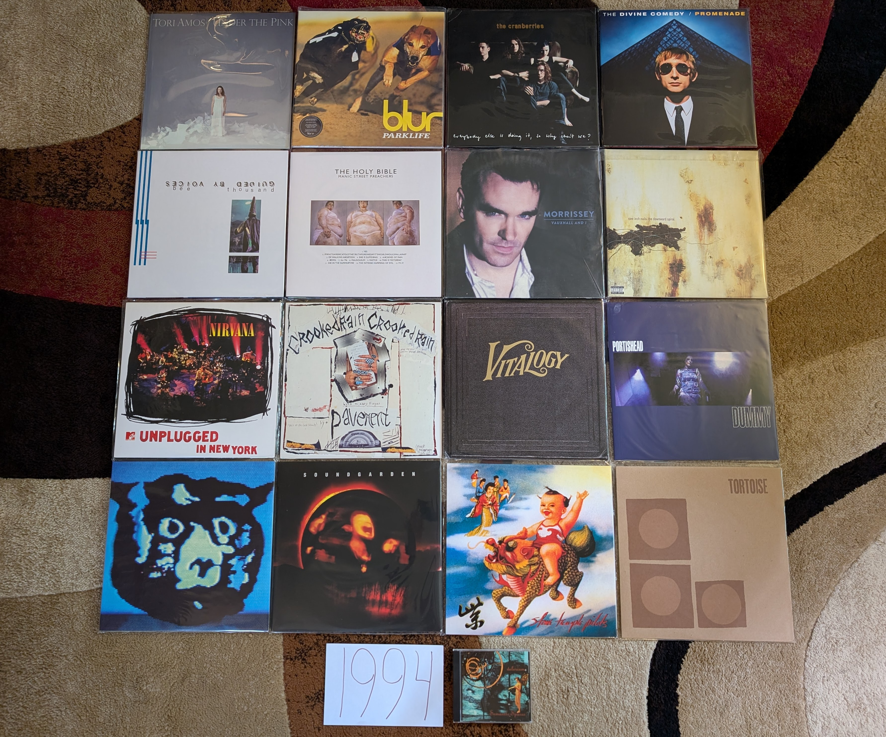

1994 Albums
-----------

In 1994 the local classic rock station that I frequented changed to a modern,
hard rock format. At first, I resisted the change and retreated into the CD
collections of my siblings. That station, WYSP, was also the broadcaster for my
beloved Philadelphia Eagles, and used the alternative rock of the station as
bumpers out to commercial breaks during games. Eventually I relented to the new
format and discovered a window to the music that my peers at school were
listening to. It was the last days of grunge, and a more diverse collection of
sounds were driving rock music. Some of the mid-90s hard rock that I was hearing
still makes my list of favorites below. Beyond rock music, there are quite a few
bits of 90s eclecticism on there as well. While I only knew about a quarter of
these albums in their year of release, this would be the peak of my pop music
awareness until my late teens.

Looking back, this was a particularly strong year for popular music. I think
this is where the positive eclecticism of the 90s really started to kick in, and
there was a wide range of sounds to listen to. 

.. raw:: html

  <iframe style="border-radius:12px" 
  src="https://open.spotify.com/embed/playlist/0WFhYr6bmlShgIZLjziYVM?utm_source=generator&theme=0" 
  width="100%" height="352" frameBorder="0" allowfullscreen="" allow="autoplay;
  clipboard-write; encrypted-media; fullscreen; picture-in-picture"
  loading="lazy"></iframe>
  
- *Under the Pink* by **Tori Amos** - Perhaps the most Tori Amos of the Tori
  Amos records. A completely unique, iconoclastic collection of highly personal,
  yet thematically ambiguous piano songs. The wide range of textures and moods
  makes for a record that never gets old, even after hundreds of plays. While
  the instrumentation and performances give a similar feel to her debut, the
  arrangements and song structure take things to a more experimental level that
  foreshadow the ambitious works to come. I think for much of the fan-base, this
  is "the record". While that isn't true for me, it certainly is a record I will
  keep coming back to. [*Memory*: This is another of those records that takes me
  back to my freshman year in college, listening on my portable cd player
  through a cassette adapter as I commuted in. There is a kind of excited,
  warmth to this album. The sounds of someone who has lived a somewhat sheltered
  life, and discovered the world a few years later than every one else. Or maybe
  that was just me.]

- *Parklife* by **Blur** - Every generation has a British band that is the most
  British of the British bands. In the 90s, that was these guys, and this is
  their most British album. I mean, there is a song based on the maritime
  weather conditions broadcast. A lot of Britpop, is more rock than pop, but
  this album really puts the pop to the forefront. [*Memory*: For many years I
  tried to convince myself that this was not the best Blur record. I was wrong,
  this is amazing.]

- *No Need to Argue* by **The Cranberries** - This is tremendously beautiful
  music. The grunge adjacent riffs and half-yodeled vocals of "Zombie" were the
  breakout hit, and most enduring moment, but I much prefer the subtle ballads.
  Much of the music has that 1980s 4AD sound, and the vocals of Dolores
  O'Riordan are peerless. Are they the best Irish band of all time? [*Memory*:
  For some reason it took a really long time for the label to satisfy the demand
  for a vinyl reissue of this one. They kept releasing small batches that would
  sell for over a hundred dollars on Discogs. I personally had two pre-orders go
  unsatisfied due to lack of stock. This one really highlighted the supply
  issues of the vinyl revival.]

- *Semantic Spaces* by **Delerium** - The huge pivot for Leeb/Fulber, what used
  to be an ambient, instrumental project now brought female guest vocalist to
  the fore. The formula was a massive success, and would continue for the next
  two decades (with perhaps too little variation to hold interest). There are
  still some fantastic instrumental tracks here, but the "pop songs" give the
  work sustained interest that the prior records lacked. "Tribal Industrial"
  music was all the rage in the mid-90s, but rarely would it sound this good.
  [*Memory*: During a 1999 trip to Niagara Falls, we were driving back from a
  fireworks display listening to modern rock station Edge 1002. The Canadian
  radio programming felt exotic and exciting. The evening program played a
  continuous mix of electronic sounds, almost all of which were unfamiliar to
  me. A sequence of two tracks particularly caught my interest. One of them
  turned out to be a new song by **Moby** (see 1999), but the other took a bit
  more work to sort out. I wrote a detailed E-mail to the station describing
  what I could remember. One word that I caught when the DJ did provide a list
  of the artists was **Delerium**. The helpful staff at Edge 102 pointed me to
  the Canadian electronic duo with that name as a potential lead. Thankfully
  they had a great website, that even included short realvideo samples of their latest
  work. It was there I found the song: "Flowers Become Screens" which would lead
  to what would become one of my favorite artists in the early 2000s, and who I
  still very much enjoy today.]

- *Promenade* by **The Divine Comedy** - [**1994 FAVORITE**]  - From a musical
  arrangement perspective, and perhaps also from a lyrical perspective, this is
  Neil Hannon's most ambitious work. There are also plenty of his trademark
  whimsey, especially on "A Drinking Song", and Irish pastoral beauty on tracks
  like "The Summerhouse". But, the main thrust of this album are heady, complex
  tunes like "When The Lights Go Out All Over Europe" and especially "Don't Look
  Down". [*Memory*: Around 2012, I became aware of Brooklyn indie iconoclasts
  **Zambri** who posted a cover of "Tonight We Fly" to their Soundcloud. It was
  now the Spotify era and I could immediately research and locate the original
  artist. That would lead me to this album and The Divine Comedy. Strangely, I
  would go no farther, and it would take several years for me to listen to any
  of the other tracks. It would then take a further few years for me to listen
  to another record by the artist. I'm not sure why I engaged so slowly, but
  eventually in 2017, I would have a new favorite artist.]

- *Bee Thousand** by *Guided By Voices* - Still their finest work. While the
  formula has varied little over their long career, it comes together here in a
  way that it never quite would again. Perfect little 1-2 minute pop songs, with
  just right amount of fuzz and distortion to give them a big punch. This is the
  kind of album that needs to be played loud to the edge of discomfort. That
  said, I don't know that this ever gets enough credit for how beautiful the
  melodies are as well.
  [*Memory*: I saw them play at the Pitchfork Music Festival in 2011. I remember
  losing my mind when the played "Gold Star for Robot Boy". While writing this I
  wondered if there was any video of their festival performance out there. On
  youtube I found a video of that song from a perspective that felt very
  familiar. What did I see in front of the camera? It was the back of my head,
  clearly losing my mind getting into the tunes.]

- *The Holy Bible* by **Manic Street Preachers** - Based on the lyrical content,
  the label didn't release this in the USA. So like most everyone over here, I
  didn't hear it until many years later. That is a shame, as it really has a
  surprisingly fresh, punk inspired sound that was contrary the prevailing
  trends of the day. British music was mostly an isolated, and independent scene
  from the alt rock that was happening on the other side of the Atlantic, and
  this album might be the most representative artifact of that era. It has been
  called the most negative album ever made, and the lyrics are mostly coming
  from a very dark place. Behind the gloom is a kind of rage that offers a way
  to a different place. This album contains the legendary runon song title:
  "Ifwhiteamericatoldthetruthforonedayit'sworldwouldfallapart", and it is a great
  song! [*Memory*: I became aware of these guys watching a Glastonbury annual
  retrospective on HDNet (a channel that played HDTV content in the early, novel
  days of the technology) in 2007. This mysterious record that hadn't yet had an
  official USA release was heralded as a cult classic, and my interest was
  piqued enough to import a copy.]

- *Vauxhall And I* by **Morrissey** - In retrospect, this feels like the last
  album of his classic period. We are still very much in the sphere of **The
  Smiths** with elements of anthemic Britpop sprinkled in. It is loaded with
  classic songs that still feature heavily in his live shows like *Now My Heart
  is Full* and frequent closer *Speedway*. The highlight for me are the tender
  moments like "Hold on to Your Friends" and "I am Hated for Loving" that have a
  kind of openness and sincerity that is rare in the Moz's catalog. [*Memory*:
  When I was very into WYSP modern rock radio, they were playing one song that
  was very different from the typical hard rock that comprised most of the
  playlist. It was "The More You Ignore Me, the Closer I Get". The whimsical
  crooning was confounding to my 14 brain, but it made a favorable impression.
  When Napster would become a thing several years later, it would be one of the
  first songs I sought out. It would take another eight years until 2008 when I
  bought his latest best of compilation. From there I would gradually become a
  scholar of the entire Morrissey catalog.]

- *The Downward Spiral* by **Nine Inch Nails** - I do really enjoy this album,
  but unlike almost everyone else in the world, it is not my favorite of
  Trent's. I prefer the slick synthpop that came before, and the prog epic that
  came after more than this heralded release. That said, there is a lot to like
  here, even if I find it hard to engage with something this angry as I settle
  into the contentment of middle age. The hits are great, but the filler..is
  filler, and this isn't one that I listen to in whole very often anymore. That
  said, every now and then, there is nothing that I need more than a listen to
  this. [*Memory*: When this came out, this "band" seemed to dark and aggressive
  to me. I saw all the kids in their NIN shirts at school, but I didn't listen
  to this album until many years later, and after I was a big fan of the albums
  that were release on either side of this one. Weirdly, this record makes me
  think about Circuit City. The electronics retailer sold CDs at a significant
  discount as a loss leader. I bought nearly the entire NIN catalog at the store
  in the late 90s early 2000s. This album was one of the last I bought at the
  State College location before it closed around 2009.]

- *MTV Unplugged in New York* by **Nirvana** - This will be the only release on
  my list by this legendary band. While I enjoy both *Nevermind* and *In Utero*,
  neither are a complete work in my opinion. The high points are amazing, but
  the low points are very mediocre. This is a wonderful, but kind of strange
  live recording. Very few of the hits are here, but many of the mellower tunes
  that didn't really work on the studio albums sound great here. There are a ton
  of covers, which are probably the better known cuts from the show: **Bowie**'s"The Man
  Who Sold The World", "Jesus Doesn't Want Me for a Sunbeam" by **The
  Vasilines**, and no less than 3(!) tracks from the **Meat Puppets** second
  record. This would serve as the exclamation point on a brief, but very notable
  career, and would drive interest in some pretty great music by other artists.
  [*Memory*: It is hard to remember a time when live albums could be mega hits,
  and spawn multiple tracks getting serious radio airplay. That said, that is
  how it was in the winter of 1994/95. This record was everywhere.]

- *Crooked Rain, Crooked Rain* by **Pavement** - This gets the reputation of the
  "mainstream" release by these guys, but I'm not sure that is quite right. This
  is much the same as what came immediately before and after, but for a brief
  moment that aligned with what was en vogue. In 1994 their was a tolerance for
  a wide range of sounds in mainstream rock, and this shambolic outfit reaped
  the benefits of that climate. "Cut Your Hair" is the song you will see used in
  TV promotions, but for me, "Rage Life" is the definitive statement. The track
  stands both musically and lyrically in opposition of the perceived prevalent
  trends of the contemporary rock world. Ironically, this song was released
  at a time when the prevailing trends mattered the least. [*Memory*: In general
  the headliners at the Pitchfork Music festival were disappointing, but 2010
  was a different story. And these guys closed out the festival on Sunday with a
  bang. I can still see Stephen Malkmus doing a high leg kick as they kicked
  into "Cut Your Hair".]

- *Vitology* by **Pearl Jam** - This album was released at the peak of the
  band's relevance to popular culture, and it delivered. The aggressive rockers
  like "Last Exit" and "Whipping"a re still there, but they are rapidly becoming
  more about the story ballads like "Nothingman" and "Better Man". No longer
  young punks, the Springsteen's of the 90s were born. [*Memory*: The release of
  this album was a huge event. I remember stories on the news about people
  lining up at stores at midnight on Tuesday for a copy. I remember being
  amazed that some folks were still buying a vinyl copy! Little did I know that
  I would return to the format 14 years later. I now too have a vinyl copy of
  Vitology.]

- *Dummy* by **Portishead** - A truly strange record. An especially atmospheric
  brand of trip-hop, with vocals by **Beth Gibbons** that sound like they were
  designed for use in a horror film. The kind of album to be listened to in a
  dark room with a glass of whiskey, neat. [*Memory*: It took me a long time to
  appreciate this. I loved the last Portishead record immediately, but it took
  me a bit to appreciate the more trip-hop heavy music on this classic.]

- *Monster* by *R.E.M.* - A shocking return to heavier rock sounds at release,
  it still stands as a noted left turn 20 years after. After several albums of
  quieter, roots rock inspired faire, "What'S the Frequency Kenneth" was a big
  jolt to the fanbase. At the time opinions were mixed, but this now is mostly
  universally accepted among their finest work. [*Memory*: This was a band that
  I was actually very into at the time. I was also a fan of their earlier punk
  inspired work, so the heavier sound was less of a shock to me.]

- *Superunknown* by **Soundgarden** - A lot has been said about the disjointed
  sensibilities of the metal inclined instrumentalists of the band and their 60s
  pop loving front man. This is the album where that tension is fully starting to
  show, and produce sonic gold like major hits "Spoonman" and "Black Hole Sun". The
  latter was everywhere in 1994, and for good reason. The mixture of grunge
  metal and psychedelia was a revelation. [*Memory*: I really liked these guys
  at the time. It took me many years to realize the parallels between this music
  and the latter day **Beatles** music I was obsessed with at the time. That
  said I never bought this CD in the 90s since it came from the "Metal" section
  of the Columbia House catalog, which was not going to fly in my family.]

- *Purple* by **Stone Temple Pilots** - In many ways, 1994 was when alternative
  music crossed into the mainstream, and there was no bigger example of that
  than "Interstate Love Song". Looking back, the track is a masterful example of
  an band dialing back their sound just enough to get on mainstream pop radio,
  while retaining their core essence. I have to wonder what some of the folks
  who bought the album based solely on that song though of the far heavier tunes
  like "Meatplow" and "Army Ants". I know what I think of them, they are
  probably my favorite work by these guys. [*Memory*: I like to think I have an
  usually objective ear, and this is one of those albums that gives me a bit of
  proof. Throughout the 90s and 00s there was a prevailing narrative that this
  band were poseurs and imitators of more authentic acts like **Pearl Jam**. I
  never saw it. I only saw an appealing combination of 90s hard rock and 60s
  psychedelia (that would be joined by garage rock and other influences later).
  The respect given to these guys really started to climb in the 2010s, and
  today I am far from the only person who gives them credit as one of the most
  interesting and enduring 90s alternative acts.]

- *Tortoise* by **Tortoise** - A lot is made about **Talk Talk** and **Slint**
  giving birth to the post-rock genre, but for me, this is where it really
  starts. There is something about the particular atmospherics here, with the
  jazzy, wide open soundscapes that define the early post-rock sound. Soon,
  other acts would dial up the intensity and create a crescendo heavy variant of
  the genre, but Tortoise's more leisurely approach still sounds great today.
  [*Memory*: I saw these guys play a now defunct Buffalo venue called Soundlab
  in the summer of 2010. It was a great show that made me appreciate the Math
  Rock elements of their sound that doesn't come across as strongly on their
  early records.]