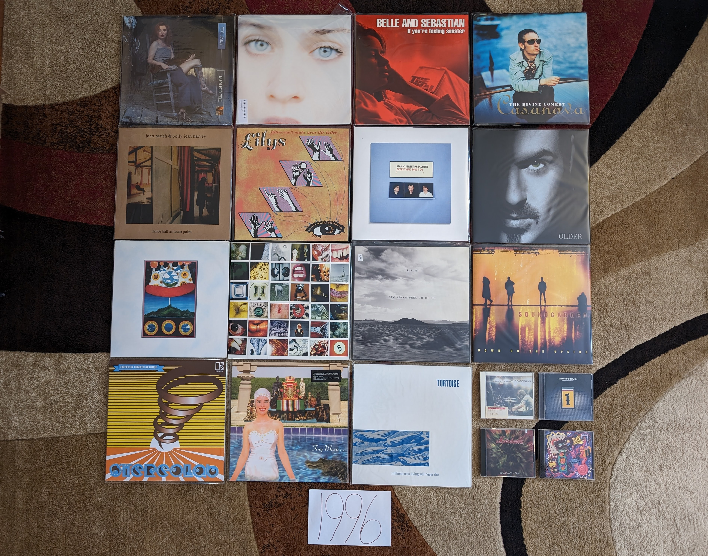

1996
----

When I look at the below image, I can confidently say that I didn't hear any of
these records in the year of their release. I was very familiar with, and a fan
of many songs off of these albums, but none had found their way into my
collection. This is partly because I was very much in the peak of my backward
looking Beatlemania, and making my first explorations into growing favorites
like **Pink Floyd** and **David Bowie**. It was also because many of the new
artists I was interested in, seemed to conflict with the religious convictions
of my parents. It is strange to think about now, but back then artists like
**Soundgarden**, **Stone Temple Pilots**, and even **Jamiroquai** felt slightly
dangerous and out of step with the conservative values of my family.

Thinking about this selection today, this feels like a pivot year between the
rock heavy early 90s and the rise of pop in the latter half of the decade. There
are also quite a few indie classics there, including a few landmark albums that
would be very influential on the dominant music trends of the next decade
(**Belle and Sebastian**, **Stereolab**, **Olivia Tremor Control**,
**Tortoise**). Finally, Britpop is starting to reach full bloom with classics
from **Divine Comedy** and **Manic Street Preachers**, and an American band has
decided to join in (**Lilys**). If there a single dominant theme here, it is
without question garage rock. That influence can be heard in artists as diverse
as **Olivia Tremor Control**, **Pearl Jam**, **Lilys** and especially here in
the album by **Stone Temple Pilots**. Its really clear to see the roots of 2000s
indie in many of the albums listed here.

.. raw:: html

  <iframe style="border-radius:12px" 
  src="https://open.spotify.com/embed/playlist/2pyhYKrUf1bRFtr1W0rDCz?utm_source=generator&theme=0" 
  width="100%" height="352" frameBorder="0" allowfullscreen="" allow="autoplay;
  clipboard-write; 
  aencrypted-media; fullscreen; picture-in-picture" loading="lazy"></iframe>

- *Boys for Pele* by **Tori Amos** - [**1996 FAVORITE**] - A remarkable record,
  produced by an artist who was experiencing a significant level of artistic
  freedom for the first time. While we have the first elements of the electronic
  music that would dominate the next few records, this is mostly still an
  acoustic, piano driven affair. The song structure and the fundamental
  structure of the album is quite different from anything that had really come
  before by any artist. The lyrics are more impenetrable than anything on her
  first two records, but they are evocative of multitude of emotions. I don't
  know that there is another album where I understand so poorly what the artist
  is singing about, but I know exactly what they mean. So many of my favorite
  songs of all time are on this album, and it is one that I will never tire of.
  [*Memory*: When I was in grad school, I met a woman studying in another
  program through a friend in her lab. We connected very deeply over this
  record, and the next three times our friend group met up at the bar, we spent
  the entire evening chatting. I'm pretty sure everyone else thought we were
  going to start dating. I might have even thought that for a brief moment, but
  we really both just really like that album, and the artist.]

- *Tidal* by **Fiona Apple** - This feels so conventional by the modern
  standards of the artist. The first album is definitely quite a bit more
  straightforward than what was to come, but no less interesting. The moody,
  singer-songwriter material on offer here is just as stunning today as it was
  back then. "Criminal" was the big hit back then, as much for its lolita-esque
  music video, as the song it was promoting. Most of the other material holds up
  much better today, especially "Shadowboxer" and the softer tracks like
  "Sullen Girl" and "Never is a Promise". [*Memory*: I got my copy of this album
  from my sister as a hand me down in the summer of 1998. She didn't connect
  with it beyond "Criminal". I was in the heights of my **Tori**-mania and this
  was a great fit for that time in my life. This album brings back vivid
  memories of driving my metallic purple 1997 Dodge Neon to the Penn
  State satellite campus I attended in Reading, PA. Many of those freshman
  mornings I would have this in the Sony Discman that was playing though a
  cassette deck adapter.]

- *If You're Feeling Sinister* by **Belle and Sebastian** - One of their best
  albums, but unlike most fans, I do not consider it to be their very best. This
  is a tremendous indie-folk record, but for me it isn't quite as effective as
  the more spare, unpolished EPs that came before, or the slicker poppier music
  that would come in the next decade. However, there are some great tracks here,
  especially "Like Dylan in the Movies" and "Seeing Other People". [*Memory*:
  These guys dominated my listening in the 2004-2006 time frame. This is the
  soundtrack to the end of my academic career and start of my first job.]

- *First Band on the Moon* by **The Cardigans** - "Lovefool" was a massive hit,
  and while a great song, it sells these guys a bit short. The kind of pop music
  that can only come from Scandinavia, this is sweet, but surprisingly moody
  music. It would get even darker from here on out, but there is a real chill to
  the atmospherics and songwriting on this record. [*Memory*: I was listening to
  this a lot in the Summer of 1999, and it reminds me very much of my first
  engineering internship. I would listen to CDs on my Windows NT machine that I
  used make CAD drawings. This was one of the discs that was on repeat.]

- *Casanova* by **Divine Comedy** - There are many of the typical elements here:
  the sense of humor, the chamber pop sensibility, the layered harmonies by the
  artist. However, this is the closest this guy has ever come to actually making
  Britpop. It is the eccentric kind of Britpop made by the likes of **Blur**,
  and it isn't quite all the way there, but if you squint, it is there. For many
  folks this is the best record, for me it is in the middle of a very strong
  pack of records. [*Memory*: This was the second album I tried from this guy
  after losing my mind listening to **Promenade** repeatedly for about 5 years.
  I remember wondering why I waited so long to dig deeper.]

- *Dance Hall at Louise Point* by **John Parish & PJ Harvey** - This is the
  first record in the quieter, artier sound that would become her predominant
  style in her more recent work. There still are some aggressive, abrasive
  moments here, but they unfold in a creeping, pensive way that is also very
  representative of the latter day Polly Jean. "Heela" is such a remarkable
  song, and will always be one of my favorites. Even though we would get a few
  more records in a more conventional rock style, this is the start of the PJ we
  know and love today. [*Memory*: When I was working my way through her catalog
  in the 2007 time frame, I bought a used CD copy of this for about a dollar and
  didn't know what to make of it. This took me a while to fully appreciate, but
  it is not one of my very favorites.]

- *Traveling Without Moving* by **Jamiroquai** - It is hard to think about this
  record without picturing that legendary video for "Virtual Insanity" and I'm
  sure I would never have heard this album without that amazing promo clip. That
  said, this is a funky, highly enjoyable affair that is more than a little
  derivative of **Stevie Wonder**. Much like the master it has patterned itself
  after, what we get here is a pleasant mix of funky upbeat tunes, and pretty
  soulful ballads. [*Memory*: This makes me think of a quant music "format" that
  I collected in the late 90s. CDs were expensive (and in some cases, evil in
  the religion I was raised in) and I couldn't always acquire the latest tunes I
  liked from TV or radio. The internet of the late 90s provided me an
  approximate solution, the MIDI file. I downloaded the minimalist, instrumental
  sequencer versions of popular tunes that I didn't have for real. I remember
  downloading a particularly impressive version of "Virtual Insanity" in the
  (new at the time) XG MIDI format. It didn't have the vocal track, but I could
  still enjoy that funky groove.]

- *Better Can't Make Your Life Better* by **Lilys** - I love **The Kinks** and
  so apparently does Kurt Heasley, the man behind **Lilys**. This feels like a
  love letter to the pre "Village Green" **Kinks** and it is expertly done. The
  90s were a time of significant interest in the sounds of the mid 60s, and this
  is a expert recreation and modernization of the garage rock sound. [*Memory*:
  There was a vinyl copy of this at one of my favorite Rochester shops (The Bop
  Shop) for probably about 5 years before I finally pulled the trigger and
  picked it up. Why was I delaying, this is wonderful stuff!]

- *Everything Must Go* by **Manic Street Preachers** - These guys were always
  one of the heavier BritPop acts, but this is where the balladry and pop
  sensibility started to really creep in. That said, it totally works. A really
  polished and literate set of tracks that never get old. The epic "Elvis
  Impersonator..." returns to one of their favorite topics, the relationships
  between the UK and America. Admittedly their frank consideration of that topic
  is why they never really made it over here, and why I didn't hear anything
  from them until the mid 2000s. I would have absolutely loved it back then, and
  I certainly do now! [*Memory*: "A Design for Life" is the ultimate BritPop
  anthem. It was made to be screamed along with by a Glastonbury festival crowd.
  I got a noise violation letter for jamming it too loud at in my State College
  apartment in 2007.]

- *Older* by **George Michael** - This album sold millions of copies, but not as
  many millions of the two prior, and therefore was perceived as a failure at
  the time. Today it sounds like a revelation. A sophisticated, mature affair
  with some of his best songwriting and vocal performances, this was not fully
  appreciated at release. "Jesus to a Child" is a remarkable song, perhaps his
  very finest. Everything has such a warm, atmospheric vibe. Maybe the best 90s
  sophista-pop record. [*Memory*: I certainly remember the singles from this
  record getting played (especially on VH1), and had them on a greatest hits
  compilation, but I didn't listen to the whole album until 2021. After reading
  a biography on the artist I streamed all the records and was blown away by
  this one.]

- *Who Can you Trust* by **Morcheeba** - The big breakout for these guys, and a
  wonderful evolution of trip-hop. The kind of smooth and elegant record that
  you could replay to infinity and not tire of. It is almost like
  **Portishead** has been polished up and made TV commercial ready, but somehow
  still very compelling. [*Memory*: Early in the 2020 pandemic year, I made an
  effort to listen through to albums I acquired in the CD era and had forgot
  about. I rediscovered this brilliant LP though that process.]

- *Dusk at Cubist Castle* by **The Olivia Tremor Control** - I like the pop
  songs on this record quite a bit, but the ambient, instrumental parts just
  don't work as well as the ones on the next (and final) record. No denying how
  influential everything about this would be on a whole generation of psych rock
  revivalists. [*Memory*: These guys always remind me of my move to Rochester,
  NY. I was very into them around that time, and they would also reissue all
  their records on vinyl around that time.]

- *In Sides* by **Orbital** - The definitive album oriented techno record. They
  always liked to work in longer forms, but this whole album is built around
  10-20 minute chunks of music. I'm always going back and forth between this and
  the brown album as my favorite, but without question "Out There Somewhere" is
  there absolute best moment. Techno in general hasn't aged well, but this still
  sounds amazing today. I really love the way they mix in real instruments with
  all the electronics here. It gives a texture that a lot of the electronic
  music of the day did  not have [*Memory*: One of my favorite things to play on
  a run, it is hard to not think about exercise when I hear this record.]

- *No Code* by **Pearl Jam** - This has always been my favorite of their albums,
  and I feel like the world has caught up with me. The stripped back garage
  mentality suits them well, and captures their live nature better than any of
  their other work. Short, hard-hitting songs that avoid the extended bombast
  that they sometimes tend to fall into. They also mix in one of their sweetest
  balads in "Off He Goes", and the greatest **Pearl Jam** song not sung by Eddie
  Vedder in "Mankind". [*Memory*: I bought a used copy of this at a secondhand
  store called Cash Converters around 1999. I payed a dollar for it, showing how
  unappreciated it was at the time. I later payed almost 40 bucks for the vinyl
  reissue, and many others were happy to do so as well.]

- *New Adventures in Hi-Fi* by **R.E.M.** - A clear attempt to return to a more
  arty, low-key sound after the straightforward rock of **Monster**. This was
  very under the radar at the time, but many people (including myself) learned
  to appreciate this over time. [*Memory*: I bought my CD copy of this record
  when I was working as a summer intern at NASA Glenn in the summer of 2023.
  There was a message board where you could post things for sale, and I bought
  this from someone along with **Hum**'s *You'd Prefer an Astronaut*.]

- *Down on the Upside* by **Soundgarden** - In my opinion, this is a highly
  underrated follow-up to their breakout hit *Superunknown*. A return to more
  conventional hard rock, with some elements of the singer-songwriter fare that
  would dominate the early **Chris Cornell** solo career. This would have been a
  great way for them to wrap up, except for the ill advised reunion in the
  2010s. [*Memory*: "Blow Up the Outside World" was one of the very first MP3s I
  downloaded from the internet. Weirdly I downloaded it from the FTP server
  ran by a fellow student who I didn't really care for at my high school. "Free"
  music conquers all barriers.]

- *Emperor Tomato Ketchup* by **Stereolab** - 90s indie was wildly diverse and
  often hard to categorize, and this might be the definitive album of the era.
  Electronic tinged rock music with a Krautrock groove and a pop soul, there is
  a little bit of everything here. This was the doorway to so many places for
  me: **Can**, **Kraftwerk**, **Bell and Sebastian**, **Of Montreal**, and who
  knows what else. [*Memory*: Maybe the most important record I sought out
  because of the AllMusicGuide genre summaries. They considered this an indie
  landmark, and that isn't putting it strongly enough.]

- *Tiny Music...* by **Stone Temple Pilots** - Much like *No Code* (above), I
  feel ahead of the times picking this record out as this band's finest hour.
  The combination of garage, psychedelia, and glam on offer here is a very
  unique and memorable sound from a group that was often dismissed as
  derivative. Here they sound very much ahead of the times, and almost sound a
  little prophetic of the indie rock that would dominate the turn of the
  millennium. [*Memory*: When I look at the cover of this record, I can't help
  but picture the Columbia House music club mailers and magazine adds that
  seemed to feature this album for the better part of 1996-97.]

- *Millions Now Living will Never Die* by **Tortoise** - This may be the
  definitive post rock record. A straight up fusion of punk and jazz, this sound
  has been attempted so many times, but very rarely this well. I sometimes
  wonder if these guys are why I grew up to like jazz (particularly
  electro-jazz) so much. [*Memory*: The name of this album has always fascinated
  me, since it is titled after the greatest lie ever told by the religion I was
  raised in. I wonder how that came to be?]