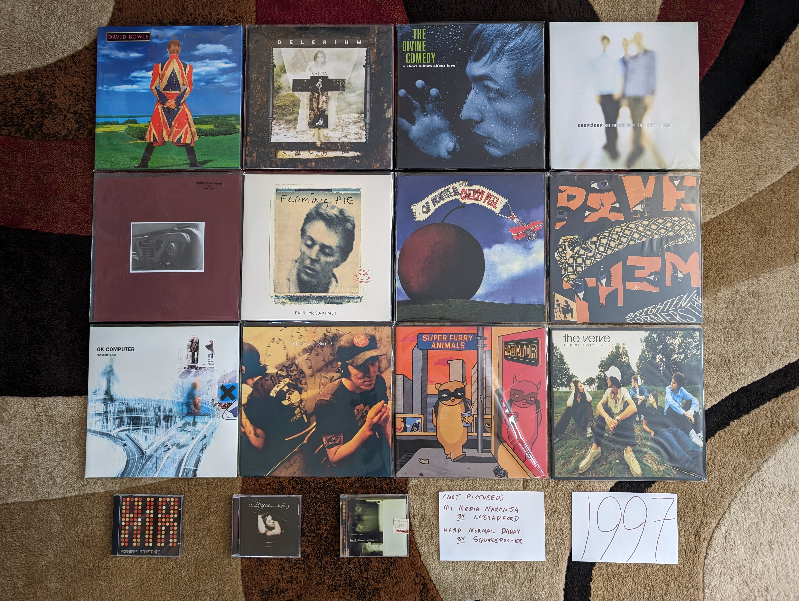

1997
----

I have mentioned this several times, but it is important to know that I worked
on this project starting in 2020 and moving backwards in time. As a result,
milestones were observed in reverse. When I look at the records below, I can see
the influence of three very big factors for the very first time. First, this was
the year that I would have my first jobs that would bring in money that I could
use to purchase albums of my own choosing. Second, I got my drivers license
which allowed me to transport myself to the mall or Best Buy/Circuit City where
I could personally select the music I was interested in. This means for the
first time there are quite a few records on the list that were something that I
purchased with my own money in the year of release.

The third big event was something the whole world was going through at the same
time, the Internet. We didn't yet have MP3s for music discovery, but static
webpages of dial-up and Web 1.0 were a wealth of information about the latest
activity and releases from my favorite artists. We had recently subscribed to
AOL at home, and it opened my eyes to a range of information about pop music and
a variety of other topics.

.. raw:: html

  <iframe style="border-radius:12px" 
  src="https://open.spotify.com/embed/playlist/4gyDMP7YhOyQqP9bXYdLLv?utm_source=generator" 
  width="100%" height="352" frameBorder="0" allowfullscreen="" allow="autoplay; 
  clipboard-write; encrypted-media; fullscreen; picture-in-picture"
  loading="lazy"></iframe>
  
- *Primeirs Symptomes* by **Air** - An EP that serves as a great summary of what
  makes these guys great. Light and pleasant French electronica, with an indie
  rawness that made it sound more warm than slick. [*Memory*: I was aware of
  this disk for years before I got a copy. The physical release was always an
  expensive import, but through the magic of eMusic, I would get a digital copy
  years later, and finally had the complete catalog of this band.]

- *Earthling* by **David Bowie** - I'm proud to say that I have always been a
  fan of 90s Bowie, even when others (even if they wont admit it now) were
  saying he was over the hill. Some of the electronic sounds are dated now, but
  it only adds to the charm. That Bowie magic is still here in a big way.
  "Battle for Britain" is one of my absolute favorites of his without
  qualification. [*Memory*: This brings together two of my biggest interests in
  1997: Bowie and The Internet. Bowie was famously and early advocate for the
  web, and one of the first artists to fully harness its power. I vividly
  remember viewing a RealVideo encoded file at extremely low bitrate of the
  video for the lead single "Little Wonder". The sounds and the technology blew
  my teenage mind.]

- *Karma* by **Delerium** - [**1997 FAVORITE**] - My absolute favorite by these
  guys also happens to be their most widely known. I do enjoy the **Sarah
  McLachlan** fronted mega-hit "Silence" (and the late 90s is the only time
  something like this would be a hit) but my favorite is the stunning "Euphoria
  (Firefly)". The combination of light industrial beats and world music
  exoticism reached a peak on this record. [*Memory*: I remember playing this
  for one of my friends on a drive, and their reaction was: "So this is the kind
  of music you are into now, huh?"]

- *A Short Album About Love* by **The Divine Comedy** - The artist claims to
  have written this album before ever actually being in love, and I think it
  shows. There is something charmingly detached about this collection of love
  songs. A lot of the usual humour ("If") and warmth ("Everybody Knows") that
  would typify the second act for this guy. Probably the beginning of the fully
  mature work for Neil Hannon, and one of his absolute finest moments.
  [*Memory*: When the vinyl reissues came out in 2020, it really made me see the
  whole discography in a new light. I don't know if any album climbed my
  personal ranking more than this one. It really is the kind of thing that needs
  to be listened to in whole, and hits hard in its short running length.]

- *So Much for the Afterglow* by **Everclear** - Music from this era hasn't aged
  very gracefully. Mostly a collection of post-grunge, nu-metal, and pop-punk,
  late 90s rock was a collection of fads that haven't generally stood the test
  of time. The combination of power pop and mature singer songwriter themes on
  display here have held up way better than most of the rock radio favorites of
  the day. Also a pretty killer record from start to finish, which is also a
  rarity for the era. [*Memory*: This is one of the few records from this year's
  list that I was actually into at the time of release. I really enjoyed the radio
  hits, but it was the deep cut "Why I Don't Believe in God" that made this a
  classic album of my teen years. It really connected with where I was at this
  point in my life, and also made me love the banjo as a rock instrument...until
  a bunch of hacks ruined that in the 2010s.]

- *F# A# ∞* by **Godspeed You! Black Emperor** - The start of the journey for
  these guys, and for the genre of chamber, apocalyptic post-rock as well.
  Everything that they continue to do is already fully formed here. I don't come
  back to this one as much, because I feel like the formula was refined in the
  later albums, but I always enjoy it when I do. Perhaps a bit more ambient with
  meandering soundscapes that have been reduced in later efforts, and with a
  generally lighter touch than the crescendo heavy later works. [*Memory*: The
  **Godspeed** records seem to have always been perpetually in print on vinyl,
  and I was able to buy this and complete my catalog of LPs back in the dark
  ages of circa 2009.]

- *Mi  Media Naranja* by **Labradford** - In the 90s and early 2000s, **Ennio
  Morricone** inspired post-rock was a fairly productive sub-genre. A lot of the
  music sounds very much the same, and for me, this is the best product of that
  scene. Moody, vaguely western soundscapes, that sound hopeless and spacious.
  I'm not in the mood for this very often these days, but wow was I about 15-20
  years ago. [*Memory*: This is the kind of record I would have never found
  without the AllMusicGuide. Fairly obscure when I found it, and even more
  obscure today, the AMG article on post-rock considered it a landmark of the
  genre. I'm glad that it pointed me this way.]

- *Flaming Pie* by **Paul McCartney** - In retrospect, this feels like one of
  the most important albums in a very important career. For the first time you can
  hear him coming to terms with his **Beatles** past, and fully engaging with a
  musical future that both considers with what came before, and what lies ahead.
  This was also the last record with the input and presence of his collaborator
  in music and life, Linda. This is where things really started to come
  together, and the brilliant final act of a brilliant musical career had it's
  start. [*Memory*: This was definitely the record I was most excited for at the
  time. I was in the peak of my **Beatles** & **McCartney** fandom, and this was
  the first new release since I had discovered these artists (other than the
  archival "Anthology" and "Live at the BBC" releases). I remember logging into
  the MPL Records website to view the latest posts to the "Flamming Pie Gazette"
  that provided updates on the production of the record. I was so excited to
  hear a short clip of "The World Tonight" in RealVideo format. This record
  invokes nostalgia not just for the music, but also the early web.]

- *Surfacing* by **Sarah McLachlan** - This is one of those records that I
  really enjoy, but wonder if its lasting effect has been negative. Up to this
  point, women's music had been arguably the highlight of 90s pop/rock. The likes
  of **PJ Harvey**, **Tori Amos**, **Alanis** and countless other women were
  making stunning, edgy work that was finding its way to the mainstream against
  all odds. Once the record execs got a look at this lush, pretty record, it
  felt like there was a massive shift in what they were willing to promote. I
  certainly don't want to blame **McLachlan** who is a master at this kind of
  music, but why couldn't it live side by side with all that other really
  awesome stuff that wasn't as easy to fit into the background of TV
  commercials? [*Memory*: I heard "Building a Mystery" for the first time while
  exercising at my physical therapist during a recovery session after breaking
  my left ankle.]

- *Cherry Peel* by **Of Montreal** - Where it all began for Kevin Barnes, it
  sounds stunningly small compared to where he would take his music. A
  collection of good natured, lowfi pop songs with imaginative lyrics and
  melodies, this project was solid from day one. "I can't Stop Your Memory" is a
  tiny masterpiece of retro-pop. It almost sounds like the 1967 **Beatles**
  going back and making music the way they did in 1961. [*Memory*: Thanks to
  eMusic, I probably heard this album years before I otherwise would have. The
  cheap mp3 downloads allowed me to explore obscure back catalog records like
  this one years before streaming made this trivial.]

- *Brighten the Corners* by **Pavement** - A bit more put together than we are
  used to from these guys,  but still had enough of that shambolic magic. That
  said, this is clearly the work of a band and a front man who were starting to
  outgrow their fundamental concept. [*Memory*: About 20 years after the release
  of this record, Spotify radio kept playing the song "Harness Your Hopes" and I
  couldn't figure out why I didn't know the track. Apparently left of this
  album, how in the world did one of the most representatively perfect
  **Pavement** songs not make the track list?]

- *OK Computer* by **Radiohead** - For a significant number of folks, this is
  the best album of the 90s, but it isn't even my top **Radiohead**
  album of the decade. That said, it still is a classic transition record,
  spanning their Britpop roots and the dreary, mixed-genre weirdness to come. I
  feel like the best moments here are the quiet tracks like "Exit Music (For a
  Film)" and "Lucky". A few albums later they would learn to rock out more
  effectively again. [*Memory*: Ironically (given the role they would later play
  in legal downloads) this album reminds me more of the Napster era than any
  other. I wasn't totally ready to buy into these guys as the next big thing,
  but I was happy to download a bunch of their stuff for no money. I now have
  this, and many of their albums, on both CD and vinyl.]

- *Unsound Methods* by **Recoil** - I don't find myself listening to **Alan
  Wilder**'s dark ambient project much these days, but I certainly found it very
  compelling 20 or so years ago. Some of this sounds a bit silly and dated now,
  and not edgy in the way it did back then. The more goth tracks like "Incubus"
  have aged better than the beat poetry based things like "Luscious Apparatus".
  Probably best enjoyed as a late 90s time capsule now. [*Memory*: I got this at
  one of those "used goods" stores that were everywhere in the late 90s. The
  shop (Cash Converters) was often a great source of underrated records by
  popular artists, and obscure gems like this.]

- *Either/Or* by **Elliot Smith** - This is a stunning little collection of
  gentle indie rock tunes. The most beautiful anyone had made sadness sound
  since **Nick Drake**. [*Memory*: Like many folks, I didn't properly get into
  his music until his passing in 2004. It would take me to acquire this
  masterpiece, but it was one of the first bunch of Emusic downloads I made in
  early 2006.]

- *Hard Normal Daddy* by **Squarepusher** - If there was ever a genre I wanted
  more of, it would be whatever this is. This distinctively funky brand of
  break beat laden, jazz-tronica is very unique. This guy is somewhat a genre
  unto himself. That said, the early albums all sound fairly similar, and this
  is far and above the best of the bunch. [*Memory*: I discovered this guy on
  the jazz-tronica show on XM Beyond Jazz, and was able to get his most recent
  work. I knew from the AMG and other sources, this was considered his finest
  work. I would have had to import an expensive CD copy from England on Amazon,
  so this was an early Amazon download for me.]

- *Radiator* by **Super Furry Animals** - Warm and comfy indie rock, with some
  clear links to late 60s **Beatles**-like psych. This gets lumped in with the
  Britpop crowd, but that link is more temporal than musical. A really fun
  record that is quite a breath of fresh air next to the dreary American rock
  music of the day. [*Memory*: Another classic record that I found out about on
  the various music retrospective sites of the early 2000s. Back then you had to
  import CD copies of this kind of thing, and I did.]

- *Urban Hymns* by **The Verve** - Sometimes a song can be too good that it
  overshadows a fantastic album. So it is with "Bitter Sweet Symphony" and this
  record. That song was so ubiquitous in 1997, that all the other gems on this
  album tend to go unremembered. That soaring symphonic sample on "Symphony"
  tends to obscure more subtle mini-masterpieces like "Luck Man", "Sonnet", and
  especially "The Drugs Don't Work". [*Memory*: I was sitting in a high school
  class (Tech Lab 2000) when one of my fellow students put on this CD, and I
  heard "Bitter Sweet Symphony" for the first time. Everyone in the classroom
  loved it. Weeks later I was totally sick of a song that had become massive and
  unavoidable. I never considered buying a copy for myself. I wouldn't pick up
  the disk until a year or two had passed, and I was floored by what I heard.]