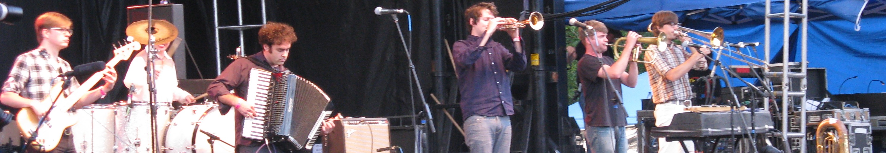
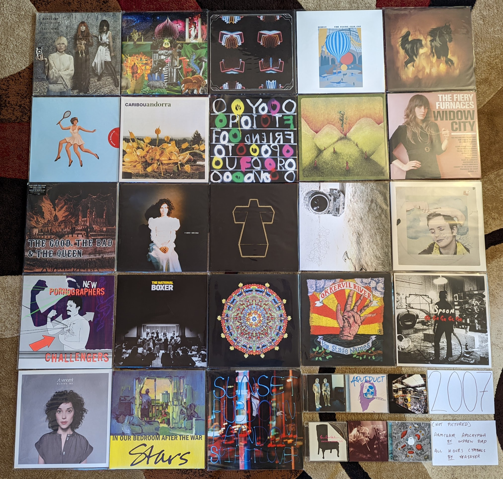

2000s
=====

2000s Overview
--------------

Coming Soon

2000s Stats/Favorites
---------------------

*Section started*: 5 Dec 2021

*Section complete*: TBD

*Latest update*: 05 Aug 2022

*Total Albums*: TBD

*Top Artists*:

TBD

*Favorite album*:

TBD

*Favorite Song*:

TBD

2007
----

I had a sense that when I got to this year, I would have a bit to say in the
introduction text, but didn't anticipate all the topics that would come to mind.
This was a pivotal year for the music industry, and for me as a listener. These
two things are not coincidental. The MP3 had almost a decade to destroy the model
for pop music that had existed since the late 1960s, and at least initially,
what was left in the ashes was wonderful. By 2007, portable media had made the
MP3 a practical means for music consumption in almost all contexts. In
mainstream music, the single was now again king, but album based rock music was
somehow stronger than ever. Digital distribution had raised awareness of indie
acts that in previous decades would have mostly toiled in obscurity and at best
might have been the favorites of music nerds, and then only retrospectively
be discovered by listeners at large. In this era of music blogs, the obscure could
rapidly become ubiquitous, and attention was getting drawn to increasingly
diverse models of what rock music could be.

The way I was consuming music was changing rapidly, but I clung to the old ways
out of nostalgic stubbornness. Like most people my age I had accumulated a
significant and very not-legit collection of MP3s. Around this time in my life,
I started to assemble a legit recreation and expansion of these illicit files. I
was using an expanded pallette of (legal) means to acquire and curate a rapidly
growing collection. This was the golden age of the subscription/buffet pricing
scheme at eMusic, who for a nominal fee (15-20 dollars a month) could provide a
path to 10 or more indie label releases in digital format. At the time, I had
started to buy my first digital albums from Amazon, but digital was eclipsed by
CDs which were still the main way music was fining its way into my collection. I
would visit City Lights records every Tuesday during my lunch break and leave
with a clutch of the latest releases and likely a bunch of catalog titles I had
special ordered. These were the first crys of "the CD is dead" but I wasn't
listening. I kept detailed records of every release that made it into my
collection regardless of format and I know that the first album I bought
(*Hissing Fauna, Are you the Destroyer?* by **Of Montreal**) was the 900th item
cataloged. A full 372 albums later, the 1272nd record (*Weirdo Rippers* by **No
Age**) would be logged, surely the most music I have ever acquired in a single
calendar year.

Most of the music I was listening to was still from years gone by, but I was
listening to more new music than I had ever done before. I have an interesting
artifact from this time, the first comprehensive attempt I ever made at a best
of the year list as a full grown adult. It isn't the final version (unfortunately
lost to time) but an in progress version that I sent to myself via E-mail. I
remember working on this list during my lunch breaks at work during the last
months of the year, and I was sending it home to complete there over the holiday
break. At this point, I owned and could assess 79 different releases! I know
what I considered to be my top 25 records at that time, and 20 of those still
make my modern list. This is a much higher ratio than what would survive from my
2009 favorites (see below), and I think this is a product of my ability to still
listen with a kind of focus that the copious consumption facilitated by digital
streaming would soon destroy.

One of the five records that appeared on that original list of favorites that
doesn't appear on my modern list feels like a case study in everything mentioned
above. *In Rainbows* by **Radiohead** was the first "pay what you want", DRM
free, digital release by a major, internationally famous rock band. Admittedly,
they were a famous rock band that didn't seem very interested in being famous.
At the time I have no doubt that I included it on my list because I thought that
it was an important release, and 15 years later, I am convinced that it is one
of the most important releases there has ever been. That said, it isn't a great
album. Interestingly, as a band that became famous for working in the long form,
it was mostly a miss as a long player. There are some killer singles on there
though, and "Reckoner" is probably my favorite song of all-time from them, and
one of the most beautiful rock songs ever made. It is hard to view this album
separate from the context in which it was released, and I can't of a better way
to summarize where pop music was in 2007 and my relationship with it.

.. raw:: html

  <iframe style="border-radius:12px" 
  src="https://open.spotify.com/embed/playlist/54ilAeceSBVelfhppPOXuw?utm_source=generator&theme=0" 
  width="100%" height="380" frameBorder="0" allowfullscreen="" 
  allow="autoplay; clipboard-write; encrypted-media; fullscreen; picture-in-picture"></iframe>

2008
----

When I look at my favorites I am struck by two things. First, almost the entire
list is comprised of fairly new (at the time) indie acts, with only two "legacy"
artists in **Portishead** and **Steven Wilson** (who was himself a newly minted
solo artist after the end of **Porcupine Tree**). The second thing I notice is
how almost all of these were discovered as they came out and represent what I
was actually listening to in 2008. Only the **Metronomy** and **William
Brittelle** records were retrospective discoveries, and only by a year or two
each. It almost seems like this is the most aligned I would be with what was hot
and "now". This year also has the distinction of being the year that I bought a
turntable and started buying vinyl records (in November). It was here that I
started the practice of buying my favorites on vinyl. Without streaming, new
discoveries were often still made on CD, so I own no less than 11 of the albums
below on both vinyl and CD. If it wasn't on eMusic, I was often getting new
music on the small discs and making the upgrade when something became a
favorite.

.. image:: images/2008.jpg
  :width: 900
  :alt: My 2008 favorite albums

.. raw:: html

  <iframe style="border-radius:12px" 
  src="https://open.spotify.com/embed/playlist/1kaeZR79MxCVk3u5szQcPY?utm_source=generator&theme=0" 
  width="100%" height="380" frameBorder="0" allowfullscreen="" allow="autoplay; clipboard-write; encrypted-media; 
  fullscreen; picture-in-picture"></iframe>

- *Devotion* by **Beach House** - The second (and final) record in their
  original sound before moving to far bigger and more popular sonic territory. I
  do prefer what they would become, but there is a lot to love on these much
  smaller, and more acoustic early songs. They would keep going upwards from
  here, but they were always great. [*Memory*: I saw them on this album cycle
  playing a twin headline show with **The Walkmen** at the TLA in Philadelphia.
  I had a nice chat with Vicky Legrand at the merch booth and shared the memory
  of their issues at their first London show in 2007. She smiled and almost
  yelled: "You saw the worst show ever!" I bought of copy the "Used to Be"
  single as a 45 and when I got home from the 3 hour drive, I listened to the
  sound of what was to come.]

- *William Brittelle* by **Mohair Timewarp** - My point of entry would be his
  concept 2010 concept album, but I would circle back to this weird art rock
  record not long after. A very strange album with extremely strange lyrics. I
  really wish New Amsterdam was releasing music like this. [*Memory*: This
  might end up being the last CD I ever buy. I realized it was one of the few
  albums I didn't own in any format and it wasn't streaming. So I bought a CD
  copy in early 2022.]

- *Half Hours with the Lower Creatures* by **Rachel Taylor Brown** - I'm fairly
  certain 99% of the folks who know about this artist, were introduced via the
  appearance of "Stagg Field" on NPR's "All Songs Considered". I'm not a huge
  fan of the show, but I really have to credit those guys for shining a light on
  some very non-commercial music by an obscure artist who would otherwise get no
  attention. A terrific art rock album. [*Memory*: After hearing this amazing
  record and the follow up in 2009 that I liked even more, I ordered her entire
  back catalog from CD Baby. The rest wasn't that great.]

- *In Ghost Colours* by **Cut Copy** - There were a bunch of bands that were
  making music that referenced an imaginary version of the 80s that never really
  existed, and then there were these guys. This is a wonderful modernization of
  **New Order** or **OMD** for the home recording era. [*Memory*: I totally held
  a vinyl copy of this in my hand at the Pitchfork music festival in 2009. I
  didn't realize how few of them they made, and that it would never get a
  re-issue. This kind of thing would go out of style, and I assume it will never
  be repressed.]

- *Missiles* by **The Dears** - Another great Canadian husband/wife band (why
  are there so many of these?). If **The Arcade Fire** are too subtle for you,
  you can count on these guys. Super over the top, dramatic rock that manages to
  be both kinda stupid and very beautiful. [*Memory*: Around this time I was
  listening to the XM Canadian indie channel called "The Verge" where I
  discovered this band and many other favorites.]

- *Offend Maggie* by **Deerhoof** - Simultaneously one of the heavier and
  quieter albums by one of the most unique acts to come out of millennial indie.
  [*Memory*: I regretted buying this on vinyl at the time, which feels odd to me
  now. It also happens to be one of the more valuable albums I own now.]

- *Microcastle* by **Deerhunter** - This is where the formula came together. All
  the great psychedelic atmospherics were still there, but now we had moments of
  supreme pop songwriting spread throughout. [*Memory*: I was always very
  skeptical of Pitchfork, but man they were right to champion this amazing
  record.]

- *In Ear Park* by **Department of Eagles** - One of those records I like way
  more than almost everyone else. I still like this slightly more than any of
  the albums by Dan Rosen's main band, **Grizzly Bear**. I've always been a
  sucker for this kind of fuzzy, layered production, and the spare piano based
  arrangements really work for this kind of music. [*Memory*: For some reason
  this became a favorite album to listen to while I ran around this time.
  Totally inappropriate to task, this was the soundtrack to many laps around the
  Penn State IM building track.]

- *The Barbarians Move In* by **Duels** - A massive change-up after the UK Indie
  pop of the first record. A moody post-punk record, with moments of orchestral
  rock pomp. The title song is a striking, dirge-like record that makes me
  wonder what happened to these guys between releases [*Memory*: I didn't
  realize until the end of the year that this had come out. There were a few
  reviews on Amazon where folks were calling this a lost classic. They were right.] 

- *4* by **Dungen** - A return to the softer, more melodic side of things.
  Doesn't feature the flute like what came before and after, but still gorgeous
  stuff. [*Melody*: This was around the time the English language imitators
  **Tame Impala** appeared. It really bummed me out that this album was
  overshadowed by second class copycats.]

- *The Seldom Seen Kid* by **Elbow** - The biggest band to come out of 2000s UK
  Indie. They came up with a sound that combined the best points of **Blur**
  style Britpop and classic **Peter Gabriel** style Art Rock. This was the album
  after which they became too big to be Indie any longer. [*Memory*: When this
  album first was getting press, I dismissed it as the next **Coldplay** but I'm
  glad they proved me wrong.]

- *Sleep Well* by **Electric President** - This was the last record that I really
  enjoyed from the minimalist electro-indie pop that was big in the first decade
  of the millennium. Some really great shoegazey post-rocky guitar in this one
  that added a new texture to their sound. A very mellow record with a calm vibe
  that I really enjoy. [*Memory*: This reminds me of the walks that I would take
  during lunch break from work, listening to my latest music acquisitions on my
  old school Sansa 200 MP3 player. This was a nice calm record to put on in the
  middle of stressful day at a startup company.]

- *The Midnight Organ Fight* by **Frightened Rabbit** - The most Scottish of the
  Scottish bands. Such a wonderful folk-punk band with enough UK Indie bombast
  to make a big sound without going over the top. They would never match this
  again, but most bands never make one almost this amazing. [*Memory*: I liked
  this record the first time I heard it, but I didn't really connect with it
  until a trip to LA in late 2008. This was a difficult trip for me, as I
  realized I was growing apart from the group of friends I was traveling with. I
  took the MetroLink train into the city solo to have a look around, and this
  was the soundtrack to my visit.]

- *Into Your Lungs...* by **Hey Rosetta!** - This year was probably the peak of
  Canadian Indie and this was one of the most representative records of the
  scene. So big (but unpretentious), so elegantly produced (but still quaintly
  charming), a remarkable record. Americans can't make music this kind of music
  without sounding like cheeseballs. [*Memory*: This was another record that got
  a ton of play on XM The Verge. Canadian Indie was where it was at in 2008.]

- *Made in the Dark* by **Hot Chip** - The start of a more "serious" turn from
  these guys. This still is slightly goofy dance-pop, but the humor was no
  longer the focus. Still charmingly self-recorded, but the more straight ahead
  themes makes for a more long lasting impact. [*Memory*: I forever get this
  mixed up with the record that would come next (they are both great!) I even
  included this record in the image for both years.]

- *Feed the Animals* by **Girl Talk** - One of the last great outcomes of pop
  music's post modern era. It was also one of the most notable "pay what you
  want" downloads in the post-MP3 era. His best attempt at merging the classic
  rock and hip-hop eras. [*Memory*: Another running playlist regular for me.
  Hard to hear this without thinking about turning laps at Tudek Park in State
  College, PA.]

- *Couples* by **The Long Blondes** - One of the most unjustifiably ignored
  follow up records out there. Just as good as their much loved debut, this
  record probably mostly suffered from a lack of promotion and tour support. My
  favorite band from the pop side of the post punk revival, this band blows away
  **The Yeah, Yeah, Yeahs** in my opinion. It is very sad this would be the end.
  [*Memory*: I was amazed to buy an unopened back-stock original pressing of
  this in 2021, 13 years after release (on Amazon of all places!).]

- *Saturdays = Youth* by **M83** - Looking back, it almost seems like this
  record is the genesis of the entire "imagined 80s" aesthetic that would
  predominate a wide swath of the indie over the next 3-4 years. The chillwave,
  the vaporwave, the other acts that seemed to be imitating a kind of 80s pop
  music that never actually quite existed. Look at that cover, and its
  characters from not quite a John Hughes film. It isn't actually that different
  from what this band had done in the record that preceded it, but it just found
  a focus that anticipated what was to come. [*Memory*: It is hard to think of
  this record without thinking of Hipster Runoff. Our boy Carles also understood
  how important this sound would be to the future direction of indie.]

- *Rabbit Habits* by **Man Man** - This album feels like a straight up
  modernization of the **Captain Beefheart** formula. It is a complete anomaly
  in the indie scene of the day that works really well. [*Memory*: This is the
  last show I would ever see at the State Theater in State College, PA. A great
  venue that would bring a kind of indie show to the town for a short window in
  the last years of the aughts. They didn't have a liquor license at the time,
  but had a great coffee shop. I was so hyped up on caffeine for the show, and
  that was the right state for this music. The headliner was **Cursive**, who
  were awful, and I left after one song.]

- *Nights Out* by **Metronomy** - Unlike most people, I prefer the more poppy
  records to come, but I like this as well. Much like **Hot Chip**, this band
  knows exactly where to find the line between joke band and serious music.
  [*Memory*: I was first attracted to this album by the amazing cover with the
  painting of the guy proudly in front of the first generation Honda Insight.]

- *Oracular Spectacular* by **MGMT** - No band or album exemplifies the
  "mainstreaming of indie" more than what we have here. It deserved to be the
  thing that broke indie to the general public. Fun but smart electronic pop
  music, the kind of thing that appeals to teenagers and music collecting forty
  year olds in equal measure. This is the least weird record this group is
  likely to ever make, and likely the beginning and the end of any wide cultural
  significance. [*Memory*: These guys have always been a major label act, but it
  was the indie music fans who discovered them first. It was shocking to see a
  band like this get such massive attention, but in retrospect the whole thing
  felt calculated by Columbia. The birth of Mindie Rock.]

- *A Thousand Shark's Teeth* by **My Brightest Diamond** - A transitionary
  record between the guitar centered songs she started with, and the very fancy
  chamber pop that was coming next. One of the greatest voices in indie, who
  often doesn't get enough credit for the range and quality of her songwriting.
  I do miss the occasional heaviness she worked into the first two records.
  [*Memory*: The first time I saw Shara live was at Bugjar in 2011, when she was
  still in the guitar focussed configuration of this album cycle. It was quietist
  I have ever seen an audience be while an artist performed at that venue.]

- *Skeletal Lamping* by **Of Montreal** - My opinions of this record have
  evolved significantly over time: starting at disappointing mess, to flawed but
  partially listenable, and today as possibly the best record by one of my
  favorite acts from these days. This collection of micro-songs really needs to
  be listened to all at once. It is also best not to spend too much time
  thinking about the often cringeworthy lyrics, and instead focus on how
  interesting it all sounds. [*Memory*: When this came out, I really thought
  that fame had gone to Kevin Barnes head, and ruined him. It turns out fame did
  go to his head, and created something wonderfully over the top.]

- *Third* by **Portishead** - [**2008 Favorite**] - It seems like this is going
  to be the last album by this legendary band, and I'm happy with this being
  their final and most important statement. There is no other album like this,
  and it arrived as wholely unique in music history. This haunting,
  uncomfortably minimalist electronic music only makes sense when listened to in
  a dark room. The way they deconstruct their own signature sound on "Machine
  Gun" is one of the most unique things a band has ever done. A top 5 favorite
  of mine forever. [*Memory*: This album made it painfully clear to me how bad
  the state of vinyl production was at the time. I bought three copies of it,
  until I was able to assemble a single reasonable copy from discs extracted
  from two different instances of the album.]

- *Rook* by **Shearwater** - Such a beautiful voice, and so much instrumental
  talent in this band. That said, this is the only one of their records that
  doesn't bore me to tears. The significant use of the classic emo quiet/loud
  dynamic is what does it for me I guess. [*Memory*: This was the vinyl album
  that made me realize how good things could be when you got a good pressing.
  For some reason, I was able to get this for like 5 bucks on Overstock.com. It
  was an impulse buy that inspired me to buy my first proper Turntable. I can
  remember clearly hearing the crisp, surface noise free sounds in my tiny
  upstairs room in the Woodycest apartment I shared at the time. I had the
  record on the Technics SL-1200 I still use, and probably will use for the rest
  of my life.]

- *At War With Walls & Mazes* by **Son Lux** - One of those acts that owes their
  career and fame to NPR music. This nerdy electo-hip hop is the kind of thing
  that is ready made for Public Radio. I prefer the proggy sounds that would
  come later with the full band incarnation, but this early recording still has
  much of the sounds that would be perfected in later work. [*Memory*: This
  record holds the distinction of being the first I owned and discovered
  exclusively on the vinyl format.]

- *Soft Airplane* by **Chad Vangaalen** - The weirdest folk rock record I have
  ever heard, and one of the best. The lyrics and music are both completely off
  the wall. I don't feel that he has ever reached these heights again as an
  artist, and it seems like his best effort went into his production of other
  artists from here on out. [*Memory*: Hearing the classic Casio drum machine
  sounds on "TMNT Mask" really took me back to the old SK-1 days.]

- *You & Me* by **The Walkmen** - By far my favorite band to come out of the
  Post Punk revival, they would rapidly transcend that genre and make amazing
  records like this. I love the warm textured sounds, and the over the top
  belting. I saw these guys twice on this tour. If I could go back in time
  to see any band, I would see the Walkmen at this point in their history.
  [*Memory*: I remember sitting in my tiny Rochester apartment as December 2009
  became January 2010 listening to the song "In the New Year". I hatched a plan
  to make a list of my favorite records from the closing decade. I never did
  that properly, but it started the larger project this site represents.]

- *Women* by **Women** - Angular, chaotic post-punk. They almost seem like the
  only band to follow on from **Wire's** late 70s trilogy. They even through in
  a slick pop song in "Black Rice". Stellar stuff, I wish they were able to make
  more than the two albums they left us. [*Memory*: This album was a complete
  impulse buy that I threw in on a vinyl order from the Simply Canadian website.
  I was intimidated by it at first, but the format made me stick with it, and
  I'm glad I did, wow!]

- *Insurgentes* by **Steven Wilson** - Looking back now, his first solo record
  was the biggest deviation from the **Porcupine Tree** sound. It is hard to put
  a finger on exactly what is different, but this is clearly more a product of a
  single person working alone. I think his music has been well served by the
  changes, and alone his music has been more consistent than his band ever was.
  "Significant Other" with its layered ethereal vocals and creepy toy piano is
  probably still my favorite thing from his solo era. [*Memory*: I remember at
  the time reflecting on how this was the last vestiges of my musical past, with
  indie my clear future.]

2009
----

I have been looking forward to this year. That is because in 2009 I spent
a lot of time documenting my favorites of the year, and therefore have a very
detailed understanding of my top records at the time of release. I even went so
far as to make a three disc compilation of my top tracks and distribute to my
friends. It was a throwback to my 1999 compilation (more on that later) and a
way to cap off what was a landmark year for my relationship with contemporary
pop music. That said, looking at the notes I distributed with the mix CDs, I
have to cringe a bit.

.. image:: images/2009_mixes.jpg
  :width: 900
  :alt: notes to my 2009 mix CDs

I sound so young for a 29 year old, but I think my connection to pop music at
the time was making me feel young and I wanted to revel in it a bit. Admittedly,
I would never feel this connected to pop music again. Despite these somewhat
silly notes, I would actually get quite a few positive comments about the mix,
and even received three mixes in response! None of them were as carefully
curated and supplemented with footnotes, but it was nice to hear what other
folks were into at the time. I feel like I could spend a remarkable amount of
time analyzing how I feel now compared to what my impressions were at the time,
but for now I am going to keep this to a simple comparison of my top albums then
and now. Here are the albums that appear in my 2009 top 20 that I no longer
consider to be among my favorites:

- *Mythomania* by **Cryptacise** - (#7) I was really feeling high on this band after
  seeing them at Noise Pop 2009, but my interest really faded as I got away from
  that show. In general that early 60s pop revival stuff hasn't aged great for
  me.
  
- *A Brief History of Love* by **The Big Pink** - (#8) Two killer singles "Dominos"
  and especially "Velvet" made me greatly overate this at the time.

- *Eyes & Eyes & Eyes Ago* by **Nesey Gallons** - (#9) I really was into
  Elephant 6 at the time, and wanted to like the latest artists in the
  collective, even if they weren't up to spec.

- *Up From Below* by **Edward Sharpe and the Magnetic Zeros** - (#12) I
  didn't like their "dirt hipster" image when I saw them live, mostly because of
  my bad experiences with this demographic as as South Wedge resident. Listening
  to this record again with fresh ears, I probably need to give it another
  chance.
  
- *Wolfgang Amadeus Phoenix* by **Phoenix** - (#17) I used to love these guys,
  but listening now I can't understand why. Such generic dance indie.

- *Embryonic* by **The Flaming Lips** - (#18) Totally fine, like most of their
  records. Doesn't feel as interesting after others have done this kind of thing
  much better.

- *The Good Feeling Music of Dent May & His Magnificent Ukulele* by **Dent May**
  - (#20) I was responding to the amazing pop songcraft here, despite the
  annoying ukulele packaging. With his later work, this is inessential. Wish he
  had made a new version of the brilliant "College Town Boy" though.

As for my numbers 21-40, that feels like me stretching to make a list, though I
will comment on a couple that moved up to my favorites when they show up in my
current list.

This was the year I attended my first two music festivals, where I discovered
a ton of music. Also, in the fall I moved to Rochester, NY and had access to
much more live music and four fantastic record stores. It was at one of these,
Lakeshore Record Exchange, that I would buy many of the last CDs in my
collection. This is the last year that CDs will appear in significant number in
my photo of favorites. This was the most involved photo in this whole project to
create. I put a record in there by accident that isn't among my favorites, can
you spot it? I'm certainly not going to go through the process of making it again!

.. image:: images/2009.jpg
  :width: 900
  :alt: My 2009 favorite albums

.. raw:: html

  <iframe 
  src="https://open.spotify.com/embed/playlist/0IPTLmZ3RFsfkUmPdVKZP8?utm_source=generator&theme=0"
  width="100%" height="380" frameBorder="0" allowfullscreen="" allow="autoplay; clipboard-write; 
  encrypted-media; fullscreen; picture-in-picture"></iframe>

- *Ashes Grammar* by **A Sunny Day in Glasgow** - While most of the bands were
  trying to conjure up the sprit of the 80s, these guys were making the kind of
  electronic, vaguely world music sounds that are straight out of the mid-90s. A
  strange little art rock record that it is really hard to compare to anything.
  It manages to be densely complex, and charmingly amateurish at the same time.
  [Memory: I discovered this while perusing the Pitchfork best of 2009 list.
  This really was the best era for that website actually promoting good music.]

- *Abnormally Attracted to Sin* by **Tori Amos** - I wasn't paying very close attention to
  Tori's career when this came out, and didn't really listen to it closely until
  almost a decade later. This is as wild record, where she seems to be trying
  out some of the popular music trends that had transpired during her 20-odd
  years in the industry. "Police Me" is particularly out there sound for Tori,
  and I'm not sure how to describe what it even is. 2007-2009 was the most
  experimental and diverse time in her career. it doesn't all work, but it will
  never stop being interesting. [*Memory*: This was one of the very last CDs I
  ever purchased at a Best Buy.]

- *Merriweather Post Pavilion* by **Animal Collective** - This is one of those
  records that was absolutely huge at the time, but you rarely hear about now.
  It still really holds up pretty well. Kind of a low-fi, electronic *Pet
  Sounds*, I rarely listen to it anymore, but always enjoy when I do. [*Memory*:
  This was one of the first albums I bought in 2009, and one of the first new
  releases I purchased on vinyl. I tried to buy it from Greg at City Lights, but
  he refused to switch back to vinyl. Probably why his store is no longer with
  us.]
  
- *Hospice* by **The Antlers** - As my mix-notes indicate above, this was my
  album of the year at the time. That isn't true anymore, but I still think this
  is a beautiful and haunted set of songs that I'm alway happy hear. However,
  the sullen mood and subject matter is something that I'm generally no seeking
  out. [*Memory*: I saw them play almost the entire album in sequence at
  Pitchfork Music Festival in 2009, and that powerful performance was one of the
  best I have ever seen]

- *Humbug* by **Arctic Monkeys** - I had enjoyed their first two records, but
  for some reason this is where it started to really click for me. They are
  mining the goth sounds that I love here a bit. It is also the album where the
  pop song-craft really started to take form. "Crying Lightning" is a remarkable
  pop-rock song. [*Memory*: When I moved to rochester my record collection had
  started to grow significantly. I remember constructing new record crates to
  store them, sitting on the old green carpet in the entry hall of my tiny attic
  apartment.]

- *Best Rest Forth Mouth* by **Bear in Heaven** - Ah, the era of the percussive
  electronic music. These guys were the best at it, and they didn't even need
  a floor tom guy to make it work. It was refreshing to see bands that were
  working in a synthpop adjacent space, who had no interest in digging up the
  80s. [*Memory*: The lead singer of this band had a great ironic mustache,
  which was the style of the time. Shortly their after, Movember, was developed
  as an excuse for men to grow mustaches again. I would grow a pretty sweet one
  of my own.]
  
- *March of the Zapotec/Holland* by **Beirut** - This collection of two EPs, is
  highly successful in two very different genres. The first, is the typical
  world music, chamber pop this guy is generally making, but with a huge brass
  band. The second is delightful, early 90s techno. The combination works great
  together somehow. [*Memory*: These guys embody the 2000s more than anyone. I
  had to pick a performance by them from Pitchfork 2009 for the banner on this page.]

- *Susan Storm's Ugly Sister and Other Saints and Superheroes* by **Rachel
  Taylor Brown** - Such a cool concept for an album that is done mostly really
  well. Less famous (mostly imaginary, and quite troubled) comic book
  characters, and religious myths (The original superheroes). [*Memory*: I don't
  know if this is true or not, but I remember this CD as the first thing I ever
  ordered online and had delivered to my new home of Rochester.]

- *The Hazards of Love* by **The Decemberists** - This band had been heading
  down a road of fairy tales and prog rock that peaked with with release. Some
  great vocal contributions from Shara Nova of **My Brightest Diamond**. I wish
  it was a little shorter, and would probably come back to it more if it had
  been trimmed down a bit. [*Memory*: There was an amazing full performance
  video of this on YouTube back in the day, I really wish that was still
  available.] 
  
- *Bitte Orca* by **Dirty Projectors** - I don't know that a band has ever done
  more with less technical proficiency (outside of punk music anyway). I don't
  think this record is as intentionally arty as the reviews would have you
  believe. This is a band stretching their skills way beyond the advisable. So
  charmingly amateurish, and somehow it adds up to way more than its individual
  parts. Everyone in this band had a completely untrained voice, and it all
  works.[*Memory*: I was very resistent to this record at first given how rough
  around the edges it is, and how much Pitchfork was pushing it.]

- *The Duckworth Lewis Method* by **The Duckworth Lewis Method** - A very late
  addition that I discovered more than a decade after release. Amazing in the
  way **The Divine Comedy** always is, but with a sense of whimsey that could
  only be produced by a concept album about the sport of cricket. I don't
  understand all the references here, but the examination of Britain's falling
  stature in the game, as an analogy for larger world issues is hard to miss.
  [*Memory*: I listened to this album more than any other in the year of 2021,
  and it even inspired me to research, and learn the rules and strategy of
  cricket so I could understand it better.]

- *Tarot Sport* by **Fuck Buttons** - I think they tried to come up with a new
  genre name for this kind of thing, but looking back it just fits on the
  electronic branch of the post rock tree. Such positive high energy music, I
  used to put this on the end of running playlists to get me home from long
  runs. [*Memory*: This is the first new release that I really had to extend
  effort to get on vinyl. I imported a copy from Amazon UK.]

- *Con Law* by **Generationals** - Remembering back to this era I think of two
  things: Chillwave, and this kind of straightforward, dance-able pop music.
  This first record has a rawness to it that would be sanded off in their later,
  more big-budget releases. They work better in this lower fidelity format.
  [*Memory*: One of the many great bands I saw play to a mostly empty room at
  Bugjar. Those who were there had a great time bopping around to these guys.]

- *Album* by **Girls** - One of my favorite bands of all time, and I pretty much
  love everything they did in their short career. My favorite will always be
  this collection of stunning pop songs. "Hellhole Ratrace" is a remarkable
  story of refusing to give up, and learning to go it alone when there is no one
  else to lean on. [*Memory*: I'm so glad I was able to catch these guys at
  Pitchfork 2010, as they would break up not long after.]
 
- *Veckatimest* by **Grizzly Bear** - This was my point of entry for this band.
  There first couple records didn't connect with me, but there was something
  about the more tightly constructed songs on this album that made me appreciate
  their psych folk sound way more. I can't think of a group with a more
  distinctive sound, and every record since this one has had a very similar
  feel, but I'm not anywhere close to being tired of it. [*Memory*: On one of my
  first extended business trips to Rochester, I remember brining along my newly
  purchased CD of this one. I remember for some reason I was assigned a full
  size pickup as my rental car. I also remember how amazing "Two Weeks" sounded
  the first time I heard it while pulling into the East Henrietta Country Inn
  and Suites.]

- *Here We Go Magic* by **Here We Go Magic** - If you were to strip **Grizzly
  Bear** back to the bare essentials, you would have something like this record.
  The next album, by the full band version of this act would blow this away, but
  there is some real magic in songs like "Fangela". [*Memory*: When I saw this
  band in 2010 I bought a shirt with the cover of this album on it. It had a
  hold in the sleeve, and I never wore it.]

- *Seek Magic* by **Memory Tapes** - This guy always hated being lumped in with
  the Chillwave bands. I can kind of understand why, as this is built from
  mostly very different parts. That said, the highly melodic and psychedelic
  sounds on offer here invoke the same sort of painful nostalgia for a 1980s
  that never existed. "Plain Material" is one of my all time favorite songs, and
  it is hard to hear it without seeing a crowd of wayfarer wearing hipsters
  bopping around in Union Park, Chicago. [*Memory*: At Pitchfork 2009, this
  record was for sale at the same amazing booth that had the Minimal Wave
  compilations. I passed on it, and regretted it for almost a decade. I was
  eventually able to get a vinyl reissue of this one.]

- *Fantasies* by **Metric** - The last great album by one of the great Canadian
  indie bands, in the year that the Canadian renaissance started to wrap up. I
  know they are still out there making music, but this is where it all starts
  sounding the same to me. [*Memory*: This is one of the very first CDs that I
  bought at Lakeshore Record Exchange, the alternative record store a two blocks 
  walk from my new apartment in Rochester, NY.]

- *No More Stories...* by **Mew** - [**2009 FAVORITE**] - Only Scandinavians can
  make this kind of music. So warm and comfy, such catchy pop songs. This isn't
  chillwave, but it is making clear references to same imagined version of the
  1980s. [*Memory*: I wish I knew how much I liked this band so I went to see
  them at Pitchfork 2009 on the B stage.]

- *Wind's Poem* by **Mount Eerie** - Such a heavy, beautiful record. I love how
  it hides all those melodies in that sea of noise. Needs to be listened to at
  high volume full the full impact. [*Memory*: I didn't full appreciate this
  record until I listened to it on a night drive at high volume, from beginning
  to end. The way this should be experienced]

- *The Life of the World to Come* by **Mountain Goats** - For some reason this
  record separates itself from the dozens of others from this guy. It is the
  same kind of self-produced indie folk/punk, but somehow by far my favorite.
  [*Memory*: I liked this record going in, but I loved this record after seeing
  a screening of a performance film of the whole record at Noise Pop 2010.]

- *The Resistance* by **Muse** - I always heard **Queen** when I listened to
  these guys in a way that other folks did not seem to hear. Well after this
  album I think I wasn't the only one. Very over the top, and an exceptional
  hard rock album. [*Memory*: I saw them on the tour for this record in Toronto
  with some work friends.]

- *Psychic Chasms* by **Neon Indian** - This is probably the definitive
  Chillwave record and "Deadbeat Summer" the definitive song in the genre. It
  also illustrates how the low budget production values were an essential part
  of the formula. His later, more refined records just don't hold up to this
  fuzzy, messy masterpiece. [*Memory*: I don't know that any record makes me
  think of my tiny, dingy Park Avenue apartment than this one. I listened to
  this a lot back in those days.]

- *The Pains of Being Pure atHeart* by **The Pains of Being Pure at Heart** -
  There was a massive "Pitchfork backlash" against this one since the site
  seemed to be way more into this than most. That said, they were absolutely
  right, and this kind pop/rock is timeless. I think everyone expected some kind
  of C86 revival, but this is really the only major artifact we got out of it.
  [*Memory*: At the Pitchfork music festival in 2009 I had just heard **The
  Antlers** play on the B stage and I was walking over to the main stages, and I
  heard these guys playing "Stay Alive". I spontaneously starting twirling
  around in a circle as I walked. It was the last time I ever felt young.]

- *You Can Have What You Want* by **Papercuts** - A fuzzy kind of psychedelic
  music that was compatible with, but not directly related to the prevailing
  trends of the time. A great album throughout, but "The Machine WIll Tell Us
  So" is one of my songs of the decade. This record almost fits better in 1999
  than 2009 and it sounds timeless today. [*Memory*: I discovered this band
  opening for *Camera Obscura* at the German House in the Rochester South Wedge.
  I was nervous to walk through an unfamiliar neighborhood carrying my new copy
  of their LP. I now own a house in that very neighborhood.]

- *Real Estate* by **Real Estate** - Making this list it is clear how this was
  the peak of fuzzy psychedelic music. These guys are making really pleasant
  jangly pop, with the fuzz dial turned up to 11. [*Memory*: I didn't get into
  this band until I saw them at a Pitchfork after-show in 2011. I was there to
  see Dent May, but these guys were super impressive live.]

- *Junior* by **Röyksopp** - It was tough to pick a favorite for this year, as I
  was split between the one I picked and this stellar record. Interestingly, I
  didn't even put this on my list of favorite albums I made at the time! I was
  already into this band by 2009, and their ambient classic *Melody AM* was a favorite.
  This album was a shock, as they had transformed into some sort of Scandinavian
  **Daft Punk**. This is stunning electro-pop record, and I wish we had gotten
  more like it. [*Memory*: I held a vinyl copy of this in my hands once. I
  didn't understand how great it was then. I greatly regret not buying it.]

- *Small Black EP* by **Small Black** - Another of the cornerstones of
  Chillwave, this has a timeless sound that has aged really well. "Weird
  Machines" is probably my favorite track from the whole genre. These guys did
  survive the transition to more refined production values pretty well, but I
  still prefer the fuzzy, heavily clipped sound of this record. You can't keep
  making this kind of music forever though. [*Memory*: I saw these guys at
  BugJar some random weeknight and remember being disappointed by how bro-ish
  these guys looked in their athleisure gear and ball caps.]

- *Actor* by **St. Vincent** - A refinement of the sound from her first record,
  and by far my favorite release by the artist. Eccentric bedroom pop with a
  sharp rock edge, made without any notion of stardom or awareness of mass
  popularity. Things would change after this record, in ways I did not care for.
  [*Memory*: I saw her at Noise Pop 2009 (Great American Music Hall) right
  before this came out. It was an outstanding show, and how I will always prefer
  to remember the artist.]

- *Suckers EP* by **Suckers** - I'm not exactly sure how to describe this genre,
  but it falls in the same space as bands like **Yeasayer** or **Menomena**.
  Highly percussive, with meandering instrumental passages, and serious music
  that isn't afraid to be very fun. They didn't last long, but what they made
  was great. [*Memory*: One of the last conversations I had with Greg at City
  Lights Records (State College, PA) was about this record. He knew I was very
  into **MGMT** and **Menomena** and he asked if I had heard the other band on
  the big summer tour (these guys). He spun his CD-R of the EP for me.]

- *The BQE* by **Sufjan Stevens** - Mark this down as one of those records I
  like way more than almost anyone else. An amazing film soundtrack that borders
  on Contemporary Classical, and Sufjan pushing his middle period sound to its
  fullest extreme. This was also gave a preview of the electronic sounds that
  were to come. [*Memory*: I bought this (with a wad of other releases) at
  Lakeshore Record Exchange and listened to them repeatedly as I taught myself
  how to wax my cross-country skiis in the basement lab at my work.]

- *The XX* by **The XX** - A minimalist rock record that was wildly popular at
  the time and that you hear little about today. My personal relationship has a
  similar arc to it. One of my very favorites at the time, but something I
  rarely find myself returning to today. Minimalism is tough. If what little is
  there doesn't have a lot of depth to it, it gets old quick. That said, I have
  to include it, even if my time with it was brief but intense. [*Memory*:
  Hipster Runoff loved to make fun of this record. Carles always had a good
  understanding of what hype records were going to fade a bit over time.]

- *Spirit Animal* by **Zombi** - It was strange to hear this kind of
  instrumental prog rock in the 21st century. It not only exists, but is
  excellent, especially the epic title track. [*Memory*: I discovered this
  album when it was played before a **Dungen** show at Mohawk Place in Buffalo,
  NY. I used the Shazaam music matching service to find it, and immediately
  downloaded from eMusic. I was pleasantly surprized to see these guys play a
  great opening set for **Ghost** half a decade later.]