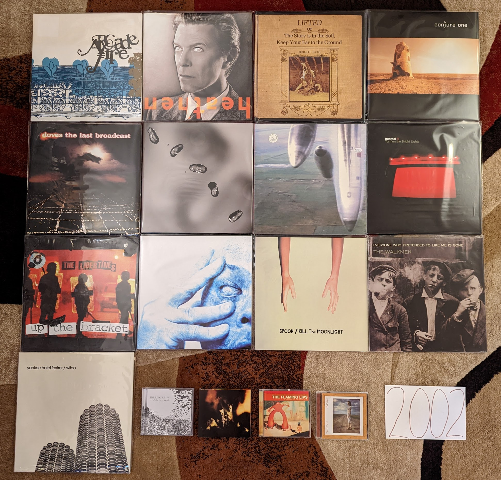

2002
----

This is another interesting inflection point in this project. I'm going through
the years backwards as I write this, and I knew there would come a time where
the majority of my favorites would be retroactive discoveries. It isn't
surprising that this happened in the last full year before paid downloads
changed the way I consumed new music, and satellite radio accelerated my music
discovery. At this point, I had mostly lost interest in mainstream rock and was
only really hearing the latest music from artists that I had a pre-existing
relationship with. The only major place I was hearing new music was online radio
streams like Virgin Radio UK. Looking back on the collection of records below,
this clearly was a landmark year for the burgeoning indie movement. A fair
number of underground scenes were starting to break through, and there are some
legendary records from the artists that would be the face of the movement on
both sides of the Atlantic. 

In 2002 I would move away from home town permanently. As an undergrad, I spent
the summer months at home in Pennsylvania working full time at the company I was
an intern for. At the end of the summer of 2002 I would move back to State
College for grad school, and that would be my home for the next 6 years. My last
year as an intern ended abruptly when I was layed off due to financial problems
at the company. It was less than two weeks before my planned departure anyway,
and I made good use of the extra time. At this point I owned just under 400 releases
on CD, and with the time I had before returning to school, I burned the whole
lot of them to MP3. Working in eight hour shifts, I used my PC to rip discs one
at a time in the days when it took a good 10-15 minutes per disk. Working in 8+
hour shifts, 6 days a week I had a hard drive filled with my entire collection
for the first time. Being able to listen to anything I owned in iTunes was a
game changer, and I was rediscovering and re-evaluating music from my teenage
years. I didn't know it yet, but this was the beginning of the end for the CD,
and the way that I had discovered and consumed music since I was very young.

.. raw:: html

  <iframe style="border-radius:12px" 
  src="https://open.spotify.com/embed/playlist/6tUGb73LKaFWCuGIbNvRrA?utm_source=generator&theme=0" 
  width="100%" height="380" frameBorder="0" allowfullscreen="" allow="autoplay;
  clipboard-write; 
  encrypted-media; fullscreen; picture-in-picture" loading="lazy"></iframe>

- *Arcade Fire* by **The Arcade Fire** - These guys arrived fully formed. While
  it lacks some of the polish their debut LP would have, the spirit and
  songwriting is all here. A stellar EP. [*Memory*: I sought this out after
  buying and loving **Funeral** and it was exciting to know that this young band
  already had more material to enjoy.]

- *Scarlet's Walk* by **Tori Amos** - I saw this as a disappointing turn to
  adult contemporary when it was first released, but have come to enjoy it much
  more over time. This is a mellower, more accessible sound but the songwriting
  and performance is still top notch. Several of her very best songs are on this
  record, in particular the amazing closer "Gold Dust". [*Memory*: The lead
  single "A Sort of Fairytale" was one of the first (perhaps the very first)
  free download of the week I remember from iTunes. Soon thereafter I remember
  seeing the creepy head on a foot video on VH1.]

- *Heathen* by **David Bowie** - A much more successful attempt a the
  neo-classical sound that had started on **Hours** and the aborted **Toy**.
  Looking back, this is the start of the glorious last act to his career. A
  subtle and warm record, the sound of an innovator who is now content but still
  a restless creative. [*Memory*: I heard this for the first time streaming
  Virgin Radio at work in June of 2002. The last record got almost no attention
  in the USA, so this came out of nowhere feeling like his first album since
  **Earthling**.]

- *Lifted..* by **Bright Eyes** - Connor Oberst is one of those artists that
  has may albums that I kinda like, but only one that I love. I think the
  stylistic variety on this one separates it from all the other very indie folk
  heavy albums. The songwriting is just a little extra sharp and the
  production just a little raw in a way that doesn't feel forced like some of
  the later albums. [*Memory*: It is funny to remember that I discovered this
  record by the way of hearing "Lover I Don't Have to Love", since that dark
  keyboard heavy track is not at all representative of the record, or this
  artist in general.]

- *Conjure One* by **Conjure One** - Maybe the single best album that Rhys
  Fulber had been a part of came from this solo project. I really
  dig the world music fusion with a much harder edge than what we typically saw
  in this guy's other work. "Manic Star" is also a fine electronic pop song.
  [*Memory*: I had only just recently discovered **Delerium** and **Front Line
  Assembly** and was bummed to hear that they were splitting up. The hiatus
  didn't last long, and we got a great new project out of it.]

- *The Last Broadcast* by **Doves** - The perfect balance of their early
  post-rock influenced sound, and the later straight ahead indie-rock. This is
  excellently produced, layered rock music with delicate pleasant vocals. The
  intricate "There Goes the Fear" is one of my all-time favorite songs.
  [*Memory*: It is hard to listen to this record and not remember the apartment
  I shared with two other students in my grad school days. I listened to this a
  ton in those days.]

- *Yoshimi Battles the Pink Robots* by **The Flaming Lips** - In general I have
  lost interest in these guys, as their eccentric psych-pop hasn't aged too
  well. That said this loose concept record is still something that I am happy
  to put on every couple years. [*Memory*: I always remember these guys as the
  first of many Pitchfork festival headliners that I was too tired to stay for
  (2009).]

- *Up* by **Peter Gabriel** - All of a sudden there was a new album by this guy,
  and it sounded shockingly contemporary. The aggressive, industrial sounds of
  "Darkness" still managed to also have that magical **Gabriel** atmosphere.
  What he gives up in frequency he more than makes up for with consistency.
  [*Memory*: When writing this 20 years later, I realized for the first time the
  artist's face is visible on the cover in the background.]

- *Yanqui U.X.O.* by **Godspeed You! Black Emperor** - The heaviest record by a
  very heavy post-rock band. The thick guitar noise regularly washes out the
  layered string instruments. "Rockets Fall on Rocket Falls" is their very best.
  [*Memory*: I don't know that I have jammed any song more often on headphones
  than "Rockets Fall on Rocket Falls".]

- *Turn on the Bright Lights* by **Interpol** - Their classic debut still hits
  hard two decades later. A landmark in the post punk revival, this also gives
  an indication of the depth they would show in later records. [*Memory*: I
  bought this record on a whim when I saw it on sale at Best Buy. I remembered
  hearing about them as the next big thing, and had heard their sound compared
  to **Joy Division** who I was starting to become very interested in. This is
  probably my gateway into indie.]

- *Up the Bracket* by **The Libertines** - Much like the US, the early days of
  2000s UK indie was dominated by rough around the edges revivalists. These guys
  feel like a more addled **Clash**. They would never come close to the quality
  of this shambolic debut again. [*Memory*: This was one of my favorite running
  records in the early-mid 2000s, and I turned many laps at the Penn State IM
  building listening to to this.]

- *Riot Act* by **Pearl Jam** - Their transition to mid-tempo aging alt rockers
  was complete. They held it together for one last excellent album before
  becoming very boring. Filled with high quality ballads like "Love Boat
  Captain". [*Memory*: I saw them on this tour in State College, PA and I'm glad
  I had the opportunity to see them before their over the hill days.]

- *In Absentia* by **Porcupine Tree** - At the time this felt like a very heavy
  metal sound. The **Steven Wilson** solo records have in many ways made this
  sound far milder. That said, it is a great semi-prog alt rock record and
  another interesting reinvention for this band. [*Memory*: I had just started
  to listen to them, when they seemed to disappear for a while. After a label
  change they became a much bigger thing in the US, such that I was even able to
  buy this from Columbia House Music Club.]

- *Kill the Moonlight* by **Spoon** - Another solid record that feels like a
  companion piece to **Girls Can Tell**. [*Memory*: I bought this new on vinyl
  at Amoeba records for 12 bucks in 2009. Many I miss those days.]

- *Everyone Who Pretended to Like Me is Gone* by **The Walkmen** [**2002
  Favorite**] - By far their most experimental record was their first. There are
  so many off-kilter rhythmic, structural, and instrumental elements here.
  **Hamilton Leithouser** was bringing it as a belting vocalist from the first
  track. Still a super interesting listen today, especially the eccentric career
  highlights "Wake Up" and "Rue the Day". [*Memory*: Like many people, I first
  heard of these guys when the song "We've Been Had" was used in a long running
  Saturn Ion commercial.]
  
- *Out of the Fierce Parade* by **The Velvet Teen** - They have made quite a bit
  of music since, but their first statement remains the best. Some really
  enjoyable light alternative rock with soaring vocals. [*Memory*: In the early
  days of Sirius radio, the DJs would get a single free pick of their own per
  shift. One of them almost always used this selection on "The Prize Fighter".
  Why not? It is an amazing track.]

- *Yankee, Hotel, Foxtrot* by **Wilco** - Not as revolutionary or experimental
  as it felt back then, but they add enough new elements to their country tinged
  sound to make things quite a bit more interesting. It was a time of great
  interest in "shortwave radio stations" and this is probably the most famous
  reference to them. A pretty great collection of songs, from the folky "Jesus,
  Etc." to the power-pop of "Heavy Metal Drummer". [*Memory*: I dropped the
  record brush on my vinyl copy while dry cleaning. It will always have a few
  pops and cracks on "Poor Places" as a result.]