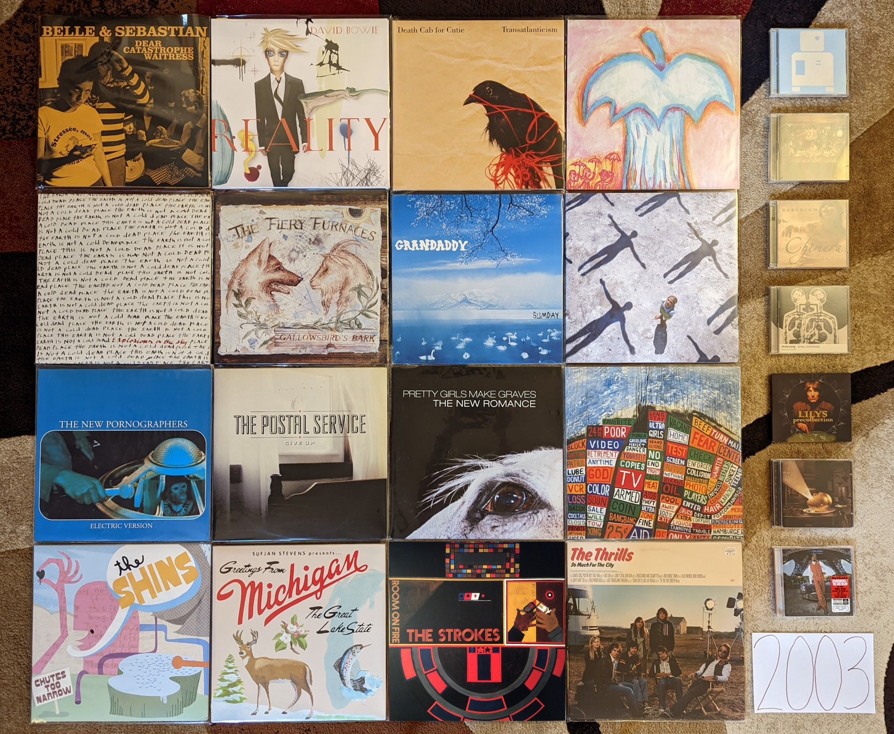

2003
----

Looking at the image below, I see a time that when I think about it seems so
long ago, but somehow also feels like only yesterday. This applies from both a
music/technology standpoint, and my personal life. I remember it
simultaneously like the beginning of the age I still live in, and the fragments of
a very different time.

In 2003 two major changes had come to how I consume music that in some form
persist today. First, I would download the first commercially released digital
music files that would enter my collection. Like almost anyone my age I had used
applications like Napster, KaZaa, WinMX, and Limewire to download music since
the late 90s, but the labels were finally starting to realize they should start
selling the product that young consumers clearly wanted. Interestingly, it was the
McDonald's Monopoly game that would lead me to Apple's nascent iTunes music
store. In the Summer of 2003, the game pieces had a new feature in the form of a
second chance code printed on every game piece. This code could be used to play
an online game for a range of prizes. I forget the details, but somehow I had
worked out the patterns where I was able to receive on nearly every play either:
a free Snapfish digital print (I won hundreds, and still have some to this day)
or a free iTunes download. My total winnings were several dozen downloads that I
would spend on the latest indie hits or back catalog tracks on the store. I was
a poor grad student living in Cleveland for the summer while I worked at NASA
and Micky Ds made a great cheap meal. There were also lots of other folks around
me who weren't exploiting the game that I could get extra game pieces from. What
started humbly, would soon be the primary way me and pretty much everyone else
would acquire music.

The second big change was the introduction of both Sirius and XM satellite
radio. Both services had a soft launch the year before, but 2003 was the start
of the national push. It would be the first major challenge to legacy,
commercial terrestrial radio, and would start a transition that internet radio
and the streaming services would later complete. Shoutcast and other early
internet streaming platforms had introduced me to the idea of expanded and niche
radio playlists, but satellite made this technology professional and put it in
my car. In the summer of 2003, during a visit back to State College on the
weekend break from my responsibilities at NASA, I bought a Sirius plug-and-play
radio at Best Buy. This unit had docking stations that allowed me to listen
either in my vehicle or hooked up to a home stereo. I would quickly discover the
stations Sirius Alt Nation and The Vault. These would expose me to the latest
modern rock hits and semi-obscure classic rock respectively. While I was yet to
discover the Sirius indie channel (Left of Center) there was extensive playlist
crossover, and I was getting dialed into the exciting new developments on
independent labels of the USA, UK, and Canada. What I was hearing an loving on
Sirius was becoming what I spent those harvested iTunes downloads on. The
pipeline of curated, genre programming was motivating digital consumption of new
releases. This system largely persists today, though it is more likely Pandora
or Spotify radio leading to streams on Spotify, Apple Music or YouTube.

This was both the beginning of my independent adulthood, and a time that I can
barely relate to anymore. I was still in school, but I now had a grad student
position that could cover all of my expenses. For part of the year, I was living
in Cleveland, which felt like an exotic far away place, and was the most
distant place from my hometown I had ever spent a significant amount of time.
My newly found financial independence and distance gave me the confidence to
take a major step. Late in 2022, I finally let my family know I wanted nothing
to do with the cult I was raised in. 2003 was the year when I started to work
out what the future was going to be like. In a way, I was starting over as a
young adult. It was a confusing time where I had to find meaning and stability
outside of the harmful organization and limitations I had known before. It was
scary and overwhelming, but more than anything it was incredibly exciting. A
massive weight had been taken off of my shoulders, and I didn't know what I was
going to do next. However, I knew for the first time in my life, right or wrong,
it would be what I wanted to do.

.. raw:: html

  <iframe style="border-radius:12px" 
  src="https://open.spotify.com/embed/playlist/28T0n5LeiB2hE0HkDV9aS3?utm_source=generator&theme=0" 
  width="100%" height="380" frameBorder="0" allowfullscreen="" 
  allow="autoplay; clipboard-write; encrypted-media; fullscreen;
  picture-in-picture" 
  loading="lazy"></iframe>

- *These Are the Vistas* by **The Bad Plus** - I bin the work of these guys into
  two groups, my favorite album (*Suspcious Activity?*) that was unique and
  superior, and the rest. This is the best of the rest. We have the usual mix of
  mostly rock covers, and a few originals. The improvisation is fairly out
  there, but the familiar pop tunes ground the whole thing. The other records in
  the "rest bit" are just like this, just not as good. [*Memory*: This was the
  first record I went out and bought after hearing them on XM Beyond Jazz in
  2006. It was good enough that I went out to get the rest, but with the noted
  exception of *Suspicious Activity?* this would never be topped.]

- *Dear Catastrophe Waitress* by **Bell and Sebastian** - At the time, this was
  a very controversial record. The more polished pop sound offended the fans of
  the earlier chamber folk focussed records. In retrospect, it doesn't feel as
  radical as it was perceived at the time. Yes there is more production here,
  and the songwriting feels a bit more ambitious, but this was more of a gradual
  shift than it was taken to be at the time. In many ways, this is the last
  record by the old version of the band with a few new elements that would point
  to their future form. [*Memory*: This was my point of entry to this band, and
  probably indie pop in general. I remember hearing "Stay Loose" playing on
  Sirius Alt Nation while cooking out on the back deck of my grad school
  apartment. That song (which I loved) was not representative of the album or
  the band in general, but when I did get the album I really liked it as well. I
  would gradually become a fan of pretty much their entire back catalog.]

- *Reality* by **David Bowie** - The third, and probably best of the
  neo-classical Bowie records. A reflective period where the artist was making
  new music that was inspired by, but only tangentially related to his classic
  70s records. A really perfect latter career record, and "Never Get Old" is one
  of his very finest songs of all. [*Memory*: At the time I assumed that he
  would go on forever making excellent records like this every few years, and
  touring regularly. This would be his last record for more than a decade, and
  his last tour ever.]

- *Long Gone Before Daylight* by **The Cardigans** - What happened to these
  guys? They were such a happy pop band, but now they are making sad
  country-esque songs. The singer even went from blonde to full black hair goth.
  It works pretty well though. A really enjoyable, if a subdued and somewhat
  downtrodden record. [*Memory*: I remember listening to this frequently during
  my early days in my first job. I apparently didn't buy this until it had been
  out for a few years.]

- *Transatlanticism* by **Death Cab for Cutie** - I've always wondered how much
  of the breakout success of this record was due to the massive success of the
  **Postal Service** record right before this. That said, Ben Gibbard's primary
  band hit the bit time after this one. This was their last records as an indie
  rock artist, as the majors and the arenas would be waiting. This still stands
  as their finest work, and the lack of perfect polish adds a charm missing in
  their later work. [*Memory*: I don't know that any song is more 2003 than
  "Title and Registration." When I hear all about that glove compartment I'm
  taken back to the world of my 23 year-old self.]

- *Apple O'* by **Deerhoof** - Their early albums are interesting, but a little
  too rough around the edges to be totally listenable. They got things together
  here, and while this still has a serious edge, it always centers itself in a
  way that make it digestible. Lots of wild drumming, heavy guitars, and cutesy
  weirdness. This is the formula that would make for their strongest stretch of
  records. [*Memory*: My vinyl copy of this was a record store day exclusive. I
  miss when RSD was more about the kind of small label artists that need those
  kinds of special releases.]

- *Chimera* by **Delerium** - This is where they started adding more light pop
  elements, and the remaining ambient industrial elements faded a bit. There is
  still enough of their classic period sound here for me to really dig the
  record, but I haven't connected with anything since. It is interesting how
  Kristy Thirsk finishes out the album with the excellent "Returning". She
  started their classic period with "Flowers Become Screens" on *Semantic
  Spaces*, and has book-ended their most successful era. [*Memory*: I had
  totally forgotten about this record and it was one of my big rediscoveries
  while doing the prep work for this list.]

- *The Earth Is Not a Cold Dead Place* by **Explosions in the Sky** - Post-rock
  has fallen out of favor in recent years, and it can be hard to remember this
  was once considered one of the finest records of the decade. It still is one
  of the greatest works in that much maligned genre, and instrumental music that
  manages to be more than a background. It will always be most famous as the
  backdrop to Friday Night Lights, but it is very easy to enjoy all on its own.
  [*Memory*: In 2006 I downloaded many of the key post-rock releases from
  eMusic. This was one of the first I checked out, as much for its reputation as
  for it being 6 tracks long, and eMusic was billing me by the song.]

- *Gallowsbird's Bark* by **The Fiery Furnaces** - Most of what made them great
  is already on display in this debut. The unpredictable, inventive
  instrumentation and structure along with the highly unusual style of
  performance unique to this duo. The songwriting is a little raw and not up to
  the standards of the next few releases. I don't listen to this often, but
  there are a couple great songs here, and a whole lot of potential. [*Memory*:
  I actually didn't like this record that much, but my completionist tendency
  led me to add it to my otherwise complete vinyl catalog of the band. After a
  few listens on the big black disc, my opinion became more favorable. The same
  did not happen with *Rehearsing My Choir*.]

- *Sumday* by **Grandaddy** - The middle record in the outstanding trilogy of
  releases that closed this band's original career is the most subtle of the
  bunch. This is much more like their early releases, mostly comprised of upbeat
  little pop songs accented by electronics. It ends with a moody cluster of
  three tracks which would have fit right in on the prior record, including the
  superb closer "The Final Push to the Sum". [*Memory*: I found out about this record
  trading music with a friend. I loaned her **The Thrills** debut, as a
  California resident I was curious about her opinion of their homage. She
  responded by sharing more authentically California sounds.]

- *Bodysong* by **Jonny Greenwood** - So many folks with a music degree are very
  jealous of the attention **Radiohead**'s guitarist gets for his "Classical"
  style movie scores. This first score proves that the attention was warranted,
  from the beginning. A tremendously interesting soundscape that does the
  screechy violin style contemporary classical better than lots of folks who go
  to school for years to make it. [*Memory*: Sirius Alt Nation used to play some
  pretty out there stuff in the early days. That is where I found out about this
  release. I didn't even realize who the artist was until after I tracked down
  the somewhat obscure CD.]

- *Precollection* by **Lillys** - An interesting combination of their preceding
  Kinks inspired sounds, and 80s psych acts like **Echo and the Bunnymen** and
  **The Church**. In other words designed for me to like. [*Memory*: I heard
  their newest songs on Sirius in 2005, and later found this on discount at
  Mike's Movies and Music. After picking this up, I had to checkout there entire
  diverse catalog. I remember having to import some of the more obscure EPs from
  the UK, for a higher sum than I would typically pay for a CD.]

- *Absolution* by **Muse** [**2003 Favorite**] - This was the album tha finally got some attention
  in the USA, and it is easy to see why. This downplays the progressive elements
  of the last record a bit, and provides something that is a bit more straight
  ahead hard rock. This was the perfect thing for all the folks who listened to
  90s alt-rock, but who weren't digging all the post-grunge of the day.
  [*Memory*: Another Satellite radio discovery. For some reason Sirius ALt
  Nation picked up on this almost a year after it was first released.]

- *Electric Version* by **The New Pornographers** - From a pure pop song
  standpoint, this is their finest moment. A tremendous collection of simple,
  hook laden tunes that do a lot with the same few elements. They had to get a
  bit more complicated from here on out to keep things interesting, but there is
  a real appeal to the simple treats on offer here. [*Memory*: "From Blown
  Speakers" has to be one of the songs that I have listened to the most in my
  life. How many hundreds of times have I listened to that 2:49 of pop
  perfection?]
  
- *Speakerboxxx/The Love Below* by **Outkast** - At times I have wondered if
  this album happened organically or if at some point a decision was made to
  produce a sprawling, divergent double album designed to signal the creative
  parting of the ways. Perhaps a bit of both. Regardless, what we have here is a
  very diverse collection of genres and styles, and the majority are done quite
  well. At this point it is mostly known as the record that produced the
  all-time hit single of "Hey Ya!", but there is a lot more here to like, from
  the wildly creatively and very funky southern hip hop of "The Rooster" to the
  genre bending psychedelic R & B of "Roses" that almost seems to anticipate
  future artists like **Janelle Monae**. [*Memory*: I bought this record at
  Circuit City the day it came out, and the second I heard "Hey Ya!" I knew it
  was going to be a massive hit. Everyone would soon know who **Outkast** were,
  but only a few short years later, they were gone.]

- *Give Up* by **The Postal Service** - A massively influential record that
  spawned dozens of imitation indie-electronic pop acts, most of which were
  terrible. Somehow the brightness and earnestness does not become grating here,
  and what would soon sound tired, is still innovative. It is probably good that
  this project never spawned a second record, as that might have been bad as
  well. What is recorded here though is almost universally brilliant. [*Memory*:
  This record had a really slow rise to prominence. It came out in January of
  2003, and I didn't hear anything of it until I caught "Such Great Heights" on
  Sirius Alt Nation in the summer of that year. I was still early. It wasn't
  until the song appeared in several commercials in 2004 and the movie Garden
  State (yuck!) happened, that this became the indie landmark we think of
  today.]

- *The New Romance* by **Pretty Girls Make Graves** - An outstanding anomaly of
  the post-punk revival that dabbles in new wave and pop-punk songs. It actually
  sounds a bit like music that would be very popular only a few short years
  later. It is a shame that this band has become so obscure over time, this
  really holds up well. [*Memory* Another discovery on Sirius Alt Nation in my
  early days listening to satellite radio. I bought a download of "Something
  Bigger, Something Brighter" but it would take me several years to finally get
  the record. While that is still my favorite song, This is a solid album
  throughout.]
  
- *Hail to the Thief* by **Radiohead** - A less consistent record than what came
  before, but the highs are very high. "2 + 2 = 5" is an especially great song,
  and the last big rocker these guys would ever make. This is where the sleepy
  mid-tempo tunes started to appear in large numbers, and they aren't all as
  interesting as the classic "There, There". [*Memory*: For some reason I
  downloaded the song "There, There" years before I ever heard this record. It
  was one of the first **Radiohead** songs I was really into, and kind of a
  strange point of entry. Maybe it was the recent single of that time?]

- *Chutes Too Narrow* by **The Shins** - A very similar sound to their first
  record, but not quite as good. That said another very pleasing power pop
  record. [*Memory*: "So Says I" was the first track I heard from these guys,
  but when I went out to find the album I had to settle for the first record,
  since it was all I could find at Circuit City that day. I eventually found
  this record at Tower Records in King of Prussia. It is hard to remember the
  days when looking for music was a struggle.]

- *Michigan* by **Sufjan Stevens** - A much smaller, humbler folk record than
  the second (and final) state album *Illinois*. Some very pretty, somber
  music. Listening to this now, this sounds more like the best record from his
  early period, and less like the start of the golden middle career. [*Memory*:
  Every once in a while I will file away a long held memory, about a
  fairly minor event in my life with an accompanying soundtrack. In 2005 I moved
  out of my last college apartment, and got a place of my own. There would no
  longer be bus service regularly to campus. Somehow this finally felt like
  adulthood. I rode the North Artherton bus into central campus to visit the
  engineering library one last time and the instrumental track "Redford" played
  giving this moment a far more profound atmosphere than it probably deserved.]

- *Room On Fire* by **The Strokes** - The sweet spot of this band for me. It
  still has the edgy post-punk sound of their first record, but with more of the
  poppy-ness that would dominate the later releases. The Albert Hammond Jr.
  penned song "Automatic Stop" is my favorite song of theirs. [*Memory*: This
  was the very first thing I discovered on Sirius Satellite radio in 2003. It
  was my gateway to 2000s indie.]

- *So Much for the City* by **The Thrills** - A bunch of sunny pop songs about
  California by a bunch of people from Scotland. A unique concept for a record
  that works out surprisingly well. Both an early specimen of 2000s indie-pop
  and somewhat of a musical anomaly with little to compare it to. [*Memory*:
  After hearing "One Horse Town" on Sirius Alt Nation I went to the local indie
  record store City Lights for the first time to look for a copy. I remember
  going to the counter and the owner telling me he was happy to sell "a nice
  record for a nice price." He would sell me many records in the years ahead.]