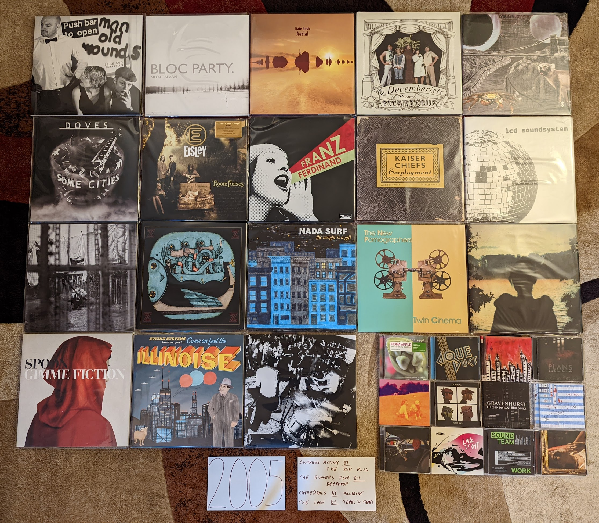

2005 Albums
-----------

I have developed a pattern for how I compile the sections for each year. Around
the time that I start writing for the year I am working on immediately prior
(which is actually the next year, since I am doing this in reverse) I look at my
list for the next year to be addressed (which is actually the year before) and
decide if any changes are required. I also decide if there are any records I
want to seek out on vinyl that I do not currently have, so that they can appear
in the picture. I knew going in that this was the year that I had the lowest
ratio of favorites owned on vinyl, with only just over a third in my collection
as LPs. Then started a surprisingly difficult sub-project to get my vinyl ratio
to 50% for 2005. It took so long that I am starting on the writing well before I
will be able to get a picture, but I did locate some really nice additions to
get myself to my target. Why is the vinyl ratio so low this year? I think the
number one factor is that this is the end of the "vinyl dark ages" when the
format was in full decline, but not enough time has passed for 20 year reissues
and other forces to get these records back in print. I also think that it is
just far enough away from when I started buying records (2008) that these
releases were not fresh in mind, and therefore not on my list to repurchase on
the big discs. Finally, there are a number of legitimately obscure indie records
here that are likely to never see a vinyl reissue.

This is where the acceleration in my music purchasing would begin. In early 2005
I would get my first real job, and one of the places those new found funds would
go are full price CDs from Mikes Movies & Music in State College, PA. I was
mostly looking backwards to explore the music of the past, but I was also
exploring the indie rock of the day with the help of Sirius Left of Center, NPR
Music, and the early music blogs. Access to funds, and the range of means to
discover good new music emboldened me to  This would be the year where I bought
my last CDs from the last remaining record club, Columbia House. It would also
be the last year where no album found a way into my collection digitally.

.. raw:: html

  <iframe style="border-radius:12px" 
  src="https://open.spotify.com/embed/playlist/3qMJLuwCwQSfwfF938Hwlp?utm_source=generator&theme=0" 
  width="100%" height="380" frameBorder="0" allowfullscreen="" 
  allow="autoplay; clipboard-write; encrypted-media; fullscreen; picture-in-picture"></iframe>

- *Extraordinary Machine* by **Fiona Apple** - This album had the strange
  distinction of having leaked in full, in a very different form several years
  before this official release. At the time, I very much preferred the most more
  eccentric, almost mid-period **Tom Waits** sound of the first release, but I
  have warmed up to the official version. What would get released by the label
  was much closer to *When the Pawn...* which happens to be one of my favorite
  records of all time. This is the last album before she destroyed her wonderful
  voice with smoking. [*Memory*: At the time I felt so betrayed by the official
  release that felt like it went against the out there wishes of the artist and
  producer. We now know that at least some portion of the unofficial version was
  made by fans based on an incomplete, in-progress cut.]

- *I Sold Gold* by **Aqueduct** - A lost classic that I feel very fortunate to
  know about. Such a good natured, electro indie-pop record with huge hooks and
  pretty melodies. This guy arrived with a full set of songwriting and home
  production skills. I wish he has made more records. [*Memory*: Every now and
  then Sirius Left of Center would become the champions of a relatively obscure
  record that would get no play or attention anywhere else. I always wondered if
  it was label relationships or DJ preferences that made this happen.
  Regardless, I feel very fortunate to have hear the pop masterpiece "Gowing Up
  With GNR" on the station back in '05.]

- *Suspicious Activity?* by **The Bad Plus** - This live recording is rougher
  around the edges than their other more conventional jazz recordings, and there
  are far fewer "covers". It is also my favorite. These, often wildly
  improvisational, originals are a peak that I don't think they would ever
  replicate again. The opening track "Prehensile Dream" is about as exciting as
  contemporary jazz has ever sounded. [*Memory*: This makes me miss XM Beyond
  Jazz. That is where I discovered this band and album when I heard "Rhinoceros
  Is My Profession" in early 2006. The format of that station made jazz feel
  like a living, still in progress art form.]

- *Push Barman to Open Old Wounds* by **Belle and Sebastian** - Actually an EP
  compilation that covers roughly the decade preceding its release. This was the
  first time I heard any of these tracks, and the originals are deleted from the
  catalog...so this counts as a 2005 record! It is also my favorite release by
  these guys. The spare, simplicity of the early EPs captures the charm of their
  early chamber pop sound better than any of the LPs from the same era. Later
  songs like "Jonathan David" feel like a preview of the 70s pop sounds that
  would soon dominate their releases. [*Memory*: In the early days of collecting
  vinyl, I found an original press of this collection, but I didn't want to pay
  $45 for it at the time. It is absurd to think about this given what records
  cost now, but I would get a chance at a re-press almost a decade later.]

- *Silent Alarm* by **Bloc Party** - A wonderful later work in the post-punk
  revival scene. It follows on well from the UK Indie sounds of the early 2000s,
  and layed down a blueprint for the "mainstream-indie" sound that would sell
  many records in the next decade. These guys were ahead of the new wave revival
  curve in a way that no-one seemed to notice at the time, especially on the
  outstanding "Banquet". [*Memory*: This album got tons of play on both Sirius
  Left of Center, and Alt Nation, the clearest indication of indie's growing
  mainstream relevance.]

- *Broken Social Scene* by **Broken Social Scene** - This Canadian indie
  collective would eventually become too massive and unfocused for me, but this
  record captured them at their peak. This is big music with layers and layers
  of guitars and voices. Tracks like "7/4 (Shoreline)" show how indie-rock could
  work simultaneously as innovative art-rock and easy to enjoy pop. [*Memory*:
  In late 2005 Sirius Satellite Radio would start broadcasting Canadian content,
  including an indie focussed station called "The Verge". This was one of many
  records I discovered there.]

- *Aerial* by **Kate Bush** - I actively resisted this album (and artist) for
  years. This record was massive at the time, particularly with the NPR Music
  set. While I would learn to appreciate her early work in the 2010s, I didn't
  connect with this later album until pandemic times. This is an art rock album
  that is so timeless, it would be impossible to place in any kind of era. More
  of a return to the experimental sounds of her 3rd and 4th records, this leaves
  behind much of the pop accessability of her late 80s peak. I can't think of
  anything more **Kate Bush** than singing the digits of Pi on the song of that
  name. [*Memory*: For several months this was my album of choice, during my
  morning walks in the middle of the COVID19 pandemic. This music has a sense of
  isolation, with a soothing warmth that went well with the mood of that time.]

- *Plans* by **Death Cab For Cutie** - A terrific followup to a massive indie
  success, and a major label debut. The first of many acts who would make this
  transition, and one of the most successful. The production is a  bit sharper,
  but otherwise this fits in well with their earlier work. These are all pretty
  much ballads now, but they have always been their best at their most sappy. I
  lost interest after this record. [*Memory*: One of the positive side effects
  of these guys going to a major was that I could get this at Columbia House
  prices. One of the last discs I would acquire that way.]

- *Picaresque* by **The Decemberists** - This will always be the peak for me.
  The perfect balance of their folky early stuff, and the later more
  progressive, conceptual work. So many whimsical story songs about mariners,
  bagmen, and barrow boys, I don't know that anything else captures the wilful
  dorkiness of 2000s indie rock. I love it. [*Memory*: This song seemed to
  produce an unusually high number of "hit singles". Indie music was everywhere
  in those days, and every song that escaped the limited visibility of college
  radio playlists was a winner. I knew about 5 songs already when I heard "16
  Miliary Wives" on one of those music choice cable channels at a friends dinner
  party. Somehow that was what sold me on these guys.]

- *Green Cosmos* by **Deerhoof** - I think the two releases from this band would
  highlight the two major threads of their sound. This one is maybe the most
  whimsical thing they have produced. A particular kind of childlike weirdness
  runs throughout the album. I mean it starts with a song that commands us to
  "Come See The Duck"! The album is also mostly in Satomi's native Japanese. It
  is filled with keyboard riffs that make the **Fiery Furnaces** look tame by
  comparison. [*Memory*: I don't think I ever heard this before I bought the
  vinyl reissue of it at Lakeshore Record Exchange on my first Record Store Day
  in 2010.] 

- *The Runners Four* by **Deerhoof** - One of the hardest rocking albums they
  have ever made, yet there is always a undercurrent of gentle pop. This one
  always has been a bit too long for me, but the highlights are very high.
  "O'Malley, Former Underdog" is a particular favorite. [*Memory*: At the time,
  eMusic was pricing albums per track. I remember this double album with all the
  short songs feeling a bit spendy under that model, and I put it off for quite
  a while.]

- *Some Cities* by **Doves** - These guys were probably the most consistent act
  to come out of the UK indie scene of the early 2000s. Not quite as good as
  what came immediately before, but still a fine rock record. **Radiohead** had
  brought synths and samples into alt-rock and bands like this took the idea to
  wildly popular places. Like **Coldplay** but actually good. [*Memory*: I had
  been interested in this band for some time due to satellite radio, but had
  never checked out their stuff due to a lack of funds. With funds from my first
  full-time job I was finally able to get their entire back-catalog in 2005,
  when this was the latest release.]

- *Blinking Lights and Other Revelations* by **Eels** - This record felt so huge
  when it came out, but going on two decades later, it has almost completely
  disappeared from public consciousness. It is a very subtle record of subdued
  and very pretty songs that can be easy to forget. It is incredibly enjoyable
  every time I do listen to it. A wide mixture of styles from late 90s style
  alt-rock to piano based ballads, this is a sprawling double album in the
  traditions of the late 60s. [*Memory*: This may be the album I have been
  looking for on vinyl for the longest time. Some day I might just have to pull
  the trigger on one of the expensive copies on discogs.]

- *Room Noises* by **Eisley** - A bunch of weird kids from Texas making major
  key **Radiohead** songs. The three sisters at the center of the group had a
  remarkable combination of voices. This first record has a quaint kind of
  childlike wonder that is really enjoyable. [*Memory*: I was on-board early as
  their early EPs (particularly *Marvelous Things*) got serious play on Sirius
  Left of Center in the summer of 2004. I even used some free download codes I
  saved up from a McDonald's promotion to download that EP from iTunes.]

- *You Could Have it So Much Better* by **Franz Ferdinand** - At the time I was
  a little disappointed that this was so much like their first record, but given
  the change in direction that would come after this, I'm now glad we got one
  more in this style. In many ways the ultimate realization of the post-punk
  revival sound, this could also be seen as the peak of UK Indie. "Walk Away" is
  one of my very favorite songs. [*Memory*: When I was being on-boarded at my
  new job, I saw a CD copy of this on the corner of one of my new colleague's
  desk. It was a good sign.]

- *Demon Days* by **Gorillaz** - While this was certainly the most popular
  project by **Damon Albarn** in the USA, it is far less interesting to me than
  his other projects. That said, this album does more for me than the others
  under this name. I think I am mostly drawn to the minimalist electronic beats
  that point forward to the sound of **The Good, The Bad, and the Queen**.
  [*Memory*: I probably wouldn't have given this a chance except for a
  recommendation that a good friend made during a conversation on AOL Instant
  Messenger. I can't think of a more early 2000s way to hear about a record.]

- *Fires In Distant Buildings* by **Gravenhurst** - A really pretty and somber
  record. An early 2000s take on the slowcore genre with some occasional uptempo
  tracks for contrast. Incredibly beautiful but sad. [*Memory*: I had been
  interested in slowcore for several years, and in late 2005 I had access to the
  early Pandora with its Music Genome Project to explore the genre further. I
  think I found out about this record via a **Red House Painters** seeded
  channel that played the **Kinks** cover "See My Friends".]

- *Employment* by **The Kaiser Chiefs** - It is easy to see these guys as a
  follow-on act to the **Franz Ferdinand** sound, but there are some old time
  rock and roll elements here that give a very different feel. I think how much
  a person is going to enjoy this record is dependent on how they feel about "la
  la la la" style singalong choruses. Leeds UK definitely had a sound in the
  mid-aughts and it pretty much was being drunk in the pub and screaming along
  with the jukebox. [*Memory*: I wish I could remember the sequence of events
  that led me to these guys. I know I saw them at Live 8. I drove through the
  night with one of my co-workers to arrive at the fundraiser concert in
  Philadelphia, and they were the first band on, shortly after noon. The singles
  off of this were certainly getting some serious play on Sirius. I also know
  that I had to import this record before it was commonly available in the USA.
  I just can't remember what order these things happened in.]

- *Not Them, You* by **Lake Trout** - A fusion of post-punk, shoegaze, and
  **Radiohead** style art-rock, it is hard to believe they started out a jazzy
  jam band. In many ways the most representative record of the early 2000s on
  this list, but also one of the most obscure. "Shiny Wrapper" is a stunning
  opener, and the record manages to keep the level high throughout. [*Memory*: I
  found out about these guys when their prior album was shared by a friend at a
  former job, during a CDR exchange. I really miss finding out about new music
  from friends, that never happens anymore as a fully grown adult.]

- *LCD Soundsystem* by **LCD Soundsystem** - The genesis of "indie dance music" and a
  record that both seems more and less important than we thought at the time. I
  don't know that this band was ever the game changer the press made them out to
  be, yet this record definitely showed a generation of Brooklyn bands that the
  indie kids, they want to dance. [*Memory*: One of the first really big buzz
  records from the indie era. The single "Losing My Edge" and copious blog hype
  had set this up for a new kind of indie fame. It was kind of weird for a
  relatively unknown band to launch their first album with a companion disc of
  bonus content.]

- *Chaos and Creation in the Backyard* - A contemporary review of this album
  made the apt observation that the last several records that he had made
  (starting with at least *Flaming Pie*) had been perceived as comeback albums.
  That said, this is where things seemed to stick and he was considered a
  relevant active artist in a way that continues until when I write this (2022).
  I think maybe this is where Paul first realized the direct connections between
  the eccentric pop music he had been making for decades and what the indie kids
  were up to. This album is clearly aware of the connections, and as a result it
  feels of the moment in a way that is remarkable for someone at this point in
  their career. [*Memory*: Paul had always been my favorite Beatle. Suddenly
  after the release of this record, that was no longer uncool.]

- *Live it Out* by **Metric** - I've always preferred the solo stuff by **Emily
  Haines** but there is a lot to like here in the finely produced indie-rock of
  her band. I do miss the edge that these earlier records have, but I'm not
  going to fault them for pursuing the mainstream fame that their increasingly
  slick sound would bring in the years ahead. [*Memory*: One of the first CDs I
  remember buying from Mike's Movies and Music in State College, and one of my
  first discoveries from Sirius 97 The Verge.]

- *Cathedrals* by **Millbrook** - When I think of this EP I realize there must
  be thousands, if not tens of thousands of records I would love, but I will
  never hear. This super obscure record is the perfect combination of Beatles
  pop and early 2000s indie, and I wish there was lots more of this. [*Memory*:
  I discovered this, like I'm sure 99% of the others who know about it, when it
  was featured on NPR All Songs Considered. This was the first time they broke
  something completely obscure, that owes its limited space in the popular
  consciousness to that 30 second segment in a popular weekly podcast.]

- *Z* by **My Morning Jacket** - Alt country was in decline by 2005, and these
  guys were one of the last big names before the genre would become
  unfashionable. This record is already a half step towards the straight ahead
  indie-rock that they, and many of their peers would pivot to in the years
  ahead. The result is their finest work. [*Memory*: NPR All Songs Considered
  was becoming embarrassingly influential on my tastes around this time. I was
  already a big fan of their song "Dancefloors" which was a favorite from my
  early days listening to satellite radio. Hearing "Off the Record" on that NPR
  podcast was what really got me into these guys for a bit.]

- *The Weight is a Gift* by **Nada Surf** - One of the great records that came
  out in the early 2000s from a 90s indie band joining in with the new kids.
  Really great pop songs with jangly guitars. [*Memory*: I found out about these
  guys when I heard the song "Always Love" on the Liquid Todd show on Sirius Alt
  Nation. The show was on at 10 PM to Midnight Saturday night, and was an
  interesting combination of electronic music and indie rock that was very to my
  tastes. I found out about a lot of great things there.]

- *Twin Cinema* by **The New Pornographers** - This was my point of entry for
  this band. In many ways it does the best way of capturing what makes them
  great. The sharp pop songs, the sweet ballads, the wonderful harmonies. More
  than anything it does a great job highlighting the strengths of the three main
  contributors to the songwriting. [*Memory*: This reminds me of the first
  apartment I had after my new job, my first without a roommate. I listened to
  this disc all the time using my home theater DVD player (as was the custom at
  the time).]

- *Deadwing* by **Porcupine Tree** - A return to more proggy sounds after a few
  albums of alt rock, and the most recent album which was on the gentle side of
  metal. That said there are still some hints of the lighter alt mid-tempo alt
  rock in "Lazarus" and the heavier sounds in "Shallow". In many ways this is a
  great summary of why these guys are one of my favorite bands of the last 25
  years. [*Memory*: At the time, this was my favorite album of the year. I tend
  to underestimate how I feel about this one, I really still love it. In fact I
  imported a vinyl copy as I wrote this paragraph. It joins my CD copy, which I
  clearly remember as the first new album I bought after getting my first real
  job in late April 2005. It was great to not feel completely broke anymore.]

- *Work* by **Sound Team** - Another case where a band's first EP is by far
  their finest moment. The rough around the edges post-punk on offer here is far
  more interesting than what would come on their debut LP. "The Fastest Man
  Alive" is still their best song. More post-punk revival bands should have
  featured the organ like these guys and **The Walkmen**. [*Memory*: I bought my
  CD copy of this after seeing them open for **Death Cab for Cutie** at the
  Bryce Jordan Center on the Penn State Campus. I'm glad I did, as this is way
  out of print now.]

- *Gimme Fiction* by **Spoon** - The last of their early albums, and the last
  one with their trademark minimalist sound. Still the ultimate realization of
  piano forward indie rock, with some create guitar accents. Not their most
  consistent record, but still a great listen [*Memory*: The song that led me to
  these guys was "I Turn My Camera On", which I heard on Sirius and immediately
  sought out the record. Interestingly the Krautrock groove that pulled me in is
  not very representative of their other work, which I ended up liking as well.]

- *Illinois* by **Sufjan Stevens** [**2005 Favorite**] - The fanciest folk
  record ever made. Some incredible songs came out of the state based theme, and
  the range of instrumentation and styles is staggering. The band that he
  assembled for this record is something else, and many, many of these folks are
  off doing great things in various projects across the rock and classical
  worlds. It is hard to see this as anything other  than than 2000s indie's
  greatest moment. [*Memory*: This is another highly rated record that I
  resisted for a while because of all the hype. It was the heartbreaking
  "Casimir Pulaski Day" that changed my mind. That story of a deeply religious
  young person questioning their faith after seeing their first love die of
  cancer is one of the very best songs of all time. This album was also highly
  influential in my tastes going forward. I always saw myself a a rock guy, but
  this got me on board with the lighter side of indie.]

- *The Loon* by **Tapes 'n Tapes** - Another band that took the indie post-punk
  revival sound and added some additional, interesting elements. These guys like
  to mess with rhythm, and use heavy distortion on the guitars and vocals in a
  way that isn't psychedelic but edgy. All their work has been very good, but
  this debut is still their top effort. [*Memory*: I always assumed these guys
  were Canadian, given their sound, and they even made a song called "Manitoba".
  Turns out they are from Minnesota. Close enough I guess.]

- *Team Sleep* by **Team Sleep** - Such a cool record. It uses electronics,
  samples, and atmosphere to turn millennial alt-rock into something way more
  interesting. Way better than the primary related band, **Deftones**, I wish
  they made more music for this wonderful side project. Every time I play this
  record, I'm struck by how interesting and enjoyable it is. [*Memory*: This is
  the only time in my life I discovered an album by one of the most cliche ways
  out there. I walked into the State College FYE at the old Nittany Mall, and
  heard this playing in the background. I went up to the counter and asked what
  it was, and they pointed to the jewel case on the counter. I walked out with
  this disc.]

- *Apologies to the Queen Mary* by **Wolf Parade** - This is another of the
  indie bands out of the post-punk revival set who would make progressively more
  complex and diverse music as their albums progress. I much prefer the earlier
  simpler stuff. Admittedly, they started out with some wonderfully eccentric
  pop elements, but it was just enough on this one. [*Memory*: This was one of
  the first records that really directed my attention to the "Canadian
  Renaissance" already in progress. Thanks to Sirius The Verge I was hearing
  this stuff very early. This was the point where it started to feel like only
  our northern neighbors could still make good guitar based indie rock like
  this.]