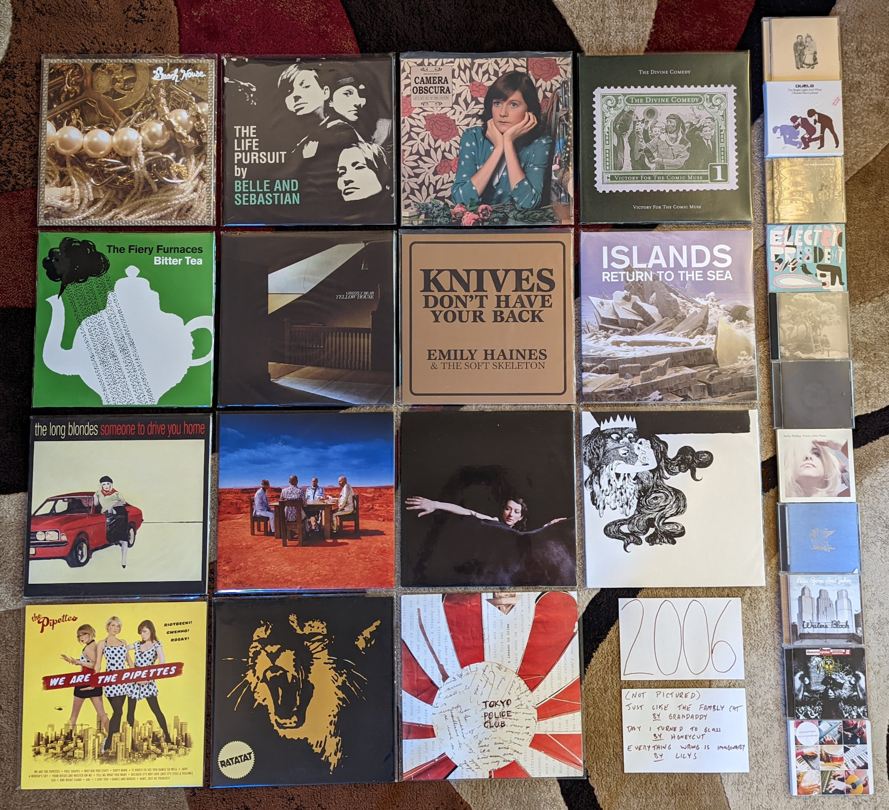

2006
----

When I look at the picture below I'm struck by how many different ways I
discovered these records. Some of these were the latest releases from acts I had
been following for some time, but mostly they were completely new things. There
are songs I heard on Sirius or XM satellite radio. There are things that were
the hot albums on the indie music blogs of the day. There were small indie
releases that were recommended by eMusic. There are 3 (!) albums that I
discovered watching a UK music countdown show, repackaged as cheap filler
content on the obscure US Cable network, HDNet. There is a album with a track I
heard on a iMac commercial. Some of these were the top records on RateYourMusic,
back when tastes were a little different there (more indie and mainstream). I
was still using the AllMusic guide to do genre studies (in this case post-rock).
There is an album I ran out and bought on the drive home from the local brewpub,
where I heard it playing in the background.

This is also the year where I have by far the most releases that I would like
to own on vinyl that I do not. In many cases, these records never saw a vinyl
release, and are obscure enough that one is not likely to ever happen. As a
result, there is quite the unsightly stack-up of CDs on the side of the image.
This almost encapsulates the unsightliness of the CD as a format. The art is too
small to be appreciated, and no matter how well you tried to take care of those
jewel cases they are scratched up and a little cracked. Many of those discs were
bought at City Lights Records, where I had started to shop when my old favorite
store, Mike's Movies and Music had closed. Many came from Amazon, in some cases
imported from the UK (a new practice that I had adopted). One of these CDs, was
imported from the UK by myself personally!

More than anything I'm looking at the image below and feeling powerful waves of
nostalgia. This was the music of my younger self. A person I can relate to, but
no longer completely am. I glad that I can always revisit my former self though
these albums.

.. raw:: html

  <iframe style="border-radius:12px" 
  src="https://open.spotify.com/embed/playlist/4jmNhlF28Q5SmCzP1Eq5yA?utm_source=generator&theme=0" 
  width="100%" height="380" frameBorder="0" allowfullscreen="" 
  allow="autoplay; clipboard-write; encrypted-media; fullscreen;
  picture-in-picture"></iframe>
  
- *Beach House* by **Beach House** - Listening to this is quite startling
  knowing the band they are today. This is a much smaller, slower, and
  meandering record than what they do now. This slight record was certainly
  enough to get me interested back then, and I still really like it today.
  [*Memory*: I found out about these guys as an eMusic recommended artist. I
  remember Greg at city lights being impressed how ahead of the scene I was that
  time. I also remember buying my vinyl copy at Amoeba records in San Francisco
  in 2009 and being surprised that they were making vinyl reissues of relatively
  recent indie records.]

- *The Life Pursuit* by **Belle and Sebastian** - It is hard to remember now,
  but this was a controversial record when it came out. The transition to
  straight ahead pop they had started on their previous record was now complete.
  Everyone missed the half-folk and chamber elements, and it was widely regarded
  as sub-par. I really enjoyed these back to basics pop songs back then, and
  now consider this their finest record. This was also the album when Stevie
  Jackson and Sarah Martin really started to play a larger, and quite welcome
  role in the band. The mix of the three primary vocalists had become the
  signature sound of the band. It was almost like they had become a more twee
  and gentle **New Pornographers**.

- *Let's Get Out Of This Country* by **Camera Obscura** - The Scots understand
  indie pop like no other nation on earth. This might be the finest record in
  the whole genre. Back when hit indie records were a thing, this was one of the
  biggest. Everywhere from Pitchfork, Stereogum, NPR Music, and Spin wanted you
  to listen to this thing. Every service recommended it as a download, and it
  climbed the RateYourMusic charts in a way music like this can't anymore. Holds
  up. [*Memory*: This was the first real concert I attended in Rochester, NY. I
  remember walking down the German house in 2009, and being excited that I could
  see bands like this in the town I lived in. This would be the beginning of
  three great years of shows.]

- *The Crane Wife* by **The Decemberists** - This was the start of a new phase
  for a band that always liked drama, but now were completely centered on
  telling grand stories. A little preview of the proggyness that would fully
  form on the next one, this was still mostly the indie-folk of the first three
  records. This whole record tells a story that I've never been able to follow,
  but it doesn't matter because the songs are so strong. A great guest spot by
  **Laura Veirs** on "Yankee Bayonet" as well. [*Memory*: I remember this being
  voted the top album of 2006 by NPR listeners and feeling a little bit old that
  my tastes aligned with that group. It isn't my favorite from the year any
  longer, but it is close!]

- *Victory of the Comic Muse* by **The Divine Comedy** - After a couple more
  serious records, Neil Hannon allows himself a little levity again. One of the
  very last of his records for me to warm up to, it joins the rest of the
  catalog as a favorite. He is probably the most consistent artist I know of.
  [*Memory*: I think I had only heard this once or twice before buying the
  entire vinyl reissue series.]

- *The Bright Lights and What I Should Have Learned* by **Duels** - A late entry
  in the UK indie scene, it is a mostly guitar based Brit-pop derivative sound
  with a sprinkling of the keyboards the USA kids were getting into. I think it
  was because this sat uncomfortably between UK indie and the contemporary
  mainstream sound that this didn't really find an audience despite being a
  really crisply put together record with some interesting sounds. Weirdly, this
  sounds a bit like the kind of "mindie" music that was about to become very
  widely popular in the USA. [*Memory*: I found out about these guys by watching
  "London Live" a repackaging of a UK countdown show that was filler material
  for an early HDTV channel called HDNet. The performance of  the song "Animal"
  had an really fresh, dance-able sound that seemed to anticipate what was about
  to come in North American Indie.]

- *Tuesday Wonderland* by **Esbjorn Svensson Trio** - In the 2000s jazz
  experienced a new kind of fusion, this time with indie and experimental rock
  music. These guys made several of the most important records in the movement.
  The startling **Radiohead**-esque "Fading Maid Preludium/Postludium" bookends
  a set of music that is only slightly more in line with conventional Piano
  jazz. The releases after this would get a little too difficult for me, and
  this is the one where the balance between artistry and accessability was most
  to my liking. [*Memory*: I was spending so much time looking for music, that a
  fairly obscure record like this one was coming at me from multiple angles. A
  featured album by NPR music, I was also hearing this on the Beyond Jazz
  channel on XM radio. I think one of the reasons I like my favorites so much
  from this era, is that I really picked them from a large number of things I
  had heard.]

- *S/T* by **Electric President** - One of the records that followed on from the
  gentle indie-electronic sound of **The Postal Service**, but this one was much
  slower and more somber. I also like how these guys played around with song
  structure, there are bridges and unexpected transitions everywhere. This was
  really interesting stuff that never found the audience it deserved. [*Memory*:
  I had been a subscriber to Sirius Satellite radio since the summer of 2003,
  and it had become a primary influence on my listening. I had always heard that
  XM had a much wider playlist, but didn't really have a full appreciation until
  I heard some XM jazz programming during an Orange Bowl trip in early 2006. I
  immediately subscribed upon my return, and "Good Morning, Hypocrite" from this
  record was one of the first tracks I heard on their indie station, XMU. I can
  almost still picture that song title in the saved track list on my portable
  XM receiver sitting on the dash of my old Purple Dodge Neon. I miss the old
  XM.]

- *Bitter Tea* by the **Fiery Furnaces** - This is one of those records where I
  never understood the prevailing opinion. Somehow this is perceived to be the
  impenetrably difficult and dense follow-up. If anything this takes the
  experimentation and proggy-ness of **Blueberry Boat** and adds back in the
  strong pop component of the early stuff. Things like "Waiting to Know You" do
  an amazing job balancing the weirdness with the sweetness. I like this record
  way more than 95% of the human population. [*Memory*: This was the time when
  you could buy an unpopular record on vinyl at a steep discount. I don't know
  if I even paid 10 bucks for a nice new copy of this.]

- *Just Like the Fambly Cat* by **Grandaddy** - It took me a while, but I came
  to appreciate the last record from the first tenure of these guys. Some
  serious punk aggression (especially on the hardcore homage "50%") has been
  added to the usual low-key, often downtrodden psych-pop. This would have been
  a great statement to end on, and I haven't liked what has come since nearly as
  much. [*Memory*: I listened to this a lot on headphones around the time I
  lived in my little Park Ave apartment. I still like to crank it through cans
  every now and then. The fuzz sounds great that way.]

- *Yellow House* by **Grizzly Bear** - I didn't like this very much when it
  first came out to great acclaim. I connected much more with the next record,
  which featured far more conventional songs. I think after I had that blueprint
  to follow, I could better appreciate this more abstract work. [*Memory*: This
  was strangely difficult to hear for a massive indie hit. It wasn't on eMusic,
  and I don't recall ever seeing the CD appear at City Lights (or Best Buy). It
  was also out of print on vinyl for a shockingly long time, until I got the
  re-issue that came out in 2022.]

- *Knives Don't Have Your Back* by **Emily Haines** - [**2006 FAVORITE**] - A
  stunning piano based singer-songwriter record, that is completely unlike
  anything else I have ever heard. I really think she saves her very best stuff
  for the rare solo releases, and this outclasses anything from **Metric** by a
  fair margin. The production on this record is quite exceptional as well, and
  the dreamy mix really adds a lot to the impact of the top notch lyrics.
  [*Memory*: I became aware of this album via a post of the excellent video for
  "Doctor Blind" on Pitchfork. The artist is strolling through an empty
  department store in a creepy scene that really complements a fairly profound
  song about the over-prescription of anti-depressants.]

- *The Day I Turned to Glass* by **Honeycut** - A delightful anomaly: hip hop
  influenced indie rock made by a classically trained cellist. I don't think
  this ever found its audience, and I'm not sure it really has much of one. I
  really like it though. Listening today, it sounds a bit ahead of it's time and
  it fits in well with what is going on in the frontier of R&B. [*Memory* I
  discovered this ]

- *Howling Bells* by **Howling Bells** - I had been enjoying this record for the
  better part of a year when someone pointed out to me that it is a bit of a
  country record. They were right. It is dark kind of country made by
  Australians, but country nonetheless. This was back when the Bella Union label
  seemed like it was trending towards some sort of modern day 4AD, and this fits
  right in with that. "Setting Sun" is one of my favorite songs of all time.
  [*Memory*: I really struggled to acquire this record. This was another band I
  discovered on HDNet's "London Live" show. Their performance was a little
  rough, but I liked it enough to DVR it and watch it over and over again. I
  remember waiting for a 2007 US release that didn't happen, and I couldn't find
  a way to import the disc from the UK on Amazon. Eventually I would buy a copy
  from HMV on my first trip to london in March 2007 and hand carry it back to
  the USA myself.]

- *Return to Sea* by **Islands** - I like this even more than the much loved
  **Unicorns** LP, as the more serious tone does it for me. Plenty of whimsey
  still here, but the epic indie-pop of "Swans (Life After Death)" was a welcome
  expansion of the wounds used by that prior band. Even "Rough Gem" manages to
  be silly in a far more epic way. This is big indie-pop. [*Memory*: Another XMU
  discovery, the expanded playlist of my new satellite radio service was
  expanding my music collection.]

- *Silent Shout* by **The Knife** - The kind of music only Scandinavians can
  make properly. Creepy atmospheric, yet highly melodic and certainly not the
  least bit danceable. This is the electronic music of calm reflection in a dark
  room. [*Memory*: This was the first time I can remember resisting a Pitchfork
  hype record out of principle. When I finally relented, it was very clearly an
  amazing record.]

- *Everything Wrong is Imaginary* by **Lilys** - The Elephant6 adjacent band
  from Philly ends on a very high note. The superior of the two records to come
  out of their third phase. The sharply produced shoegazy indie-pop on offer
  puts to shame the myriad of new bands working in this territory at the time.
  [*Memory*: After this record came out I assumed it was the start of a glorious
  comeback for this guy. I didn't realize it was the end.]

- *Someone to Drive You Home* by **The Long Blondes** - Very derivative of the
  long history of post-punk and new wave, but the execution is perfect. In
  retrospect this can almost be seen as the period on the post-punk revival.
  This is where the new wave revival and imaginary 80s began. [*Memory*: I have
  always been unable to process exactly how much I like this record for some
  reason. When it was getting good press back in '06 I was so resistant to it.
  When I reviewed my candidates when making this list, I was tempted to leave it
  off. After half a listen I was rushing off to find a vinyl copy on discogs.]

- *One More Drifter in the Snow* by **Aimee Mann** - Probably my favorite
  Christmas record that isn't *A Charlie Brown Christmas* (which trancends the
  genre for me), a great collection of traditionals and originals. This
  captures the warm but somber mood that I associate with the holiday season,
  much like that jazz classic. [*Memory*: Around 2019 I created a playlist of my
  holiday favorites, and this is the traditional first album on all versions of
  that compilation.]

- *Pretty Little Head* by **Nellie Mckay** - Another double album genre
  experiment, this time on an indie label, where this belongs. Less white girl
  rapping, and what remains is well done. The genres here are more looking back
  on Broadway and cabaret music, with some alt rock thrown in. [*Memory*: One of
  the first records I remember buying on eMusic. It was very surprising to see
  her on an indie, though it certainly made far more sense than this kind of
  thing being on Columbia. I had started using the eMusic platform in 2006 and
  its subscription based buffet was becoming very influential in my tastes.]

- *You Are There* by **Mono** - Post-rock was a very tired scene by 2006, and
  these guys were one of the last great bands to emerge. Somewhere between the
  shimmering guitars of **Explosions in the Sky** and the chaotic strings of
  **Godspeed You! Great Emperor** maybe the last listenable combination of
  elements left to cover. Their finest record, with their definitive track
  "Moonlight". [*Memory*: This album, and particularly the track "Moonlight" was
  one of the great rediscoveries while making this list. I streamed it during a
  morning walk during a review of the albums on the bubble for the year. I
  probably streamed it half a dozen more times that day.]

- *Black Holes and Other Revelations* by **Muse** - This was the record that
  would finally break these guys in America, more due to better promotion than
  any shift in sound or quality. Still very big alt-rock music, with perhaps a
  bit more of the **Queen** style theatrics. The hit "Supermassive Back Hole"
  introduces a funky kind of groove that would hit at the broader template that
  would be used in the next few records. Looking back, this probably was the
  peak of their first era, and it makes me a little sad since I don't like their
  new direction quite as much. [*Memory*: Another time when I got to feel a bit
  ahead of my time thanks to the expanded playlist of satellite radio.]

- *Bring Me the Workhorse* by **My Brightest Diamond** - I became aware of Shara
  Nova through her work with **Sufjan Stevens** and **The Decemberists**, which
  led me to her solo catalog. Her debut is a subdued, and often moody record. At
  times it feels like a gentler, more classically trained **PJ Harvey** album.
  I don't listen to this as much as her later work, but it is still a great one.
  [*Memory*: In the early days of my vinyl collecting, I could still buy back
  stock first pressings of records that weren't big sellers. That is how I got
  this one around 2010.]

- *He Poos Clouds* by **Owen Pallett** - I became aware of this record on the
  Pitchfork best of 2006 list, so I gave it a download on eMusic. They compared
  it to **Andrew Bird**, but aside from the violin, I don't know why. This is
  some very out there, art-rock that is heavily influenced by contemporary
  classical music. I liked bits of it at the time, I love it now. A complex and
  difficult album, and a first class performance and recording. [*Memory*: This
  along with **Shara Nova** was my gateway into contemporary classical. It was
  very sneaky how they got me to accept the complex sounds by wrapping it in pop
  songs.]

- *Writer's Block* by **Peter, Bjorn, and John** - "Hey Google, play the hipster
  whistling song." This was the first time that an indie artist made a song that
  felt like it was designed for commercials. This was the genesis of mainstream
  indie (or mindie as Carles liked to call it). That does nothing to tarnish an
  outstanding indie pop record, and really it only helped to elevate the status,
  and increase the production of great indie-pop records. [*Memory*: I heard
  (the now legendary) "Young Folks" for the first time when it was playing in
  the background of Otto's Pub and Brewery, my hangout at the time. I stopped at
  Best Buy on the way home, hoping to find a CD copy. I came home with what
  would become one of my favorite records of the year.]

- *We Are the Pipettes* by **The Pipettes** - In the mid 2000s, there were
  constantly new genres of indie that were going to be the next big thing, but
  produced a few big records before fading away. "Pre-Beatles pop-music" was
  such an animal, and the 60s girl groups were an obvious place find
  inspiration. In retrospect this does seem like the kind of gimmick that
  wouldn't last long, but what a glorious debut record. They sing in an
  untrained but pure tone that sounds great together. The pop songwriting is
  great, especially on the classic "Pull Shapes". [*Memory*: Yet another band
  that I discovered on HDNet London Live. It was such a surprise to see such an
  out there concept get any attention at all. I remember having Greg at City
  Lights order me a copy of their first US EP, and him asking me "so is this
  like a 60s girl group or something?" Kinda, but not exactly in a way that
  really, really worked for a short time.]

- *Operation: Mindcrime II* by **Queensryche** - What a huge surprise. A sequel
  to one of my favorite albums of all time arrived, and it was far better than I
  could have imagined. A remarkable return to the classic sound of this band, we
  now know it mostly a Geoff Tate solo album. It would have been impossible to
  achieve the same high level of the original, but this is about 75% the
  quality, which is still very, very good. More than anything it takes the story
  to a new place, that somehow makes the first record more interesting from a
  narrative perspective. [*Memory*: I hadn't thought much about these guys in
  years when I heard that this was coming out. Thanks to this record I would
  re-engage with their back-catalog and they would become one of my all-time
  favorites.]

- *In Rainbows* by **Radiohead** - For a long time I saw this album as two
  stunners ("Nude" and "Reckoner") and bunch of filler, but my perception has
  changed. I now can hear this as a whole statement, and it holds up to their
  albums leading up to this one. That said, this is the last one that I truely
  think works as a complete work. My opinion has very much changed on this
  record during the course of this project, and has motivated the most
  significant revision of my personal music narrative to date. [*Memory*: It is
  obviously very difficult to separate this record from how it was released.
  This was the first time a major artist released an entire studio album as a
  "pay what you want" download. Is that why I undervalued it for so many years,
  perhaps. Now it graces my vinyl collection in physical form.]

- *Classics* by **Ratatat** - Instrumental rock that is very much not post-rock,
  this whimsical record is more like the modern **Ventures**. One of those bands
  where every album is very similar, and I only end up caring about their very
  best effort. [*Memory*: In 2007, I went on a bus tour of the Irish
  countryside north of Dublin. I remember a rich doctor was there with his wife
  and adult son who was wearing a Ratatat shirt. Why do I remember this, I don't
  know. I've got nothing else for here.]

- *Hello Everything* by **Squarepusher** - His records had been expanding to
  include more and more elements, and the title of this one seems to recognize a
  peak had been reached. After this he would bite off a bit more than he could
  chew, but the eclecticism works out well here. The jazz influenced electronica
  of "Planetarium" is a particular favorite, and probably the high point for
  this guy. [*Memory*: I found out about this artist on XM Beyond Jazz, where I
  heard "Modern Jazz Guitar". The early XM was a great platform, and while I am
  still a happy customer of the modern SiriusXM, I miss those old stations with
  their edge case genres, and massive, handcrafted playlists.]

- *A Lesson in Crime* by **Tokyo Police Club** - Sometimes a band's first work
  is their best, and in this case it is a 17 minute long EP. The rawness and
  rough edges are a positive here, and it is almost like they ruined themselves
  by started to understand what they were doing. This is pure garage, the sounds
  of kids who don't completely know how to make rock music, but do so pretty
  effectively anyway. The songs are strange and wonderful, particularly the
  charmingly amateurish science fiction of "Citizens of Tomorrow". They would
  never come close to this again. This is my favorite EP of all time. [*Memory*:
  I saw the band play an opening set as "the next big thing" in a packed to the
  gills basement club in Temple Bar Dublin. They played the EP in sequence and
  nothing more. They pulled a girl up from the crowd to sing the one line of
  female vocals from "Nature of the Experiment". A buzz band at their peak, and
  I was glad to be there.]