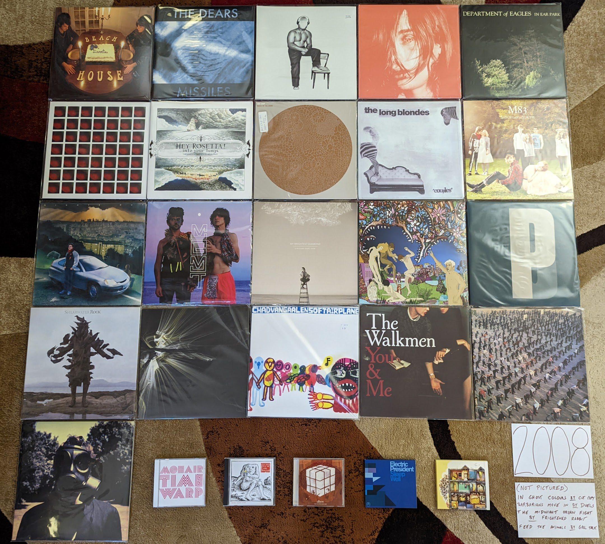

2008 Albums
-----------

When I look at my favorites I am struck by two things. First, almost the entire
list is comprised of fairly new (at the time) indie acts, with only two "legacy"
artists in **Portishead** and **Steven Wilson** (who was himself a newly minted
solo artist after the end of **Porcupine Tree**). The second thing I notice is
how almost all of these were discovered as they came out and represent what I
was actually listening to in 2008. Only the **Metronomy** and **William
Brittelle** records were retrospective discoveries, and only by a year or two
each. It almost seems like this is the most aligned I would be with what was hot
and "now". This year also has the distinction of being the year that I bought a
turntable and started buying vinyl records (in November). It was here that I
started the practice of buying my favorites on vinyl. Without streaming, new
discoveries were often still made on CD, so I own no less than 11 of the albums
below on both vinyl and CD. If it wasn't on eMusic, I was often getting new
music on the small discs and making the upgrade when something became a
favorite.

.. raw:: html

  <iframe style="border-radius:12px" 
  src="https://open.spotify.com/embed/playlist/1kaeZR79MxCVk3u5szQcPY?utm_source=generator&theme=0" 
  width="100%" height="380" frameBorder="0" allowfullscreen="" allow="autoplay; clipboard-write; encrypted-media; 
  fullscreen; picture-in-picture"></iframe>

- *Devotion* by **Beach House** - The second (and final) record in their
  original sound before moving to far bigger and more popular sonic territory. I
  do prefer what they would become, but there is a lot to love on these much
  smaller, and more acoustic early songs. They would keep going upwards from
  here, but they were always great. [*Memory*: I saw them on this album cycle
  playing a twin headline show with **The Walkmen** at the TLA in Philadelphia.
  I had a nice chat with Vicky Legrand at the merch booth and shared the memory
  of their issues at their first London show in 2007. She smiled and almost
  yelled: "You saw the worst show ever!" I bought of copy the "Used to Be"
  single as a 45 and when I got home from the 3 hour drive, I listened to the
  sound of what was to come.]

- *Mohair Timewarp* by **William Brittelle** - My point of entry would be his
  concept 2010 concept album, but I would circle back to this weird art rock
  record not long after. A very strange album with extremely strange lyrics. I
  really wish New Amsterdam was releasing music like this. [*Memory*: This
  might end up being the last CD I ever buy. I realized it was one of the few
  albums I didn't own in any format and it wasn't streaming. So I bought a CD
  copy in early 2022.]

- *Half Hours with the Lower Creatures* by **Rachel Taylor Brown** - I'm fairly
  certain 99% of the folks who know about this artist, were introduced via the
  appearance of "Stagg Field" on NPR's "All Songs Considered". I'm not a huge
  fan of the show, but I really have to credit those guys for shining a light on
  some very non-commercial music by an obscure artist who would otherwise get no
  attention. A terrific art rock album. [*Memory*: After hearing this amazing
  record and the follow up in 2009 that I liked even more, I ordered her entire
  back catalog from CD Baby. The rest wasn't that great.]

- *In Ghost Colours* by **Cut Copy** - There were a bunch of bands that were
  making music that referenced an imaginary version of the 80s that never really
  existed, and then there were these guys. This is a wonderful modernization of
  **New Order** or **OMD** for the home recording era. [*Memory*: I totally held
  a vinyl copy of this in my hand at the Pitchfork music festival in 2009. I
  didn't realize how few of them they made, and that it would never get a
  re-issue. This kind of thing would go out of style, and I assume it will never
  be repressed.]

- *Missiles* by **The Dears** - Another great Canadian husband/wife band (why
  are there so many of these?). If **The Arcade Fire** are too subtle for you,
  you can count on these guys. Super over the top, dramatic rock that manages to
  be both kinda stupid and very beautiful. [*Memory*: Around this time I was
  listening to the XM Canadian indie channel called "The Verge" where I
  discovered this band and many other favorites.]

- *Offend Maggie* by **Deerhoof** - Simultaneously one of the heavier and
  quieter albums by one of the most unique acts to come out of millennial indie.
  [*Memory*: I regretted buying this on vinyl at the time, which feels odd to me
  now. It also happens to be one of the more valuable albums I own now.]

- *Microcastle* by **Deerhunter** - This is where the formula came together. All
  the great psychedelic atmospherics were still there, but now we had moments of
  supreme pop songwriting spread throughout. [*Memory*: I was always very
  skeptical of Pitchfork, but man they were right to champion this amazing
  record.]

- *In Ear Park* by **Department of Eagles** - One of those records I like way
  more than almost everyone else. I still like this slightly more than any of
  the albums by Dan Rosen's main band, **Grizzly Bear**. I've always been a
  sucker for this kind of fuzzy, layered production, and the spare piano based
  arrangements really work for this kind of music. [*Memory*: For some reason
  this became a favorite album to listen to while I ran around this time.
  Totally inappropriate to task, this was the soundtrack to many laps around the
  Penn State IM building track.]

- *The Barbarians Move In* by **Duels** - A massive change-up after the UK Indie
  pop of the first record. A moody post-punk record, with moments of orchestral
  rock pomp. The title song is a striking, dirge-like record that makes me
  wonder what happened to these guys between releases [*Memory*: I didn't
  realize until the end of the year that this had come out. There were a few
  reviews on Amazon where folks were calling this a lost classic. They were right.] 

- *4* by **Dungen** - A return to the softer, more melodic side of things.
  Doesn't feature the flute like what came before and after, but still gorgeous
  stuff. [*Melody*: This was around the time the English language imitators
  **Tame Impala** appeared. It really bummed me out that this album was
  overshadowed by second class copycats.]

- *The Seldom Seen Kid* by **Elbow** - The biggest band to come out of 2000s UK
  Indie. They came up with a sound that combined the best points of **Blur**
  style Britpop and classic **Peter Gabriel** style Art Rock. This was the album
  after which they became too big to be Indie any longer. [*Memory*: When this
  album first was getting press, I dismissed it as the next **Coldplay** but I'm
  glad they proved me wrong.]

- *Sleep Well* by **Electric President** - This was the last record that I really
  enjoyed from the minimalist electro-indie pop that was big in the first decade
  of the millennium. Some really great shoegazey post-rocky guitar in this one
  that added a new texture to their sound. A very mellow record with a calm vibe
  that I really enjoy. [*Memory*: This reminds me of the walks that I would take
  during lunch break from work, listening to my latest music acquisitions on my
  old school Sansa 200 MP3 player. This was a nice calm record to put on in the
  middle of stressful day at a startup company.]

- *The Midnight Organ Fight* by **Frightened Rabbit** - The most Scottish of the
  Scottish bands. Such a wonderful folk-punk band with enough UK Indie bombast
  to make a big sound without going over the top. They would never match this
  again, but most bands never make one almost this amazing. [*Memory*: I liked
  this record the first time I heard it, but I didn't really connect with it
  until a trip to LA in late 2008. This was a difficult trip for me, as I
  realized I was growing apart from the group of friends I was traveling with. I
  took the MetroLink train into the city solo to have a look around, and this
  was the soundtrack to my visit.]

- *Into Your Lungs...* by **Hey Rosetta!** - This year was probably the peak of
  Canadian Indie and this was one of the most representative records of the
  scene. So big (but unpretentious), so elegantly produced (but still quaintly
  charming), a remarkable record. Americans can't make music this kind of music
  without sounding like cheeseballs. [*Memory*: This was another record that got
  a ton of play on XM The Verge. Canadian Indie was where it was at in 2008.]

- *Made in the Dark* by **Hot Chip** - The start of a more "serious" turn from
  these guys. This still is slightly goofy dance-pop, but the humor was no
  longer the focus. Still charmingly self-recorded, but the more straight ahead
  themes makes for a more long lasting impact. [*Memory*: I forever get this
  mixed up with the record that would come next (they are both great!) I even
  included this record in the image for both years.]

- *Feed the Animals* by **Girl Talk** - One of the last great outcomes of pop
  music's post modern era. It was also one of the most notable "pay what you
  want" downloads in the post-MP3 era. His best attempt at merging the classic
  rock and hip-hop eras. [*Memory*: Another running playlist regular for me.
  Hard to hear this without thinking about turning laps at Tudek Park in State
  College, PA.]

- *Couples* by **The Long Blondes** - One of the most unjustifiably ignored
  follow up records out there. Just as good as their much loved debut, this
  record probably mostly suffered from a lack of promotion and tour support. My
  favorite band from the pop side of the post punk revival, this band blows away
  **The Yeah, Yeah, Yeahs** in my opinion. It is very sad this would be the end.
  [*Memory*: I was amazed to buy an unopened back-stock original pressing of
  this in 2021, 13 years after release (on Amazon of all places!).]

- *Saturdays = Youth* by **M83** - Looking back, it almost seems like this
  record is the genesis of the entire "imagined 80s" aesthetic that would
  predominate a wide swath of the indie over the next 3-4 years. The chillwave,
  the vaporwave, the other acts that seemed to be imitating a kind of 80s pop
  music that never actually quite existed. Look at that cover, and its
  characters from not quite a John Hughes film. It isn't actually that different
  from what this band had done in the record that preceded it, but it just found
  a focus that anticipated what was to come. [*Memory*: It is hard to think of
  this record without thinking of Hipster Runoff. Our boy Carles also understood
  how important this sound would be to the future direction of indie.]

- *Rabbit Habits* by **Man Man** - This album feels like a straight up
  modernization of the **Captain Beefheart** formula. It is a complete anomaly
  in the indie scene of the day that works really well. [*Memory*: This is the
  last show I would ever see at the State Theater in State College, PA. A great
  venue that would bring a kind of indie show to the town for a short window in
  the last years of the aughts. They didn't have a liquor license at the time,
  but had a great coffee shop. I was so hyped up on caffeine for the show, and
  that was the right state for this music. The headliner was **Cursive**, who
  were awful, and I left after one song.]

- *Nights Out* by **Metronomy** - Unlike most people, I prefer the more poppy
  records to come, but I like this as well. Much like **Hot Chip**, this band
  knows exactly where to find the line between joke band and serious music.
  [*Memory*: I was first attracted to this album by the amazing cover with the
  painting of the guy proudly in front of the first generation Honda Insight.]

- *Oracular Spectacular* by **MGMT** - No band or album exemplifies the
  "mainstreaming of indie" more than what we have here. It deserved to be the
  thing that broke indie to the general public. Fun but smart electronic pop
  music, the kind of thing that appeals to teenagers and music collecting forty
  year olds in equal measure. This is the least weird record this group is
  likely to ever make, and likely the beginning and the end of any wide cultural
  significance. [*Memory*: These guys have always been a major label act, but it
  was the indie music fans who discovered them first. It was shocking to see a
  band like this get such massive attention, but in retrospect the whole thing
  felt calculated by Columbia. The birth of Mindie Rock.]

- *A Thousand Shark's Teeth* by **My Brightest Diamond** - A transitionary
  record between the guitar centered songs she started with, and the very fancy
  chamber pop that was coming next. One of the greatest voices in indie, who
  often doesn't get enough credit for the range and quality of her songwriting.
  I do miss the occasional heaviness she worked into the first two records.
  [*Memory*: The first time I saw Shara live was at Bugjar in 2011, when she was
  still in the guitar focussed configuration of this album cycle. It was quietist
  I have ever seen an audience be while an artist performed at that venue.]

- *Skeletal Lamping* by **Of Montreal** - My opinions of this record have
  evolved significantly over time: starting at disappointing mess, to flawed but
  partially listenable, and today as possibly the best record by one of my
  favorite acts from these days. This collection of micro-songs really needs to
  be listened to all at once. It is also best not to spend too much time
  thinking about the often cringeworthy lyrics, and instead focus on how
  interesting it all sounds. [*Memory*: When this came out, I really thought
  that fame had gone to Kevin Barnes head, and ruined him. It turns out fame did
  go to his head, and created something wonderfully over the top.]

- *Third* by **Portishead** - [**2008 Favorite**] - It seems like this is going
  to be the last album by this legendary band, and I'm happy with this being
  their final and most important statement. There is no other album like this,
  and it arrived as wholely unique in music history. This haunting,
  uncomfortably minimalist electronic music only makes sense when listened to in
  a dark room. The way they deconstruct their own signature sound on "Machine
  Gun" is one of the most unique things a band has ever done. A top 5 favorite
  of mine forever. [*Memory*: This album made it painfully clear to me how bad
  the state of vinyl production was at the time. I bought three copies of it,
  until I was able to assemble a single reasonable copy from discs extracted
  from two different instances of the album.]

- *Rook* by **Shearwater** - Such a beautiful voice, and so much instrumental
  talent in this band. That said, this is the only one of their records that
  doesn't bore me to tears. The significant use of the classic emo quiet/loud
  dynamic is what does it for me I guess. [*Memory*: This was the vinyl album
  that made me realize how good things could be when you got a good pressing.
  For some reason, I was able to get this for like 5 bucks on Overstock.com. It
  was an impulse buy that inspired me to buy my first proper Turntable. I can
  remember clearly hearing the crisp, surface noise free sounds in my tiny
  upstairs room in the Woodycest apartment I shared at the time. I had the
  record on the Technics SL-1200 I still use, and probably will use for the rest
  of my life.]

- *At War With Walls & Mazes* by **Son Lux** - One of those acts that owes their
  career and fame to NPR music. This nerdy electo-hip hop is the kind of thing
  that is ready made for Public Radio. I prefer the proggy sounds that would
  come later with the full band incarnation, but this early recording still has
  much of the sounds that would be perfected in later work. [*Memory*: This
  record holds the distinction of being the first I owned and discovered
  exclusively on the vinyl format.]

- *Soft Airplane* by **Chad Vangaalen** - The weirdest folk rock record I have
  ever heard, and one of the best. The lyrics and music are both completely off
  the wall. I don't feel that he has ever reached these heights again as an
  artist, and it seems like his best effort went into his production of other
  artists from here on out. [*Memory*: Hearing the classic Casio drum machine
  sounds on "TMNT Mask" really took me back to the old SK-1 days.]

- *You & Me* by **The Walkmen** - By far my favorite band to come out of the
  Post Punk revival, they would rapidly transcend that genre and make amazing
  records like this. I love the warm textured sounds, and the over the top
  belting. I saw these guys twice on this tour. If I could go back in time
  to see any band, I would see the Walkmen at this point in their history.
  [*Memory*: I remember sitting in my tiny Rochester apartment as December 2009
  became January 2010 listening to the song "In the New Year". I hatched a plan
  to make a list of my favorite records from the closing decade. I never did
  that properly, but it started the larger project this site represents.]

- *Women* by **Women** - Angular, chaotic post-punk. They almost seem like the
  only band to follow on from **Wire's** late 70s trilogy. They even through in
  a slick pop song in "Black Rice". Stellar stuff, I wish they were able to make
  more than the two albums they left us. [*Memory*: This album was a complete
  impulse buy that I threw in on a vinyl order from the Simply Canadian website.
  I was intimidated by it at first, but the format made me stick with it, and
  I'm glad I did, wow!]

- *Insurgentes* by **Steven Wilson** - Looking back now, his first solo record
  was the biggest deviation from the **Porcupine Tree** sound. It is hard to put
  a finger on exactly what is different, but this is clearly more a product of a
  single person working alone. I think his music has been well served by the
  changes, and alone his music has been more consistent than his band ever was.
  "Significant Other" with its layered ethereal vocals and creepy toy piano is
  probably still my favorite thing from his solo era. [*Memory*: I remember at
  the time reflecting on how this was the last vestiges of my musical past, with