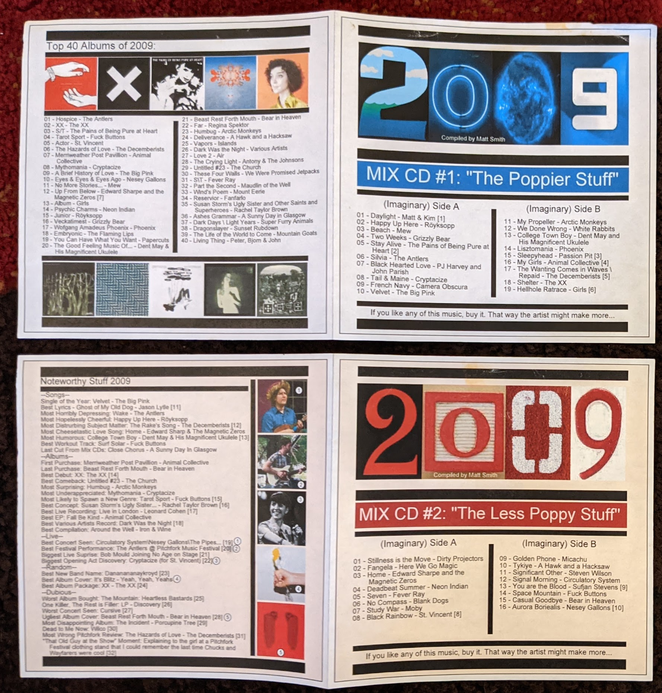
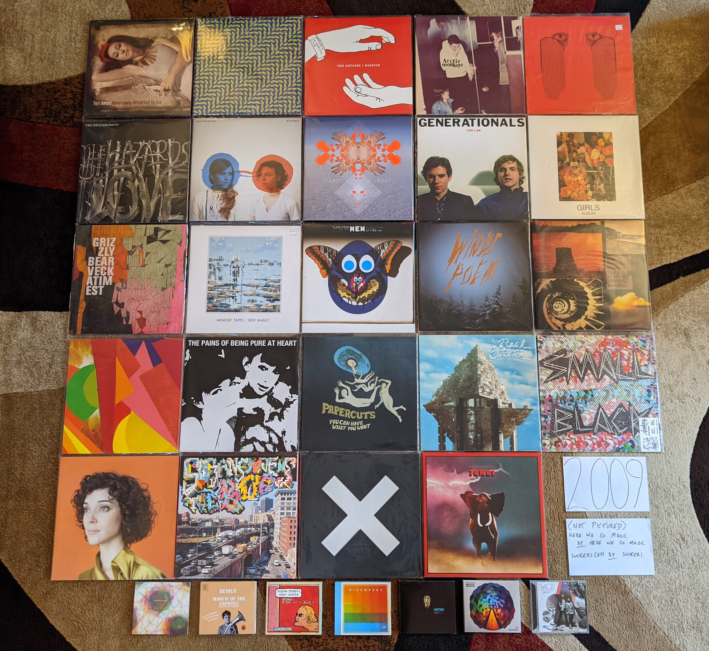

2009 Albums
-----------

I have been looking forward to this year. That is because in 2009 I spent
a lot of time documenting my favorites of the year, and therefore have a very
detailed understanding of my top records at the time of release. I even went so
far as to make a three disc compilation of my top tracks and distribute to my
friends. It was a throwback to my 1999 compilation (more on that later) and a
way to cap off what was a landmark year for my relationship with contemporary
pop music. That said, looking at the notes I distributed with the mix CDs, I
have to cringe a bit.

I sound so young for a 29 year old, but I think my connection to pop music at
the time was making me feel young and I wanted to revel in it a bit. Admittedly,
I would never feel this connected to pop music again. Despite these somewhat
silly notes, I would actually get quite a few positive comments about the mix,
and even received three mixes in response! None of them were as carefully
curated and supplemented with footnotes, but it was nice to hear what other
folks were into at the time. I feel like I could spend a remarkable amount of
time analyzing how I feel now compared to what my impressions were at the time,
but for now I am going to keep this to a simple comparison of my top albums then
and now. Here are the albums that appear in my 2009 top 20 that I no longer
consider to be among my favorites:

- *Mythomania* by **Cryptacise** - (#7) I was really feeling high on this band after
  seeing them at Noise Pop 2009, but my interest really faded as I got away from
  that show. In general that early 60s pop revival stuff hasn't aged great for
  me.
  
- *A Brief History of Love* by **The Big Pink** - (#8) Two killer singles "Dominos"
  and especially "Velvet" made me greatly overate this at the time.

- *Eyes & Eyes & Eyes Ago* by **Nesey Gallons** - (#9) I really was into
  Elephant 6 at the time, and wanted to like the latest artists in the
  collective, even if they weren't up to spec.

- *Up From Below* by **Edward Sharpe and the Magnetic Zeros** - (#12) I
  didn't like their "dirt hipster" image when I saw them live, mostly because of
  my bad experiences with this demographic as as South Wedge resident. Listening
  to this record again with fresh ears, I probably need to give it another
  chance.
  
- *Wolfgang Amadeus Phoenix* by **Phoenix** - (#17) I used to love these guys,
  but listening now I can't understand why. Such generic dance indie.

- *Embryonic* by **The Flaming Lips** - (#18) Totally fine, like most of their
  records. Doesn't feel as interesting after others have done this kind of thing
  much better.

- *The Good Feeling Music of Dent May & His Magnificent Ukulele* by **Dent May**
  - (#20) I was responding to the amazing pop songcraft here, despite the
  annoying ukulele packaging. With his later work, this is inessential. Wish he
  had made a new version of the brilliant "College Town Boy" though.

As for my numbers 21-40, that feels like me stretching to make a list, though I
will comment on a couple that moved up to my favorites when they show up in my
current list.

This was the year I attended my first two music festivals, where I discovered
a ton of music. Also, in the fall I moved to Rochester, NY and had access to
much more live music and four fantastic record stores. It was at one of these,
Lakeshore Record Exchange, that I would buy many of the last CDs in my
collection. This is the last year that CDs will appear in significant number in
my photo of favorites. This was the most involved photo in this whole project to
create. I put a record in there by accident that isn't among my favorites, can
you spot it? I'm certainly not going to go through the process of making it again!

.. raw:: html

  <iframe 
  src="https://open.spotify.com/embed/playlist/0IPTLmZ3RFsfkUmPdVKZP8?utm_source=generator&theme=0"
  width="100%" height="380" frameBorder="0" allowfullscreen="" allow="autoplay; clipboard-write; 
  encrypted-media; fullscreen; picture-in-picture"></iframe>

- *Ashes Grammar* by **A Sunny Day in Glasgow** - While most of the bands were
  trying to conjure up the sprit of the 80s, these guys were making the kind of
  electronic, vaguely world music sounds that are straight out of the mid-90s. A
  strange little art rock record that it is really hard to compare to anything.
  It manages to be densely complex, and charmingly amateurish at the same time.
  [Memory: I discovered this while perusing the Pitchfork best of 2009 list.
  This really was the best era for that website actually promoting good music.]

- *Abnormally Attracted to Sin* by **Tori Amos** - I wasn't paying very close attention to
  Tori's career when this came out, and didn't really listen to it closely until
  almost a decade later. This is as wild record, where she seems to be trying
  out some of the popular music trends that had transpired during her 20-odd
  years in the industry. "Police Me" is particularly out there sound for Tori,
  and I'm not sure how to describe what it even is. 2007-2009 was the most
  experimental and diverse time in her career. it doesn't all work, but it will
  never stop being interesting. [*Memory*: This was one of the very last CDs I
  ever purchased at a Best Buy.]

- *Merriweather Post Pavilion* by **Animal Collective** - This is one of those
  records that was absolutely huge at the time, but you rarely hear about now.
  It still really holds up pretty well. Kind of a low-fi, electronic *Pet
  Sounds*, I rarely listen to it anymore, but always enjoy when I do. [*Memory*:
  This was one of the first albums I bought in 2009, and one of the first new
  releases I purchased on vinyl. I tried to buy it from Greg at City Lights, but
  he refused to switch back to vinyl. Probably why his store is no longer with
  us.]
  
- *Hospice* by **The Antlers** - As my mix-notes indicate above, this was my
  album of the year at the time. That isn't true anymore, but I still think this
  is a beautiful and haunted set of songs that I'm alway happy hear. However,
  the sullen mood and subject matter is something that I'm generally no seeking
  out. [*Memory*: I saw them play almost the entire album in sequence at
  Pitchfork Music Festival in 2009, and that powerful performance was one of the
  best I have ever seen]

- *Humbug* by **Arctic Monkeys** - I had enjoyed their first two records, but
  for some reason this is where it started to really click for me. They are
  mining the goth sounds that I love here a bit. It is also the album where the
  pop song-craft really started to take form. "Crying Lightning" is a remarkable
  pop-rock song. [*Memory*: When I moved to rochester my record collection had
  started to grow significantly. I remember constructing new record crates to
  store them, sitting on the old green carpet in the entry hall of my tiny attic
  apartment.]

- *Best Rest Forth Mouth* by **Bear in Heaven** - Ah, the era of the percussive
  electronic music. These guys were the best at it, and they didn't even need
  a floor tom guy to make it work. It was refreshing to see bands that were
  working in a synthpop adjacent space, who had no interest in digging up the
  80s. [*Memory*: The lead singer of this band had a great ironic mustache,
  which was the style of the time. Shortly their after, Movember, was developed
  as an excuse for men to grow mustaches again. I would grow a pretty sweet one
  of my own.]
  
- *March of the Zapotec/Holland* by **Beirut** - This collection of two EPs, is
  highly successful in two very different genres. The first, is the typical
  world music, chamber pop this guy is generally making, but with a huge brass
  band. The second is delightful, early 90s techno. The combination works great
  together somehow. [*Memory*: These guys embody the 2000s more than anyone. I
  had to pick a performance by them from Pitchfork 2009 for the banner on this page.]

- *Susan Storm's Ugly Sister and Other Saints and Superheroes* by **Rachel
  Taylor Brown** - Such a cool concept for an album that is done mostly really
  well. Less famous (mostly imaginary, and quite troubled) comic book
  characters, and religious myths (The original superheroes). [*Memory*: I don't
  know if this is true or not, but I remember this CD as the first thing I ever
  ordered online and had delivered to my new home of Rochester.]

- *The Hazards of Love* by **The Decemberists** - This band had been heading
  down a road of fairy tales and prog rock that peaked with with release. Some
  great vocal contributions from Shara Nova of **My Brightest Diamond**. I wish
  it was a little shorter, and would probably come back to it more if it had
  been trimmed down a bit. [*Memory*: There was an amazing full performance
  video of this on YouTube back in the day, I really wish that was still
  available.] 
  
- *Bitte Orca* by **Dirty Projectors** - I don't know that a band has ever done
  more with less technical proficiency (outside of punk music anyway). I don't
  think this record is as intentionally arty as the reviews would have you
  believe. This is a band stretching their skills way beyond the advisable. So
  charmingly amateurish, and somehow it adds up to way more than its individual
  parts. Everyone in this band had a completely untrained voice, and it all
  works.[*Memory*: I was very resistent to this record at first given how rough
  around the edges it is, and how much Pitchfork was pushing it.]

- *The Duckworth Lewis Method* by **The Duckworth Lewis Method** - A very late
  addition that I discovered more than a decade after release. Amazing in the
  way **The Divine Comedy** always is, but with a sense of whimsey that could
  only be produced by a concept album about the sport of cricket. I don't
  understand all the references here, but the examination of Britain's falling
  stature in the game, as an analogy for larger world issues is hard to miss.
  [*Memory*: I listened to this album more than any other in the year of 2021,
  and it even inspired me to research, and learn the rules and strategy of
  cricket so I could understand it better.]

- *Tarot Sport* by **Fuck Buttons** - I think they tried to come up with a new
  genre name for this kind of thing, but looking back it just fits on the
  electronic branch of the post rock tree. Such positive high energy music, I
  used to put this on the end of running playlists to get me home from long
  runs. [*Memory*: This is the first new release that I really had to extend
  effort to get on vinyl. I imported a copy from Amazon UK.]

- *Con Law* by **Generationals** - Remembering back to this era I think of two
  things: Chillwave, and this kind of straightforward, dance-able pop music.
  This first record has a rawness to it that would be sanded off in their later,
  more big-budget releases. They work better in this lower fidelity format.
  [*Memory*: One of the many great bands I saw play to a mostly empty room at
  Bugjar. Those who were there had a great time bopping around to these guys.]

- *Album* by **Girls** - One of my favorite bands of all time, and I pretty much
  love everything they did in their short career. My favorite will always be
  this collection of stunning pop songs. "Hellhole Ratrace" is a remarkable
  story of refusing to give up, and learning to go it alone when there is no one
  else to lean on. [*Memory*: I'm so glad I was able to catch these guys at
  Pitchfork 2010, as they would break up not long after.]
 
- *Veckatimest* by **Grizzly Bear** - This was my point of entry for this band.
  There first couple records didn't connect with me, but there was something
  about the more tightly constructed songs on this album that made me appreciate
  their psych folk sound way more. I can't think of a group with a more
  distinctive sound, and every record since this one has had a very similar
  feel, but I'm not anywhere close to being tired of it. [*Memory*: On one of my
  first extended business trips to Rochester, I remember brining along my newly
  purchased CD of this one. I remember for some reason I was assigned a full
  size pickup as my rental car. I also remember how amazing "Two Weeks" sounded
  the first time I heard it while pulling into the East Henrietta Country Inn
  and Suites.]

- *Here We Go Magic* by **Here We Go Magic** - If you were to strip **Grizzly
  Bear** back to the bare essentials, you would have something like this record.
  The next album, by the full band version of this act would blow this away, but
  there is some real magic in songs like "Fangela". [*Memory*: When I saw this
  band in 2010 I bought a shirt with the cover of this album on it. It had a
  hold in the sleeve, and I never wore it.]

- *Seek Magic* by **Memory Tapes** - This guy always hated being lumped in with
  the Chillwave bands. I can kind of understand why, as this is built from
  mostly very different parts. That said, the highly melodic and psychedelic
  sounds on offer here invoke the same sort of painful nostalgia for a 1980s
  that never existed. "Plain Material" is one of my all time favorite songs, and
  it is hard to hear it without seeing a crowd of wayfarer wearing hipsters
  bopping around in Union Park, Chicago. [*Memory*: At Pitchfork 2009, this
  record was for sale at the same amazing booth that had the Minimal Wave
  compilations. I passed on it, and regretted it for almost a decade. I was
  eventually able to get a vinyl reissue of this one.]

- *Fantasies* by **Metric** - The last great album by one of the great Canadian
  indie bands, in the year that the Canadian renaissance started to wrap up. I
  know they are still out there making music, but this is where it all starts
  sounding the same to me. [*Memory*: This is one of the very first CDs that I
  bought at Lakeshore Record Exchange, the alternative record store a two blocks 
  walk from my new apartment in Rochester, NY.]

- *No More Stories...* by **Mew** - [**2009 FAVORITE**] - Only Scandinavians can
  make this kind of music. So warm and comfy, such catchy pop songs. This isn't
  chillwave, but it is making clear references to same imagined version of the
  1980s. [*Memory*: I wish I knew how much I liked this band so I went to see
  them at Pitchfork 2009 on the B stage.]

- *Wind's Poem* by **Mount Eerie** - Such a heavy, beautiful record. I love how
  it hides all those melodies in that sea of noise. Needs to be listened to at
  high volume full the full impact. [*Memory*: I didn't full appreciate this
  record until I listened to it on a night drive at high volume, from beginning
  to end. The way this should be experienced]

- *The Life of the World to Come* by **Mountain Goats** - For some reason this
  record separates itself from the dozens of others from this guy. It is the
  same kind of self-produced indie folk/punk, but somehow by far my favorite.
  [*Memory*: I liked this record going in, but I loved this record after seeing
  a screening of a performance film of the whole record at Noise Pop 2010.]

- *The Resistance* by **Muse** - I always heard **Queen** when I listened to
  these guys in a way that other folks did not seem to hear. Well after this
  album I think I wasn't the only one. Very over the top, and an exceptional
  hard rock album. [*Memory*: I saw them on the tour for this record in Toronto
  with some work friends.]

- *Psychic Chasms* by **Neon Indian** - This is probably the definitive
  Chillwave record and "Deadbeat Summer" the definitive song in the genre. It
  also illustrates how the low budget production values were an essential part
  of the formula. His later, more refined records just don't hold up to this
  fuzzy, messy masterpiece. [*Memory*: I don't know that any record makes me
  think of my tiny, dingy Park Avenue apartment than this one. I listened to
  this a lot back in those days.]

- *The Pains of Being Pure atHeart* by **The Pains of Being Pure at Heart** -
  There was a massive "Pitchfork backlash" against this one since the site
  seemed to be way more into this than most. That said, they were absolutely
  right, and this kind pop/rock is timeless. I think everyone expected some kind
  of C86 revival, but this is really the only major artifact we got out of it.
  [*Memory*: At the Pitchfork music festival in 2009 I had just heard **The
  Antlers** play on the B stage and I was walking over to the main stages, and I
  heard these guys playing "Stay Alive". I spontaneously starting twirling
  around in a circle as I walked. It was the last time I ever felt young.]

- *You Can Have What You Want* by **Papercuts** - A fuzzy kind of psychedelic
  music that was compatible with, but not directly related to the prevailing
  trends of the time. A great album throughout, but "The Machine WIll Tell Us
  So" is one of my songs of the decade. This record almost fits better in 1999
  than 2009 and it sounds timeless today. [*Memory*: I discovered this band
  opening for *Camera Obscura* at the German House in the Rochester South Wedge.
  I was nervous to walk through an unfamiliar neighborhood carrying my new copy
  of their LP. I now own a house in that very neighborhood.]

- *Real Estate* by **Real Estate** - Making this list it is clear how this was
  the peak of fuzzy psychedelic music. These guys are making really pleasant
  jangly pop, with the fuzz dial turned up to 11. [*Memory*: I didn't get into
  this band until I saw them at a Pitchfork after-show in 2011. I was there to
  see Dent May, but these guys were super impressive live.]

- *Junior* by **Röyksopp** - It was tough to pick a favorite for this year, as I
  was split between the one I picked and this stellar record. Interestingly, I
  didn't even put this on my list of favorite albums I made at the time! I was
  already into this band by 2009, and their ambient classic *Melody AM* was a favorite.
  This album was a shock, as they had transformed into some sort of Scandinavian
  **Daft Punk**. This is stunning electro-pop record, and I wish we had gotten
  more like it. [*Memory*: I held a vinyl copy of this in my hands once. I
  didn't understand how great it was then. I greatly regret not buying it.]

- *Small Black EP* by **Small Black** - Another of the cornerstones of
  Chillwave, this has a timeless sound that has aged really well. "Weird
  Machines" is probably my favorite track from the whole genre. These guys did
  survive the transition to more refined production values pretty well, but I
  still prefer the fuzzy, heavily clipped sound of this record. You can't keep
  making this kind of music forever though. [*Memory*: I saw these guys at
  BugJar some random weeknight and remember being disappointed by how bro-ish
  these guys looked in their athleisure gear and ball caps.]

- *Actor* by **St. Vincent** - A refinement of the sound from her first record,
  and by far my favorite release by the artist. Eccentric bedroom pop with a
  sharp rock edge, made without any notion of stardom or awareness of mass
  popularity. Things would change after this record, in ways I did not care for.
  [*Memory*: I saw her at Noise Pop 2009 (Great American Music Hall) right
  before this came out. It was an outstanding show, and how I will always prefer
  to remember the artist.]

- *Suckers EP* by **Suckers** - I'm not exactly sure how to describe this genre,
  but it falls in the same space as bands like **Yeasayer** or **Menomena**.
  Highly percussive, with meandering instrumental passages, and serious music
  that isn't afraid to be very fun. They didn't last long, but what they made
  was great. [*Memory*: One of the last conversations I had with Greg at City
  Lights Records (State College, PA) was about this record. He knew I was very
  into **MGMT** and **Menomena** and he asked if I had heard the other band on
  the big summer tour (these guys). He spun his CD-R of the EP for me.]

- *The BQE* by **Sufjan Stevens** - Mark this down as one of those records I
  like way more than almost anyone else. An amazing film soundtrack that borders
  on Contemporary Classical, and Sufjan pushing his middle period sound to its
  fullest extreme. This was also gave a preview of the electronic sounds that
  were to come. [*Memory*: I bought this (with a wad of other releases) at
  Lakeshore Record Exchange and listened to them repeatedly as I taught myself
  how to wax my cross-country skiis in the basement lab at my work.]

- *Dragonslayer* by **Sunset Rubdown** - A much more refined production, and a
  slightly more straightforward collection of songs than what had come before.
  Still best described at indie-prog, the title even seems to wink at the
  nerdiness contained within. For a long time, this was the last work from these
  guys, and a great time capsule of when indie rock was reaching into way artier
  and more ambitious territory. [*Memory*: Somehow this made it to my sell pile
  in late 2024 and I gave it a listen before making that designation official.
  I'm not sure what I was thinking. This is an amazing record! Alas, it not in
  the picture as a result of my losing track of it.]

- *The XX* by **The XX** - A minimalist rock record that was wildly popular at
  the time and that you hear little about today. My personal relationship has a
  similar arc to it. One of my very favorites at the time, but something I
  rarely find myself returning to today. Minimalism is tough. If what little is
  there doesn't have a lot of depth to it, it gets old quick. That said, I have
  to include it, even if my time with it was brief but intense. [*Memory*:
  Hipster Runoff loved to make fun of this record. Carles always had a good
  understanding of what hype records were going to fade a bit over time.]

- *Spirit Animal* by **Zombi** - It was strange to hear this kind of
  instrumental prog rock in the 21st century. It not only exists, but is
  excellent, especially the epic title track. [*Memory*: I discovered this
  album when it was played before a **Dungen** show at Mohawk Place in Buffalo,
  NY. I used the Shazaam music matching service to find it, and immediately
  downloaded from eMusic. I was pleasantly surprized to see these guys play a
  great opening set for **Ghost** half a decade later.]