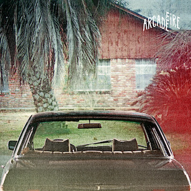

2010s
=====

.. image:: images/2010s.jpg
  :width: 900
  :alt: Pitchfork Music Festival 2011

2010s Overview
--------------
This was an interesting decade for music and for my relationship with music.
When it began, we were at the point I like to call "peak indie" where a
collection of small labels were releasing the most culturally relevant albums,
and the big labels were trying to pretend they were the small labels in order to
compete. I was writing for a local music blog, and attending multiple large music
festivals per year. These were mostly the (now rare) club festivals that were
spread out among multiple small venues over several days. These were the kind of
festivals that demanded research and study to attend properly. I loved the
process of reading about all the bands, getting ahold of a sample of music, and
laying out my plan to rove about the clubs to catch my favorites. The tee-shirts
and vinyl records bought from merch stands at these shows are now staples of my
wardrobe and album collection today.

When the decade closed, mainstream pop from the major labels had returned as the
dominant force in the music scene. This kind of mainstream music had never
really gone away, it was more
that independent music had receded to the shadows again. I have nothing against
mainstream pop, as my lists for earlier decades show. My objections mostly have
to do with the impacts of how modern pop music is made. Today, your average pop
single is written and produced by a committee of dozens. When that many folks
contribute to the creative process it has the effect of sanding every edge off 
of the track by the time
it reaches the finish line. Any remaining distinguishing characteristics are so
intentionally created, that it can't help but feel contrived. I haven't been to a
music festival since 2013. That last one was the inaugural "Crossing Brooklyn
Ferry", a combination of the most high brow indie combined with artists that
typically get labeled as contemporary classical. This was my Woodstock, lol.
The rest of the decade, 75% of
the live music I saw was the local symphony orchestra, This was where "I got
old", but where exactly did it happen?

2010s Stats/Favorites
---------------------
*Section started*: 13 Aug 2021

*Section complete*: 7 Nov 2021

*Latest update*: 13 Jan 2024

*Total Albums*: 185

*Top Artists*:

- 6 albums (1) - Lana Del Rey

- 5 albums (1) - Beach House

- 4 albums (5) - Ariel Pink, Ghost, Son Lux, Sufjan Stevens, Steven Wilson

*Favorite album*:

At the risk of sounding like a cliche' indie music bro...

*The Suburbs* by **The Arcade Fire**

...but how in the world did this get the album of the year Grammy?

*Favorite Song*:

Braids made one of my favorite songs of all time and put it on a really boring
electronic album:

"In Kind" by **Braids**

.. raw:: html

  <iframe width="698" height="393" src="https://www.youtube.com/embed/_Xk-s4fCCwc"
  title="YouTube video player" frameborder="0" allow="accelerometer; autoplay; 
  clipboard-write; encrypted-media; gyroscope; picture-in-picture" 
  allowfullscreen></iframe>

.. toctree::
   :maxdepth: 3
   :caption: Contents:

   2010
   2011
   2012
   2013
   2014
   2015
   2016
   2017
   2018
   2019
   2010_single_songs
   2010_footnotes