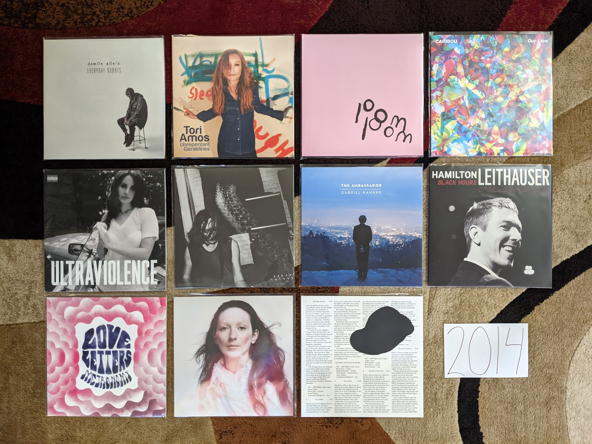
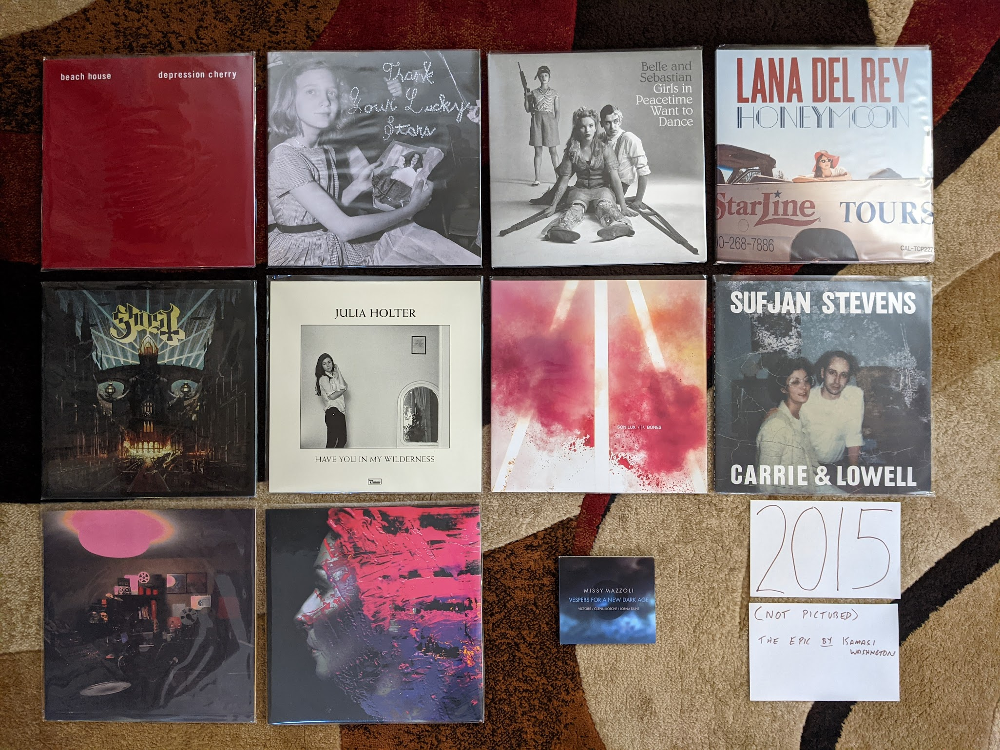
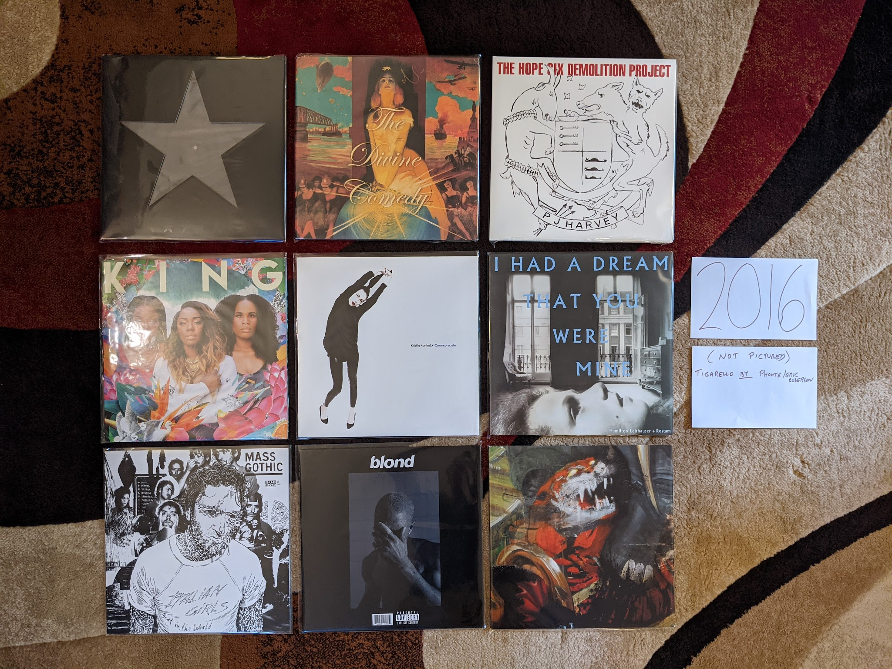
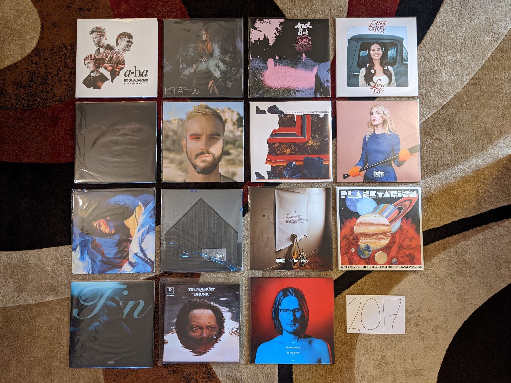
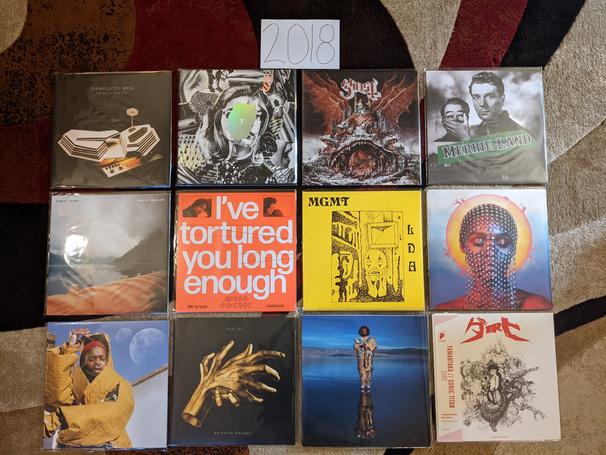
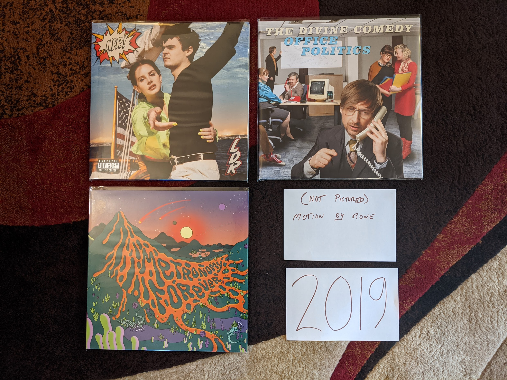

2010s
=====

This was an interesting decade for music and for my relationship with music.
When it began, we were at the point I like to call "peak indie" where a
collection of small labels were releasing the most culturally relevant albums,
and the big labels were trying to pretend they were the small labels in order to
compete. I was writing for a local music blog, and attending multiple large music
festivals per year. These were mostly the (now rare) club festivals that were
spread out among multiple small venues over several days. These were the kind of
festivals that demanded research and study to attend properly. I loved the
process of reading about all the bands, getting ahold of a sample of music, and
laying out my plan to rove about the clubs to catch my favorites. The tee-shirts
and vinyl records bought from merch stands at these shows are now staples of my
wardrobe and album collection today.

When the decade closed, mainstream pop from the major labels had returned as the
dominant force in the music scene. This kind of mainstream music had never
really gone away, it was more
that independent music had receded to the shadows again. I have nothing against
mainstream pop, as my lists for earlier decades show. My objections mostly have
to do with the impacts of how modern pop music is made. Today, your average pop
single is written and produced by a committee of dozens. When that many folks
contribute to the creative process it has the effect of sanding every edge off 
of the track by the time
it reaches the finish line. Any remaining distinguishing characteristics are so
intentionally created, that it can't help but feel contrived. I haven't been to a
music festival since 2013. That last one was the inaugural "Crossing Brooklyn
Ferry", a combination of the most high brow indie combined with artists that
typically get labeled as contemporary classical. This was my Woodstock, lol.
The rest of the decade, 75% of
the live music I saw was the local symphony orchestra, This was where "I got
old", but where exactly did it happen?

2013
----
This is probably the last year in my life where my musical taste will be
anywhere close to "on trend." It was the last year that I attended a music
festival, and it was the last time I got excited about a new mainstream pop
artist. This is the end of my youth.

.. image:: images/2013.jpg
  :width: 900
  :alt: My favorite albums from 2013

.. raw:: html

  <iframe
  src="https://open.spotify.com/embed/playlist/64s1eRMAFNulP786prnhXt?theme=0" 
  width="100%" height="380" frameBorder="0" allowtransparency="true" 
  allow="encrypted-media"></iframe>

- *Reflektor* by **The Arcade Fire** - This was the highpoint for one of the most 
  important acts of the indie era. It isn't their best record, but it is the band
  executing perfectly at the peak of the time in the popular consciousness. I
  felt so smart for having listened to them since 2002. ;) [*Memory*: The
  marketing push for this record was huge. I remember a high profile performance
  on SNL and a bunch of social media things. This was indie's peak.]

- *Until In Excess, Imperceptible UFO* by **The Besnard Lakes** - There are a lot 
  of husband/wife indie bands operating out of Canada. These guys are a hidden
  gem in the genre. I don't know why I stopped paying attention after this,
  which was the third great album in a row. I think it is because they stuck
  with the same noisy post-rock meets dream pop formula and I didn't feel like I
  needed anymore than I already had? [*Memory*: When I made this list, I
  remembered that I really liked this album, but not much else]

- *Tomorrow's Harvest* by **Boards of Canada** - I kind of hope we never get 
  another record from these guys. I want their catalog to be bookended by two
  mysterious masterpieces. Without question I have listened to this record the
  most out of any from this bunch. [*Memory*: This is exactly the kind of thing 
  I want to listen to first thing in the morning, and I have dozens of times]

- *The Next Day* by **David Bowie** - I was very much a fan of millennial Bowie, 
  and I love 90s Bowie. This was the album that finally got the critics and the
  general public back on board the Bowie train. In retrospect, I'm not sure what
  made this better than something like *Heathen*, perhaps it was just marketed
  better. That said, it is another extremely solid record to close out a
  sequence where he was exploring his past sounds. [*Memory*: At the time I
  assumed this was the beginning of another string of successful Bowie records,
  but he would disappear again, and it would not work out that way]

- *Random Access Memories* by **Daft Punk** - This will be the last release to win
  the Album of the Year Grammy to appear on my list. I say this not just because
  of my "getting old" but because of trends in popular music that I do not
  expect to ever significantly change. The way this walked a tightrope between
  indie electronic and mainstream pop is masterful. One of the most deserving
  albums to ever win that award. [*Memory*: I was at the headquarters of the
  company I worked for at the time, and I heard someone humming "Get Lucky" at
  the photocopier. I felt hip for being in line with prevailing pop trends for once.]

- *Sticky Wickets* by **The Duckworth Lewis Method** - Neil Hannon makes a second 
  record about cricket with his collaborator. It's not quite as good as the
  first one, but still way better than it seems like it should be. The best
  track is "Judd's Paradox" which revisits the concepts and themes from the
  first album regarding social class and cricket, and recycles the melody from a
  **Divine Comedy** record released only a few years prior. [*Memory*: It was
  shocking to learn there was not one, but two solid concept records about the
  sport of cricket]

- *Infestissumam* by **Ghost** - When I discovered this band, this was their 
  newest release. It was their weakest record then, and still is. I almost have
  this on my list solely for the prog metal epic "Ghuleh/Zombie Queen" which is
  pretty much the only song from this record they bother to play live at this
  point. [*Memory*: Back when this was the new Ghost record, I took it as a sign
  that they were not going to have staying power. I was wrong about this record,
  I was wrong about the band.]
  
- *Pure Heroine* by **Lorde** - Around this time I was attending the "Alternative 
  Music Film Series" at the Memorial Art Gallery, and they would play videos for
  recent alternative hits before the feature. It was in this context that I
  heard "Royals" for the first time, and I was a bit embarrassed by how much I
  liked it. It didn't seem like the kind of music I should be in to. Time would
  show that Lorde was very much the kind of music I am into. [*Memory*: "Team" 
  will always be my Sunday morning Wegman's jam]

- *Warm Blanket* by **Dent May** - For a very brief moment this guy found an
  interesting XTC meets lounge singer sound that was indie pop gold. I can't get
  into his new stuff, but this record is what I want to hear when I am sitting
  on the porch sipping a cool beverage. [*Memory*: I was really excited about
  the sound of this record, and was very sad that he would soon move on from this]

- *New* by **Paul McCartney** - Beatle Paul starts paying attention to indie and
  attempts to integrate what he sees into his own music. This has virtually
  nothing to do with 2010s indie, but it is stunning. "Queenie Eye" is an
  especially fresh and quite unexpected single. This the start of an ambitious,
  if inconsistent late career push. [*Memory*: It was startling how fresh and
  vibrant McCarney seemed all of a sudden when this record came out. We were
  only a few years from that horrid covers record.]

- *The Electric Lady* by **Janelle Monae** - It's a huge bummer that we will never
  get a proper end to the Cindy Mayweather epic. Monae has clearly gone in a
  different (mildly disappointing) direction. This record does an amazing job
  balancing modern pop idioms with dozens of ideas from the past. I really
  wonder if we will ever see anything like this again. [*Memory*: The Prince
  estate has continually allowed and disallowed streaming of the track "Givin'
  'Em What They Love" which features the purple one. This is a shame because it
  is a hell of a way to start the record.]

- *Trouble Will Find Me* by **The National** - In retrospect *High Violet* was a
  massive pivot for these guys, and every record since has been the same low key
  collection of dirges and love songs. It never feels as samey as it should
  because it is so textured and delicately beautiful. "Pink Rabbits" is the
  definitive track from this era of the band. [*Memory*: This is the album when
  I finally allowed myself to be a sensitive indie bro National fan]

- *Lanterns* by **Son Lux** - By far the most accessible record by Ryan Lott, and
  that was a smart move. After the visibility his friends at NPR provided, this
  was the record that built the fan base that would sustain his art rock
  endeavour. "Lost It To Trying" was a clear effort to write a pop single that
  totally worked out. [*Memory*: I was mildly ashamed of myself for liking "Lost
  it To Trying" because it indulged in the "Woah-oh-oh!" chorus trend that was a
  cliche of mainstream pop in those days]

- *The Raven That Refused to Sing (and Other Stories)* by **Steven Wilson** - Wilson
  was in the process of producing remasters of the **King Crimson** discography
  when this album was made, and it shows. This is the kind of jazz influenced
  "heavy prog" that Crimson were up to in the early 70s. [*Memory*: The cover of this album
  will always remind me of Lakeshore Record Exchange, a record store that was
  walking distance from my first apartment in Rochester. They had a special
  edition LP of this in stock for the last five years of their existence.]

- *Uzu* by **Yamantaka//Sonic Titan** - I discoverd this record while preparing to
  attend the 2014 Polaris Music Prize Gala in Toronto. For several years I had
  been streaming the gala online and had enjoyed the window it gave me
  into the wildly experimental indie scene of 2010s Canada. It was a remarkable
  time for Canadian music, and this band were one of the most out there acts.
  They didn't win or even perform at the ceremony, but this was the pick of the
  litter for me. This is theatrical, progressive metal that manages to never feel
  cheesy, and was a real breath of fresh air. [*Memory*: Seeing this band perform
  at the 2012 Polaris Prize was incredibly memorable]

2014
----
This is it folks, the year "I got old." I do feel like I made an attempt to
explore the new releases, and keep in touch with what was being covered in the
remaining indie music blogs. This is the last year I kept a Spotify playlist of
the things that I streamed for posterity. Interestingly, I feel like this is
also the year that indie music took a big hit in popularity and more mainstream
styles returned to prominence. That said, this is still a pretty great set of
records. 

.. raw:: html

  <iframe
  src="https://open.spotify.com/embed/playlist/6LX6vr3idzHiTlDmHzqWDb?theme=0" 
  width="100%" height="380" frameBorder="0" allowtransparency="true" 
  allow="encrypted-media"></iframe>

- *Everyday Robots* by **Damon Albarn** - A delightfully minimalist record that
  feels like a variation on his other project **The Good, the Bad, and the Queen**,
  this is what Albarn does best. "The Selfish Giant"" was probably my favorite
  song from this year. He doesn't get enough credit for his inventive piano
  playing. [*Memory*: I remember being disappointed by most of the new music I
  was hearing this year and latching on to this record in a very strong way]
  
- *Unrepentant Geraldines* by **Tori Amos** - This is where she entered into
  that career phase where every album is perceived as a comeback. That probably
  says more about the press and the general public not paying attention. Those
  in the know, understand that there has only been on sub-par Tori Amos album.
  That said, this is return to a smaller kind of songwriting, that was a clear
  effort to do something different. [*Memory*: The record scared me a little at release, as
  Tori felt like she was aging for the first time. It was as much about me as it
  was her. Then I realized that Tori was showing her age only for effect. Her
  voice was becoming weathered in a way that could be used for color. It was
  just another tool in the toolbox.]

- *pom pom* by **Arial Pink** - It seems like everyone is converging on this
  being the best release for this guy. It certainly is the most extreme
  specimen, and that probably does make it the best. This is not subtle music.
  "Picture Me Gone" is such a beautiful song and a relevant critique of social
  media culture. [*Memory*: This album was a bit much for me when it first came
  out, it took years for me to warm up to it.]

- *Our Love* by **Caribou** - Another solid, understated electronic record from
  Dan Snaith. I know this kind of music is still being made, but not nearly as
  well as it was done here. [*Memory*: Pitchforks glowing review of this
  actually made me not listen to it at first. That's the way it was in those days.]

- *Ultraviolence* by **Lana Del Rey** - I didn't take Lizzy Grant very seriously
  until this record. I know that the production is what is pulling me in, but
  there is some serious songwriting here as well. This was shocking at the time,
  but it makes complete sense in retrospect with the sequence of fantastic
  records that would follow. "Brooklyn Baby" is such a great diss track aimed at
  the New York City hipster culture that rejected her. [*Memory*: Hearing the
  instrumental second bridge in the title song for the first time was startling.
  It was so beautiful and interesting.]

- *Keys* by **Hooray for Earth** - This band had a very brief but highly
  productive run. Only 3 years after their debut EP they released their finest
  work here. The big guitars, the strong melodies, the delicate vocals, 
  the judicious use of electronics, and the
  slick production that sounds increasingly like Toto. One of my favorite bands
  of the late indie era, and their breakup almost was a signal that time was
  over. [*Memory*: These guys always had a great promo video for the first
  single on a new record, and "Keys" really got my attention]
  
- *The Ambassador* by **Gabriel Kahane** - A concept album about his former home
  of Los Angeles. This was the record where Kahane replaced Sufjan as my
  favorite maker of "fancy folk music." He is almost going prog here on "Empire
  Liquor Mart." The song "Villains" is great comic observation about how movies
  and other media distort our perceptions of reality. [*Memory*: When this got
  pressed on vinyl, I realized that the format was truly back]

- *Black Hours* by **Hamilton Leithouser** - When **The Walkmen** one of my
  favorite bands of the indie era went on permanent hiatus I was bummed. I'm
  glad this guy kept making music that was very in line with the sound of his
  band, but with a mature sounds for his aging fans. This is a logical extension
  of the strings and horn sound of the late Walkmen records. [*Memory*: Hearing
  one of my favorite rock artists make this kind of music made me realize we
  were both getting older]

- *Love Letters* by **Metronomy** - The Metronomy records can be organized into
  two groups: The understated half-instrumental soundscapes, and the quirky pop
  collections. This one is strongly in the latter class. "Reservoir" has become
  one of their trademark songs, but it is only one of many pop gems here.
  [*Memory*: I don't know why, but I didn't really "get" the band until this
  album, which is one of their less popular]

- *This is My Hand* by **My Brightest Diamond** - A transition work between the
  chamber pop that came before and the dance worthy tracks that would be next.
  It is also the line between the woman who was Shara Worden but would become
  Shara Nova. [*Memory*: I saw Shara for the last time on this tour. It was a
  fantastic show in a small venue in Toronto]

- *In Conflict* by **Owen Pallet** - The record where he perfected the formula
  that was started with the **Final Fantasy** records. While the music is
  feeling more refined and perfected than ever before, the lyrics are a
  stunningly transparent account of someone who is really struggling. 
  [*Memory*: I'll never forget seeing the artist perform "The Riverbed" at 
  the 2014 Polaris Prize Gala]

2015
----
I turned 35 in 2015, which sounded very old at the time. My relationship with
music was also making me feel old. I saw three bands this year: The Psychedelic
Furs, The Church, and The Chameleons. It was the year of 80s nostalgia I guess.
I was very much treading musical water, keeping in touch with the artists that
hadn't let me down in the past. That ended up working out really well in 2015,
as several of my favorites released their best work.

.. raw:: html

  <iframe
  src="https://open.spotify.com/embed/playlist/55DcWRgBQciL97k3bsftmi?theme=0" 
  width="100%" height="380" frameBorder="0" allowtransparency="true" 
  allow="encrypted-media"></iframe>

- *Depression Cherry* by **Beach House** - This was when the world caught up with
  what I already knew, these guys are one of the best bands currently working.
  It is a little strange that dream pop made by two people with fairly minimal
  instrumentation and fairly consistent production techniques has had such
  staying power. This is great record, and "Beyond Love" is my most favorite song of
  theirs among many favorites from them. [*Memory*: For some reason I had
  convinced myself before I hear it, that there was no way this was going to
  stand up to their earlier work. Wow, I was wrong.]
  
- *Thank Your Lucky Stars* by **Beach House** - Now, releasing two records after
  one another was some serious flexing. In my opinion, this one is even a little
  bit better. It certainly is a bit brighter in a way that I like. [*Memory*:
  Hearing that this existed and was the leftovers from the first album they made
  this year, and thinking there was no way it could be great. Wow, was I wrong.]

- *Girls in Peacetime Want to Dance* by **Belle and Sebastian** - Very solid an
  enjoyable, but the kind of record that made me wonder how much more they could
  milk the sound they had been working for the last decade plus. Sarah Marin's
  vocal contributions continue to carry the band a bit at this point. They
  needed to change after this, and they did. [*Memory*: When I played the first
  song on this record the first time, I realized it was the end of an era for
  these guys.]

- *Honeymoon* by **Lana Del Rey** - A very mellow left turn for Lana, this
  wasn't perfect by any means, but it was an important step in a different
  direction that she still is on as of 2021.

- *Meliora* by **Ghost** - This is the record where the formula came together in
  a big way. It is amazing how something so satirical can also be such seriously
  great music. "He Is" is such a beautiful and stunningly produced mockery of
  christian rock. [*Memory*: One of the most fun shows I have ever been to in my
  life was seeing them at the Rochester Main Street armory on this tour]

- *Have You In My Wilderness* by **Julia Holter** - I have had a strange
  relationship with this record. I was exposed to the song "silhouette" by
  Spotify radio soon after it came out and loved it. I listened to only that
  song for years and never sought out the record. When I finally heard the whole
  album and loved it, I never checked out any of her other releases. I don't
  know why I am approaching this artist so cautiously. This is the kind of
  conservatory trained musician making complicated but highly melodic music
  thing that I love. Maybe someday I listen to something else she has done.
  *Memory*: I've streamed the song "silhouette" on Spotify more than almost any
  other song in existence]

- *Bones* by **Son Lux** - NPR's "favorite son" recruits some permanent members
  and becomes a real band. It was the best thing to ever happen to this project.
  This is nerd rock at its finest. A very strong concept record, this one to listen to from
  beginning to end. Still my favorite of theirs. [*Memory*:  I saw them at the Warhol 
  after this record, and that was the right kind of place to see this
  museum on the tour adventurous art rock.]

- *Carrie & Lowell* by **Sufjan Stevens** - I think there is a prevailing
  opinion that this is Sufjan's finest work. I'm glad he made this record so
  that the general public can understand the brilliance of this man, but I'm
  far happier that he immediately returned to making the weird stuff I like way
  more. Still a fine folk record with that Sufjan magic, but a bit too
  conservative to stand with his best work. [*Memory*: I almost didn't buy this
  on vinyl as it just wasn't "my kind of Sufjan" but I decided it has its time
  an place (and a place in my collection)]

- *Multi-Love* by **Unknown Mortal Orchestra** - They finally got it all to work
  together here. The delightfully funky electronic sound they occasionally got
  to work on their first two releases comes into focus here. Such a great
  sounding production as well, even though I'm pretty sure this is an analog
  home recording made in that little studio on the cover. [*Memory*: It took a
  while to realize I loved this whole album because I liked the first track so
  much, I never got to the later stuff]

- *Hand Cannot Erase* by **Steven Wilson** - A mellow prog rock concept record
  about an isolated person dying alone. Obviously intended to be sad and
  haunting, but also exceptionally beautiful. Feels like a massive upgrade to
  the Stupid Dream/Lightbulb Sun era **Porcupine Tree**. [*Memory*: Every now
  and then an album becomes a running playlist favorite despite not being in the
  typical genre for exercise. This is one of those for me.]

- *Vespers for a New Dark Age* by **Victoire** and **Missy Mazzoli**. The first
  Victoire record was a classically trained composer creating a rock band to
  make a very unusual kind of prog rock. This album is the composer using that
  band to play a contemporary classical work. In a way this albums felt like the
  end of "indie classical" and while I liked to scoff at the idea of the genre, it
  was a real and compelling thing for a while. The remix of "A Thousand Tongues" by the very
  much not a classical composer **Lorna Dune** feels like the last glorious
  moments of the spirit of classical music nerds forming rock bands. [*Memory*:
  I remember tweeting my enjoyment of the "A Thousand Tongues" remix and I could
  tell the artists generally appreciated the support]

- *The Epic* by **Kamasi Washington** - This is the most recent of my favorite
  albums that I do not own on vinyl, but easily could if I wanted to. I think it
  says a lot. I really like this triple album of modern jazz fusion, but I like
  his next record even more. There is nothing here that makes me need to own
  another quite epic release on vinyl, but I spin this one on Spotify often. The
  texture of this music is exceptional. [*Memory*: Hearing this and realizing
  what a consistent artist Washington is]

2016
----
A significant portion of the music from this year was actually discovered during
my attempt to reconnect with pop music in the following year. The other albums
are all from established artists that I had be following for years. I'll
remember this year mostly for the passing of three of my favorite artists:
George Michael, Prince, and David Bowie.

.. raw:: html
  
  <iframe
  src="https://open.spotify.com/embed/playlist/0UKeYHGoGOzLvhyuxxXSCc?theme=0" 
  width="100%" height="380" frameBorder="0" allowtransparency="true" 
  allow="encrypted-media"></iframe>

- *Blackstar* by **David Bowie** - It is difficult to think about this record
  outside of the context in which it arrived. My pre-ordered copy showed up in the
  mail two days after Bowie, my favorite musician had died. It was so mysterious
  and exciting, but it was also the end of the story. Pop's ultimate performer had
  one last grand statement on the world stage, the big exit. Experimenting with
  new sounds until the very end, it is hard to imagine there will ever again be a
  musician who is both this massively popular and  yet committed to pushing
  the boundaries of pop music. [*Memory*: I used to spend time thinking about
  what it would be like when my favorite artists started dying, it happened so
  fast it almost doesn't feel real]

- *Foreverland*  by **Divine Comedy** - In my opinion, this is the weakest of
  the Divine Comedy records released to date, but it is still among my
  favorites. Neil Hannon feels very content here, and I think it is reducing
  some of the tension and contemplation that have made his previous work great.
  I actually own two vinyl copies of this, since my first one is signed by the
  artist, but I had to buy the reissue because Hannon's liner notes are that
  good. [*Memory*: When it became apparent I would own all the classic Divine
  Comedy albums as vinyl reissues, I panic bought the only copy of this in the
  United States on Discogs]
  
- *The Hope Six Demolition Project* by **PJ Harvey** - In 2016 we finally got
  the PJ Harvey saxophone record we had been waiting for. This record somehow
  feels like the capstone on what Polly has been up to for the last decade with
  her younger voice and harder sound rejoining her contemplative, social justice
  minded songwriting. I love the crazy aesthetic for this tour with Polly Jean
  dressed up in feathers playing in a chorus of saxophones. [*Memory*: I really
  wanted to travel to the UK to see the recording of this record which was
  presented in public as an art exhibition]

- *King* by **We are KING** - This was the record that brought my attention back
  to modern pop music. I have an annual tradition of watching the Grammy awards
  ceremony. Most years I hate nearly everything, but I like to stay in touch
  with what is going on in pop. I heard a snippet of "Red Eye" from this record
  during the presentation of the award for the "Urban Contemporary Album of the
  Year". This would put me on a path of exploration in what we now call
  "Alternative R&B" that continues to today. [*Memory*: I keep watching the
  Grammys hoping it will help me find other amazing music like this, so far not happening]

- *X-Communicate* by **Kristin Kontrol** - Kristin Gundred is a masterful mimic
  of the music of the past. Starting with her band **Dum Dum Girls** she
  excelled of mining the past without sounding totally derivative. Her first
  solo record manages to borrow liberally from late 80s Kate Bush, and 2010s
  synth pop, while adding just enough to stand up totally on its own. I really
  hope there will be another record from this project. [*Memory*: Being
  surprised that music like this was still being made, and getting high ratings
  from the likes of Pitchfork]

- *I Had a Dream That You Were Mine* by **Hamilton Leithouser** and **Rostam** -
  This record ended up sounding like the combination of **The Walkmen** and
  **Vampire Weekend** that it seemed like it would be on paper. This is aging
  hipster music done right. [*Memory*: A person on a social VR platform
  (AltSpace) playing this for me excitedly, and dying under mysterious
  circumstances days later]

- *Mass Gothic* by **Mass Gothic** - In what was a big theme to my middle 2010s,
  this album is some of my favorite artists of the previous decade moving on to
  their next project. In this case, the husband/wife duo from **Hooray for
  Earth** and **Zambri** teaming up to make some delightfully poppy noise rock.
  "Every Night You've Got to Save Me" is a stunning single that shows off what
  these underrated musicians can do. [*Memory*: The mixed emotions of a great
  new band, but the loss of two that were a bit better]

- *blond* by **Frank Ocean** - A stunning concept record by one of the best
  artists working today. My vinyl copy of this record is an amazingly made
  bootleg, because the real thing is worth over 400 bucks these days. Ocean
  seems intent on only being so popular, almost choosing artistic relevance 
  over fame. It is hard to argue with the results. "Nights" might be the best
  song of the last 10 years. [*Memory*: Actively seeking out a bootleg for the
  first time to have a physical manifestation of one of my all time favs]

- *Tigarello* by **Phonte** and **Eric Robertson** - Nothing says where my head
  is at these days than this album of rap songs about the bliss of  monogamy 
  and settling down. Hip hop for rapidly approaching middle age. [*Memory*: This
  album makes me feel really old, and I don't care]

- *Jessica Rabbit* by **Sleigh Bells** - These guys are making some great tunes
  completely under the radar. I wish the hipsters that were buzzing about this
  band at the start of the decade were still paying attention. This is some
  surprisingly complex, rocking stuff. [*Memory*: ]

2017
----
In 2017 I made a specific effort to pay more attention to modern music.
Admittedly, I wasn't trying very hard and my efforts were mostly about
using the discovery features of Spotify. This did yield some fruit (particularly
in the R&B renaissance that was going on) but this year is still mostly
comprised of artists from the early century indie boom that I had been following for years.

.. raw:: html

  <iframe
  src="https://open.spotify.com/embed/playlist/0aoSZPgfa910GZKWAPnrAa?theme=0" 
  width="100%" height="380" frameBorder="0" allowtransparency="true" 
  allow="encrypted-media"></iframe>

- *Unplugged* by **A-ha** - This is certainly the outlier here, a very 90s kind
  of performance from a very 80s band. I had heard for years about how A-ha were
  way more popular in Europe and how they were much better than the one hit
  wonder they were here. The Spotify algorithm decided I needed to her this, and
  I'm glad it did. The understated arrangements really show off how great their
  songwriting is. I'm a huge fan now. [*Memory*: I used to listen to this on
  repeat while painting D&D miniatures]

- *Native Invader* by **Tori Amos** - After her previous record I had assumed
  that Tori was going to make much smaller and more subtle music in her later
  career. This record certainly proved me wrong on that. A return to her late
  90s glory years, this album is a very big sounding, and at times straight up
  rocking. This isn't *Choirgirl*, but it isn't too far from the best of
  *Venus*. *Geraldines* scared me a little bit because Tori was starting to
  sound a bit older. This record makes it clear there are many exciting records
  yet to come. [*Memory*: Realizing that Tori was going to keep doing what Tori
  does for a long time, and feeling happy]

- *Dedicated to Bobby Jameson* by **Ariel Pink** - Yes it breaks my heart that
  he has been outed as a terrible person, and I can't imagine I'll be keeping up
  with his career going forward. That said, these records are stunning works of
  outsider brilliance. If I'm going to keep records by people like Michael
  Jackson on this list, there is room for the work other deeply flawed artists.
  [*Memory*: Enjoying the very dated sounds taking me back to the glory days of
  this kind of thing around 2010]

- *Lust for Life* by **Lana Del Rey** - It is her weakest record thus far, but
  still among my favorites. The whole thing is a little to mid tempo monotonous,
  but there are still some stunners here, including the title track. The
  outstanding production values of the record really puts this one over the top.
  [*Memory*: This is essentially the background music of this era of my life]

- *Dirty Projectors* by **Dirty Projectors** - While this project existed before
  and will continue after the musical (and romantic) partnership of Dave
  Longstreth and Amber Coffman, I doubt I will ever enjoy the records made by
  those other incarnations nearly as much. The exception is this Longstreth solo
  effort that serves as a document of the dissolution of that central
  partnership, and a compelling bookend to an amazing run of records. [*Memory*:
  I heard this album before I knew anything about the breakup, but I didn't need
  to hear the story from the indie bloggers to know what was up]

- *Jardín* by **Gabriel Garzón-Montano** - 2017 was the year I discovered what
  is now called "Alternative R&B". An ambiguous genre, to me it feels like a
  return to what Stevie Wonder was attempting to to in the mid-70s. This record
  especially feels like the kind of thing Stevie would have come up with if he
  had been born in the 90s. [*Memory*: This was the golden era of Spotify
  recommendation radio for me, thanks Spotify!]

- *Painted Ruins* by **Grizzly Bear** - Some bands are constantly changing and
  trying new sounds, others like Grizzy Bear, started with a fully developed
  sound and have been gradually perfecting it. I'm curious how many more albums
  of this same general formula I will tolerate. "Losing All Sense" is getting
  pretty close to the ultimate implementation of this kind of music. [*Memory*:
  I actively avoided the record thinking they had lost the sound I loved, and
  yeah I was wrong about that]

- *Choir of the Mind* by **Emily Haines** - *Metric* is a fine band, but Haines
  solo work is on a completely different level. We seem to only get one classic
  album a decade from her, but maybe that is why the level of songcraft is so
  high. A gorgeous set of songs mostly about the artist and her piano with just
  enough atmospheric electronics and vocal overdubbing to create a pleasant
  warmth. [*Memory*: I've listened to "Legend of the Wild Horse" so many times,
  I know I'll never tire of it]
  
- *Melodrama* by **Lorde** - This album is amazing, but it fills me with
  anxiety. I greatly fear the machinations of mainstream pop music will get
  their hooks into Lorde and turn her into a Billie Eilish style commercial
  interest instead of her far more interesting authentic self. This album put
  her much more on the **Kate Bush** path of a prodigy bucking prevailing trends
  and pushing the boundaries of modern pop. Will this be allowed to continue?
  [*Memory*: I hated the lead single "Green Light" at first because it was such
  a change and I wasn't ready]

- *Sleep Well Beast* by **The National** - I'm an aging indie bro, so of
  course I love these guys. There is just enough here to connect me to the band
  I have loved over the last 10 years. Somehow though, it is just gut enough in
  a way that makes it feel like my jumping off point. [*Memory*: Somehow this
  record never sticks in my memory, but I really enjoy it each time I listen to it]

- *Kid Kruschev* by **Sleigh Bells** - In the 2010s there were many buzz
  bands that got way more attention and credit than they probably deserved early
  in their careers. Some of them have developed into stunning artists that
  probably are now not getting nearly enough credit. Chief among them is Sleigh
  Bells, who have turned their semi-obnoxious combination of electronics, guitar
  riffs, and belting into art rock gold. "Rainmaker" might be the best ever
  invocation of the "Ashely's Roachclip" break, and that is saying something.
  [*Memory*:  This was the record that made me go back and really realize the
  amazing body of work these guys have created]

- *Planetarium* by **Sufjan Stevens**, **Nico Muhly**, **Bryce Dessner**, and
  **James McAlister** - I saw a workshop performance of this at the 2012 Music
  Now festival. I didn't care for it very much then, and the finished product
  feels way different. I'm fairly certain that Sufjan pretty much wrapped this
  one up on his own because in the end we got something very much in line with
  *the BQE* and *Age of Adz*. I'm really pleased that the weirdest form of
  electo-Sufjan got one last time to shine. [*Memory*: I wish I could hear how
  that performance back in 2012 really sounded, because I can't related it to
  what is recorded here]

- *Fin* by **Syd** - A great piece of minimalist "alternative R&B". I want
  dozens more albums in this genre. [*Memory*: I feel like I listened to this
  record every day at work in 2017]

- *Drunk* by **Thundercat** - Is this the new jazz fusion? I hope so. Jazz and
  fusion have become genres for boring white people rehashing the past. This
  combination of bass virtuosity and funky sounds is super compelling. Bonus
  points for the effective use of Kenny Loggins. [*Memory*: I somehow didn't
  pick up on Kenny Loggins participation until 3 years had passed]

- *To the Bone* by **Steven Wilson** - I'm fascinated how Wilson is almost
  repeating the same career trajectory of his band **Porcupine Tree** again as a
  solo artist. In both cases he started off as a prog rock revivalist. The
  second phase, which for his solo career commences with this record, is a
  lighter alt rock sound. Perhaps the return to progressive metal concept albums
  is just around the corner? Wilson has mixed in some killer pop songs over the
  years, but "Permanating" is the finest yet. [*Memory*: Another record I
  avoided for years due to a bad cover]

2018
----
I think the best summary of this year is that all of these albums except
two were by artists that were among my favorites going into the year. Those two
new artists were both discovered on NPRs All Things Considered. I may have been
a bit out of touch with popular music.

.. raw:: html

  <iframe
  src="https://open.spotify.com/embed/playlist/4pSrzHRA9VaFcj48PgrE1R?theme=0" 
  width="100%" height="380" frameBorder="0" allowtransparency="true" 
  allow="encrypted-media"></iframe>

- *Tranquility Base Hotel + Casino* by **Arctic Monkeys** - Of all the bands to
  come out of the early 2000s post punk revival, these guys have stayed the most
  interesting for me. All the genre hopping on this one put a lot of people off,
  but it is why I still care about them. [*Memory*: There was a good month or
  two where this was all I was listening to]

- *7* by **Beach House** - The name is a reference to this being the seventh
  record, all of which are among my favorites of all time. It feels a little
  weird to me that my favorite modern band is a two person dream pop act. There
  are a lot of familiar sounds on those seven records, but it never gets old.
  [*Memory*: Hearing the first track the first time and thinking: "they've done
  it again"]

- *Prequelle* by **Ghost** - After the last record, I was really hoping for more
  power ballads along the lines of "He Is" and we got them, and it was great.
  "Life Eternal" does such an amazing job straddling the line of comic theatrics
  and beautiful sincerity. Some killer rocking tunes too (e.g. "Rats").
  [*Memory*: Hearing the saxophone part on "Miasma" and wishing that they do
  some ridiculous presentation of it on tour, they did]

- *Merrie Land* by **The Good, the Bad, and the Queen** - Somehow I missed the
  release of this album, and didn't find out about it until two years later.
  Their self titled record was one of my favorites from the last decade, and
  I thought it was a one off project. Like the first one, this album is a big time grower
  that takes a bit to get into. Given the passing of Tony Allen I assume this is
  the last one, but it already feels like a bonus that we have this. [*Memory*:
  Finding out that this existed when cataloging my valuable vinyl copy of their
  first record, and panic buying a vinyl copy of this one]

- *Book of Travelers* by **Gabriel Kahane** - I saw Kahane perform this album
  twice, the first of those as a multimedia performance at BAM. The story of his
  cross country train trip looses something without the little stories he told
  between songs, but it is still a beautiful set of melancholy little folk
  tunes that reminds me of those great performances. [*Memory*: Seeing a
  performance of this concept album about an Amtrak journey, that I traveled to
  via Amtrak]

- *I've Tortured You Long Enough* by **Mass Gothic** - Now sounding like a
  direct merger of their former bands **Hooray for Earth** and **Zambri** I am
  very much sold on this project. I'm really pleased that Jessica Zambri is now
  singing most of the songs as it suits the style better somehow. [*Memory*:
  Feeling happy that this existed, but sad that it was a sign that two of my
  favorites were never coming back]

- *Little Dark Age* by **MGMT** - After their highly disappointing, self titled
  third album, I had given up on these guys. I can usually sense when a band has
  lost the sound that made me enjoy them in the first place. When they came back
  with this strong release out of nowhere it was the surprise of the decade for
  me. They did it by finding their way back to their old sound. Sometimes
  regression is a good thing. [*Memory*: Feeling blown away by how good this was
  when Spotify radio played it for me]

- *Dirty Computer* by **Janelle Monae** - This album has been influenced by the
  sounds of highly manufactured, modern pop music. At first it was shocking and
  disappointing from an artist who seems to transcend that kind of thing.
  Eventually I was able to find the things that make Monae one of my favorites,
  and I can appreciate this for what it is: a way above average implementation
  of 21st century pop idioms. [*Memory*: Intially feeling collosially
  disappointed by the incusion of modern pop into the work of an artist that had
  until now, done a great job sounding timeless]

- *Soil* by **serpentwithfeet** - NPR discovery 1 of 2. I love when the sounds of
  church music are adapted to a more honorable purpose. A former choirboy turned
  Satanist makes a gorgeous record of queer love songs. [*Memory*: It was
  becoming troubling how much of my new music was coming from the NPR morning show]

- *Brighter Wounds* by **Son Lux** - A fitting place between two new NPR
  discoveries, for an artist who owes their career to NPR. That early public
  radio fame has led to one of the strangest bands to have a fairly large
  following. Their second record as a legit three piece band, they are really
  testing the limits of their audience with this challenging record. "Forty
  Screams" is such a complex, stunning opener for an album that never quite
  matches that opening intensity. [*Memory*: I listed to "Forty Screams" so many
  times after this came out, and I still crank it on the headphones often]

- *Heaven and Earth* by **Kamasi Washington** - I love jazz fusion (as is clearly
  evident by my 1970s favorites). There isn't much good fusion being made today,
  but Washington gave us three whole disks worth here. His band is killer and I
  particularly enjoy the vocal contributions of Patrice Quinn (and I normally
  hate vocal jazz). NPR discovery 2 of 2. [*Memory*: Due to the pandemic, this
  was the last artist I would see in concert for a very long time]

- *Dirt* by **Yamantaka//Sonic Titan** - I bought my vinyl copy of this record
  from Alaska B, the leader and only consistent member of this art metal band.
  She was surrounded with an almost all new assortment of Montreal musicians
  who had taken the band in a new, much heavier direction.
  The show was at BugJar, the tiny indie club down the street from my house. It
  was incredible to see such loud music in such a small space, what a night.
  [*Memory*: Wondering if this would be the last time I would see a band I loved
  at the BugJar]

2019
----
This year holds the distinction of me having the fewest favorite albums from
the years I lived through first hand. There is no question I was
almost completely disengaged from looking for new music. I spent a lot of time
listening to the local classical music station, and some time looking backward
thinking about the project I am working on here.

.. raw:: html

  <iframe
  src="https://open.spotify.com/embed/playlist/3J3ZDe6pnhcNWbCEHKsY1m?theme=0" 
  width="100%" height="380" frameBorder="0" allowtransparency="true" 
  allow="encrypted-media"></iframe>

- *Norman Fucking Rockwell* by **Lana Del Rey** - This was the only album that I
  discovered and fully engaged with during the year of 2019. I like all of
  Lana's albums, but this one is stunning. The songwriting has gone to a new
  level, and she has really separated herself from her peers working in the the
  crowded female singer songwriter (with a large support team) space of our
  current era. "Venice Bitch" and "Hope is a Dangerous Thing for A Woman Like Me
  to Have, but I Have it" are her two finest songs so far. [*Memory*: All of a
  sudden the world was on board with Lana, and feeling ahead of the times]

- *Office Politics* by **The Divine Comedy** - No act played a bigger part in my
  late 2010s listening that Neil Hannon and company. I had largely stayed away
  from the newer records, as I was for some reason convinced that their best work
  was back in the 90s. I especially avoided this record due to that horrendous
  cover making it look like some sort of comedy record. Hannon has always gone
  right up to the line of being a "joke band" but has managed to stay in the
  region of witty, ornate chamber pop. This record was a pretty big departure
  musically, with a broad range of styles, and has the most humor we have seen
  from him in over 20 years. I was wrong to be suspicious, this is an exciting
  reinvention and an indication of a bright future. [*Memory*: That cover is
  awful, I avoided the record for almost two years as a result]

- *Forever* by **Metronomy** - When I heard this back in 2019 I immediately
  loved the song "Sex Emoji" but didn't really get the rest.  This is one of
  Metronomy's more difficult albums, and it took some time to warm up to the
  more intricate, atmospheric electronic parts. [*Memory*: Feeling disappointed
  that I didn't like this at first, because I was getting into so little new
  music at the time]

- *Motion* by **Rone** - Somewhere between electronic music and contemporary
  classical, I love this kind of thing. I have my Spotify weekly recommendations
  to thank for this one. Good job Spotify! This is technically a long single,
  not an album. This is how little music I've heard from 2019, that I need to
  count this. [*Memory*: Hearing this on Spotify recommendation radio and
  immediately loving it]