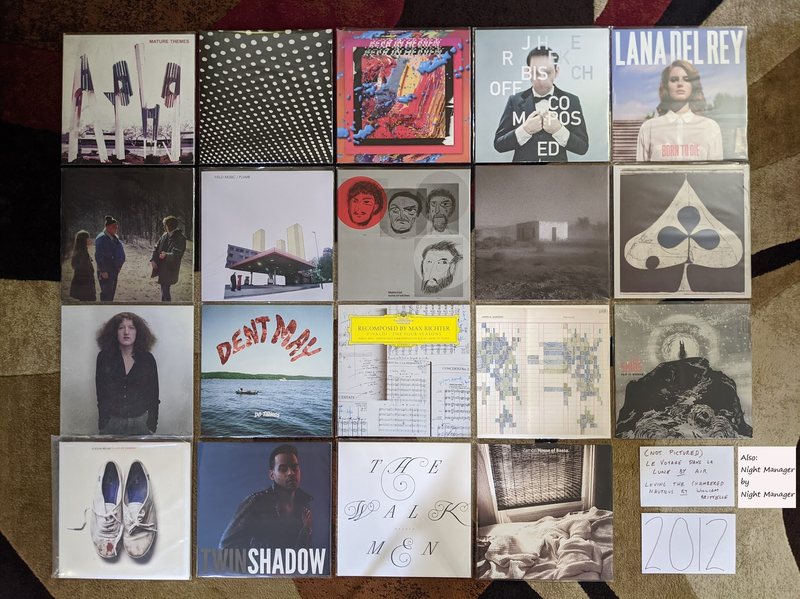

2012 Albums
-----------

This was a great year for music. I often think of this as the very climax of the
"peak indie" years. Lots of great stuff being released regularly, and much of it
was really pushing the art form forward. At the time, I assumed life would go on
like this forever. I didn't realize mainstream pop was about to become the
dominant form, and I didn't realize how quickly I would start to "get old." I've
noticed this is where the documentation process is starting to slow a bit.
Partially because my memory of these years is getting fuzzy, partially because I
am savoring the process of revisiting the past.

.. raw:: html

  <iframe
  src="https://open.spotify.com/embed/playlist/5YFH6N6PeCeQ3sNmfG7BDc?theme=0" 
  width="100%" height="380" frameBorder="0" allowfullscreen="" allow="autoplay; 
  clipboard-write; encrypted-media; fullscreen; picture-in-picture"></iframe>

- *Le voyage dans la lune* by **Air** - I have been following these guys closely
  since their first record back in the late 90s. This is might be the closest
  the have come to the quality of that first record, and I fear that it might be
  their last release. It is very difficult to make instrumental electric music
  that can either fade into the background or strongly captivate the listener
  depending on context, but this is that kind of music. If this is the last one,
  it was a heck of a way to go out. [*Memory*: This was the first album on my best
  of 2012 Spotify list where I captured my favorites as they came out. As a
  result, I listened to it many times, and it never got old. I don't think it
  ever will.]

- *Mature Themes* by **Ariel Pink's Haunted Graffiti** - This record was a big
  step up in production quality for this band. They survive the less low-fi
  conditions and find a new warmth in the process. Some seriously weird music
  with totally non-serious childlike themes. Extraordinary stuff. [*Memory*:
  Hearing "Symphony of the Nymph" for the first time on a car ride at night, the
  exact right way to listen to that song]

- *Bloom* by **Beach House** - Like many people, I was anxiously waiting to see
  what this duo did after the amazing *Teen Dream*. The answer was: make an
  album that was nearly as good, and significantly more refined. I don't listen
  to this one as much as its predecessor, but it is another extremely pretty and
  atmospheric dream pop record that I'm always happy to hear. [*Memory*: I was
  almost afraid to listen to this for fear of disappointment. This should never
  be a concern with this group.]

- *I Love You, It's Cool* by **Bear in Heaven** - Their brand of synthpop
  colored by psychedelic music didn't last long, but it was great while it
  lasted. "Kiss Me Crazy" is the best song they ever made, and a distillation of
  what made them great in a single track. This album might be the most
  representative artifact of the spirit of experimentation typified by this
  band. [*Memory*: Looking at the cover and thinking it was really ugly for such
  a great record. I was yet to understand the style that would morph into the
  vaporwave aesthetic.]

- *Composed* by **Jherek Bischoff** - The short lived "indie classical" era was
  also peaking in 2012. This record was probably the best effort bringing
  together pop singers with the conventions of "fancy music school music." I
  knew nothing of this project until I heard a performance of it broadcast as
  part of the Ecstatic Music Festival on Q2 (now defunct, new music sub-channel
  of WQXR). Listening to new music concerts broadcast on the radio kind of sums
  up this time of life for me. [*Memory*: Seeing David Byrne and Amanda Palmer
  perform tracks of of this record at the Crossing Brooklyn Ferry festival later
  this year]

- *Loving the Chambered Nautilus* by **Wiliam Brittelle** - A really bright and
  cheerful fusion of chamber music and 90s electronic music. In retrospect this
  fits vaguely into the vaporwave scene that was an underground phenomenon at
  the time. It also sounds somewhat like the kind of music that would have been
  in a 90s infomercial.[*Memory*: At the Crossing Brooklyn Ferry festival, I was
  sitting in the balcony of BAM watching the band Caveman and William Brittelle
  sat next to me. He was a somewhat intimidating figure with wild hair and an
  outlandish sense of style. I moved seats.]

- *Born to Die* by **Lana Del Rey (Paradise Edition)** - I liked the big single 
  "Video Games" but
  it took a while for me to warm up to this record. It really wasn't until her
  stunning second record came out that I came back and appreciated what was
  going on here. This hip hop tinged music is very far from where she is now,
  but much of it still really works, especially the outstanding "Summertime
  Sadness." [*Memory*: This album caused quite the stir at the music blog I was
  contributing to at the time. The general sexism and focus on style over
  substance from the blog owners is what drove me away.]

- *Swing Low Magellan* by **Dirty Projectors** - Feels a bit like *Bitte Orca**
  Pt II, and I have no problem with that at all. The central partnership in this
  band produces another solid winner. The high water mark in white bands trying to
  create soulful backing vocals, but creating something completely different (that
  is also pretty OK). [*Memory*: This was the first time I struggled to get a new
  album release on vinyl, and solid evidence that many other folks were also
  buying records again.]

- *Plumb* by **Field Music** - I have no memory of how I became aware of this
  record. This is one of those bands I was very aware of but had never checked
  out. Fits in really well with all the chamber pop and indie classical stuff I
  was into at the time. Reminds me a little of ELO (in a very good way). A very
  prog rock spirit to this record. For some reason I have never explored their 
  other music. [*Memory*: I remember this album being a landmark decision point
  for me. Was I going to buy all my favorite new records on vinyl? Thankfully I
  decided on yes.]

- *Matricidal Sons of Bitches* by **Matthew Friedberger** - Without his sister
  to temper his more experimental tendencies, the other half of *The Fiery
  Furnaces** made some truly odd, minimalist music. This is strange, repetitive
  stuff, but I love it for some reason. This takes the most interesting ideas of
  the *Solos* project and expands it into a super interesting double album.
  [*Memory*: I remember playing the "organ album" from the *Solos* project (the
  obvious direct precursor to this album) to a
  room full of classical organ people who crashed a party at my house. I for
  some reason wanted to offend their sensibilities with music that I knew
  wouldn't fit their taste. There was no reaction.]

- *Allelujah! Don't Bend! Ascend!* by **Godspeed You! Black Emperor** - How long
  was I going to enjoy what this over the top apocalyptic post-rock band was up
  to? Exactly this long! Not remarkably different than what had come before, but
  different enough for me to enjoy. I've tried the record that come later, but I
  feel like this is exactly the amount of Goodspeed I need in my life.
  [*Memory*: Seeing this band play on this tour at the Town Ballroom in Buffalo
  was an amazing bookend on my relationship with this band.]

- *Shields* by **Grizzly Bear** - It was hard to appreciate while it was
  happening, but this band has been getting progressively better on each of
  these records. The one-two of "gun-shy" and "Half Gate" summarizes my favorite
  qualities of the "fancy psych" that these guys specialize in. [*Memory*: I
  remember listening to this album repeatedly on a road trip back to the SE
  Pennsylvania area in late '12]

- *A Church that Fits Our Needs* by **Lost In the Trees** - [*2012 FAVORITE*] 
  There were a couple
  bands that got a notable boost from the NPR program "All Songs Considered" in
  the early 2010s, and that included this act. I doubt they would have had a
  chance to make such an ambitious, sprawling record without the spotlight from
  the folks in DC. They still are making a lot a sound with clearly only a few
  musicians. The songwriter/leader of this band gives the impression of using
  duplicating effects and overdubs to piece together an approximation of an
  orchestra. Its not perfect, but very effective. [*Memory*: "Garden" is probably
  my favorite song from this year, and I have listened to it hundreds of times
  since]
  
- *Do Things* by **Dent May** - I saw this guy back in his "magnificent ukelele"
  phase, as the opening act for AC Newman at the Noise Pop Festival 2009. It was
  kind of silly music, but there was a clear songwriting talent there, with a
  great sense of humor. By the time I saw him open for another act in 2011, he
  had cleaned things up as the front man for a slick indie-pop outfit that
  reminds me a little bit of XTC (and the also the Love Boat for some reason?).
  Fun summer music. [*Memory*: When I saw the band in 2011 I ran into May in the
  bathroom after their set. There was a super awkward moment when I told him how
  much I enjoyed the show as we both stood at the urinals. Nice guy.]

- *Night Manager* by *Night Manager* - When I think of peak indie, I think of
  this crew. They took all the elements of early 2010s indie rock and turned
  them up to 11: reverb, surf rock rhythms, shouted distorted vocals, angular
  guitars, and a sense of adventure. This is some fairly avant garde, it is a
  shame they only lasted a few years in mostly obscurity. [*Memory*: This was
  one of the few things that I discovered from one of my fellow writers at the
  music blog. They actually played at BugJar the club right down the road from
  me, but alas I didn't go.]

- *Recomposed* by **Max Richter** - OK, this project has few rules, but I said
  no pure classical music. I'm gonna claim this is made with a rock and roll
  spirit. I mean, I hate Vivaldi's Four Seasons, and this turns it into
  something I love. This is a classical remix, and a great one. The addition of
  the minimalist repetition and post-rock soundscapes really transformed this
  into something amazing. [*Memory*: I remember streaming a concert video
  premiere that Q2 (RIP) broadcast from the Greene Space in NYC. The violinist
  was wearing sneakers, so it's totally rock and roll and legal for this project.]

- *Port of Morrow* by **The Shins** - No one does straight ahead indie-pop quite
  like The Shins. A perfect pop record, perfectly produced and little more to
  say that that. [*Memory*: I think this is the first thing that I ever
  discoverd from Spotify radio. I had given up on this band a bit after their
  third record, but one listen to "Simple Song" and I was back onboard]

- *Reign of Terror* by **Sleigh Bells** - I was OK with their much hyped first
  record, but this is where they really get going for me. Much more ambitious an
  interesting than the monotone *Treats*. The perfect combination of sweet and
  loud. Obnoxious in the good way. [*Memory*: I saw them on the tour for this
  record at Water Street and it was a big disappointment. They just can't
  replicate their sound very well in the live setting.]

- *Confess* by **Twin Shadow** - A much more refined record than his first one. I
  really miss the raw haziness of the first record. This is really enjoyable,
  but it was the start of a move away from what made this act great. [*Memory*:
  Standing in the orchestra pit for his performance at Crossing Brooklyn Ferry]

- *Heaven* by **The Walkmen** - One of my favorite bands makes their (most
  likely) last album. There is a message here about growing up and getting old.
  Like me, they were just turning 30. The whole indie movement seemed to realize
  that it was aging, and so did I. [*Memory*: Co-incidentally these guys were
  next on after *Twin Shadow* at Crossing Brooklyn Ferry. I saw them for the
  last time in the front row in the orchestra pit. Great show, and I finally got
  a vinyl copy of their first album at the merch stand after.]

- *House of Baasa* byh **Zambri** - Can a band that only has one album (and an
  EP) be one of my favorite artists? I think so. This is such unique music,
  constructed mostly from layers of distorted vocal tracks. Definitely fits in
  well with the darkwave revival thing that was going on, but with a unique
  character that is all its own. The kind of music that could only be made with
  two sisters who shared a room for most of their life. [*Memory*: I remember
  seeing them as the first band on a three band bill at Music Hall of
  Williamsburg in fall 2012. I miss being the kind of person who wanted to see
  the first band in a three band show. Also, it was cute seeing dozens of
  members of the Zambri family make a big fuss over the sisters after their show.]