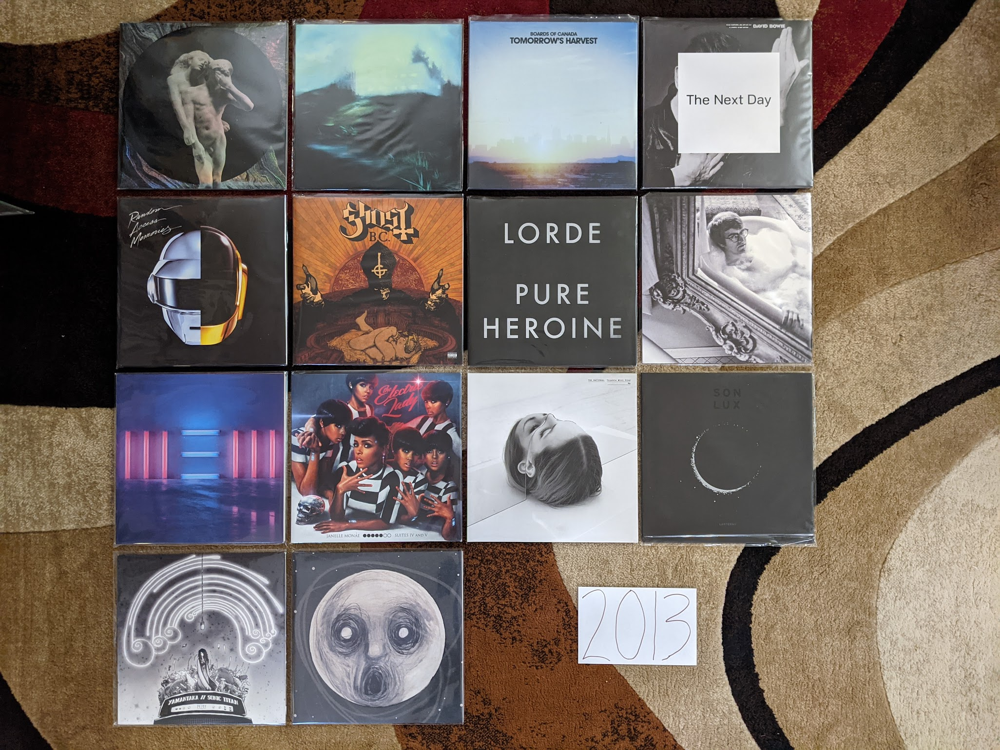

2013 Albums
-----------

This is probably the last year in my life where my musical taste will be
anywhere close to "on trend." It was the last year that I attended a music
festival, and it was the last time I got excited about a new mainstream pop
artist. This is the end of my youth.

.. raw:: html

  <iframe
  src="https://open.spotify.com/embed/playlist/64s1eRMAFNulP786prnhXt?theme=0" 
  width="100%" height="380" frameBorder="0" allowtransparency="true" 
  allow="encrypted-media"></iframe>

- *Reflektor* by **The Arcade Fire** - This was the highpoint for one of the most 
  important acts of the indie era. It isn't their best record, but it is the band
  executing perfectly at the peak of the time in the popular consciousness. I
  felt so smart for having listened to them since 2002. ;) [*Memory*: The
  marketing push for this record was huge. I remember a high profile performance
  on SNL and a bunch of social media things. This was indie's peak.]

- *AM* by **Arctic Monkeys** - This has the distinction of the first retroactive
  addition to this project, and therefore in not in the picture above. I didn't
  include it at first because this isn't a strong record throughout, but the
  first few songs are incredible, especially "Do I wanna Know?". [*Memory*:
  Another of the tentpoles of peak indie. The massive popularity of records like
  this made me think the scene would last forever. It would last about another year]

- *Until In Excess, Imperceptible UFO* by **The Besnard Lakes** - There are a lot 
  of husband/wife indie bands operating out of Canada. These guys are a hidden
  gem in the genre. I don't know why I stopped paying attention after this,
  which was the third great album in a row. I think it is because they stuck
  with the same noisy post-rock meets dream pop formula and I didn't feel like I
  needed anymore than I already had? [*Memory*: When I made this list, I
  remembered that I really liked this album, but not much else]

- *Tomorrow's Harvest* by **Boards of Canada** - I kind of hope we never get 
  another record from these guys. I want their catalog to be bookended by two
  mysterious masterpieces. Without question I have listened to this record the
  most out of any from this bunch. [*Memory*: This is exactly the kind of thing 
  I want to listen to first thing in the morning, and I have dozens of times]

- *The Next Day* by **David Bowie** - I was very much a fan of millennial Bowie, 
  and I love 90s Bowie. This was the album that finally got the critics and the
  general public back on board the Bowie train. In retrospect, I'm not sure what
  made this better than something like *Heathen*, perhaps it was just marketed
  better. That said, it is another extremely solid record to close out a
  sequence where he was exploring his past sounds. [*Memory*: At the time I
  assumed this was the beginning of another string of successful Bowie records,
  but he would disappear again, and it would not work out that way]

- *Caveman* by **Caveman** - This is an excellent, if very straightfoward indie
  record. In many ways it speaks to both the peak of indie rock's influence, but
  also its impending demise. It isn't a criticism of these guys who are the
  utmost of professionals, but the music being produced by the small labels had
  converged to a sound indistinguishable from countless major label acts of the
  day. Even the self-titled label on the disk seems to point to a more refined
  new beginning for the band after the rougher nature of their prior releases.
  That said, I do prefer this over those rawer earlier efforts. That said, the
  world was moving on from this kind of music, and those making it were no
  longer concerned about differentiating themselves from the mainstream. I think
  this record has been unjustly overlooked, as it got lost in the fading
  relevance of indie. "In the City" and "Shut You Down" are a particularly
  impactful sequence on the A side. [*Memory*: I saw this band at the bugjar the
  year before this album came out, and then shortly after its release at the
  Crossing Brookly Ferry festival. It was quite striking how far they had come
  as a band in that time. You really felt like they were polishing the act for
  bigger and great things to come. It is a shame they never got the attention
  they deserved. Given that they didn't make my original list and were added
  years later, I didn't give them the attention they deserved. I've worn the
  really cool looking tour shirt I got at that bugjar show, way more times than
  I have listened to their records.]

- *Random Access Memories* by **Daft Punk** - This will be the last release to win
  the Album of the Year Grammy to appear on my list. I say this not just because
  of my "getting old" but because of trends in popular music that I do not
  expect to ever significantly change. The way this walked a tightrope between
  indie electronic and mainstream pop is masterful. One of the most deserving
  albums to ever win that award. [*Memory*: I was at the headquarters of the
  company I worked for at the time, and I heard someone humming "Get Lucky" at
  the photocopier. I felt hip for being in line with prevailing pop trends for once.]

- *Sticky Wickets* by **The Duckworth Lewis Method** - Neil Hannon makes a second 
  record about cricket with his collaborator. It's not quite as good as the
  first one, but still way better than it seems like it should be. The best
  track is "Judd's Paradox" which revisits the concepts and themes from the
  first album regarding social class and cricket, and recycles the melody from a
  **Divine Comedy** record released only a few years prior. [*Memory*: It was
  shocking to learn there was not one, but two solid concept records about the
  sport of cricket]

- *Infestissumam* by **Ghost** - When I discovered this band, this was their 
  newest release. It was their weakest record then, and still is. I almost have
  this on my list solely for the prog metal epic "Ghuleh/Zombie Queen" which is
  pretty much the only song from this record they bother to play live at this
  point. [*Memory*: Back when this was the new Ghost record, I took it as a sign
  that they were not going to have staying power. I was wrong about this record,
  I was wrong about the band.]
  
- *Pure Heroine* by **Lorde** - Around this time I was attending the "Alternative 
  Music Film Series" at the Memorial Art Gallery, and they would play videos for
  recent alternative hits before the feature. It was in this context that I
  heard "Royals" for the first time, and I was a bit embarrassed by how much I
  liked it. It didn't seem like the kind of music I should be in to. Time would
  show that Lorde was very much the kind of music I am into. [*Memory*: "Team" 
  will always be my Sunday morning Wegman's jam]

- *Warm Blanket* by **Dent May** - For a very brief moment this guy found an
  interesting XTC meets lounge singer sound that was indie pop gold. I can't get
  into his new stuff, but this record is what I want to hear when I am sitting
  on the porch sipping a cool beverage. [*Memory*: I was really excited about
  the sound of this record, and was very sad that he would soon move on from this]

- *New* by **Paul McCartney** - Beatle Paul starts paying attention to indie and
  attempts to integrate what he sees into his own music. This has virtually
  nothing to do with 2010s indie, but it is stunning. "Queenie Eye" is an
  especially fresh and quite unexpected single. This the start of an ambitious,
  if inconsistent late career push. [*Memory*: It was startling how fresh and
  vibrant McCarney seemed all of a sudden when this record came out. We were
  only a few years from that horrid covers record.]

- *The Electric Lady* by **Janelle Monae** - [**2013 FAVORITE**] It's a huge
  bummer that we will never
  get a proper end to the Cindy Mayweather epic. Monae has clearly gone in a
  different (mildly disappointing) direction. This record does an amazing job
  balancing modern pop idioms with dozens of ideas from the past. I really
  wonder if we will ever see anything like this again. [*Memory*: The Prince
  estate has continually allowed and disallowed streaming of the track "Givin'
  'Em What They Love" which features the purple one. This is a shame because it
  is a hell of a way to start the record.]

- *Trouble Will Find Me* by **The National** - In retrospect *High Violet* was a
  massive pivot for these guys, and every record since has been the same low key
  collection of dirges and love songs. It never feels as samey as it should
  because it is so textured and delicately beautiful. "Pink Rabbits" is the
  definitive track from this era of the band. [*Memory*: This is the album when
  I finally allowed myself to be a sensitive indie bro National fan]

- *Lanterns* by **Son Lux** - By far the most accessible record by Ryan Lott, and
  that was a smart move. After the visibility his friends at NPR provided, this
  was the record that built the fan base that would sustain his art rock
  endeavour. "Lost It To Trying" was a clear effort to write a pop single that
  totally worked out. [*Memory*: I was mildly ashamed of myself for liking "Lost
  it To Trying" because it indulged in the "Woah-oh-oh!" chorus trend that was a
  cliche of mainstream pop in those days]

- *The Raven That Refused to Sing (and Other Stories)* by **Steven Wilson** - Wilson
  was in the process of producing remasters of the **King Crimson** discography
  when this album was made, and it shows. This is the kind of jazz influenced
  "heavy prog" that Crimson were up to in the early 70s. [*Memory*: The cover of this album
  will always remind me of Lakeshore Record Exchange, a record store that was
  walking distance from my first apartment in Rochester. They had a special
  edition LP of this in stock for the last five years of their existence. That
  record store always smelled great. When I think of this album I smell a record
  store of my past...]

- *Uzu* by **Yamantaka//Sonic Titan** - I discoverd this record while preparing to
  attend the 2014 Polaris Music Prize Gala in Toronto. For several years I had
  been streaming the gala online and had enjoyed the window it gave me
  into the wildly experimental indie scene of 2010s Canada. It was a remarkable
  time for Canadian music, and this band were one of the most out there acts.
  They didn't win or even perform at the ceremony, but this was the pick of the
  litter for me. This is theatrical, progressive metal that manages to never feel
  cheesy, and was a real breath of fresh air. [*Memory*: Seeing this band perform
  at the 2012 Polaris Prize was incredibly memorable]