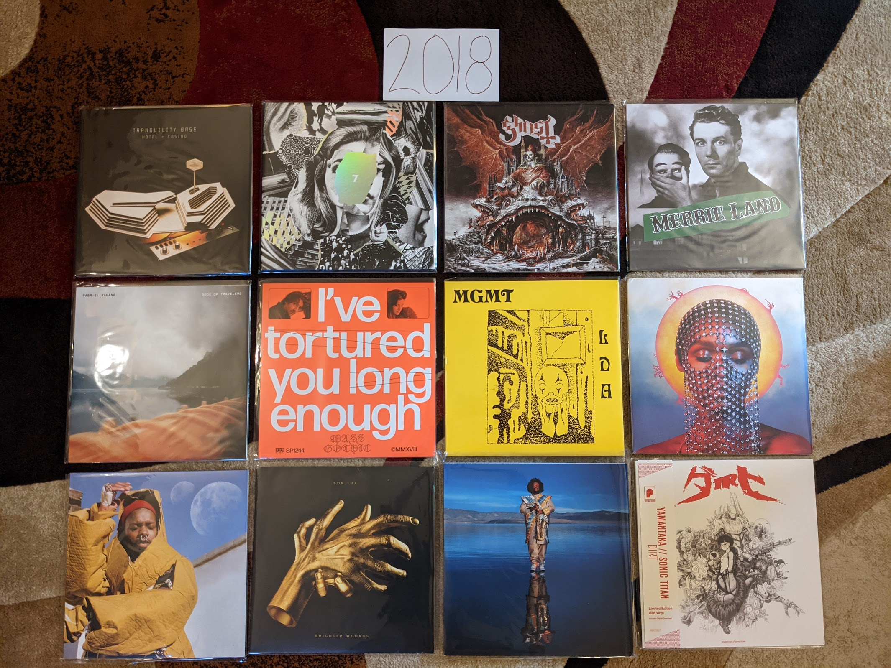

2018 Albums
-----------

I think the best summary of this year is that all of these albums except
two were by artists that were among my favorites going into the year. Those two
new artists were both discovered on NPRs All Things Considered. I may have been
a bit out of touch with popular music.

.. raw:: html

  <iframe
  src="https://open.spotify.com/embed/playlist/4pSrzHRA9VaFcj48PgrE1R?theme=0" 
  width="100%" height="380" frameBorder="0" allowtransparency="true" 
  allow="encrypted-media"></iframe>

- *Tranquility Base Hotel + Casino* by **Arctic Monkeys** - Of all the bands to
  come out of the early 2000s post punk revival, these guys have stayed the most
  interesting for me. All the genre hopping on this one put a lot of people off,
  but it is why I still care about them. [*Memory*: There was a good month or
  two where this was all I was listening to]

- *7* by **Beach House** - The name is a reference to this being the seventh
  record, all of which are among my favorites of all time. It feels a little
  weird to me that my favorite modern band is a two person dream pop act. There
  are a lot of familiar sounds on those seven records, but it never gets old.
  [*Memory*: Hearing the first track the first time and thinking: "they've done
  it again"]

- *Prequelle* by **Ghost** - After the last record, I was really hoping for more
  power ballads along the lines of "He Is" and we got them, and it was great.
  "Life Eternal" does such an amazing job straddling the line of comic theatrics
  and beautiful sincerity. Some killer rocking tunes too (e.g. "Rats").
  [*Memory*: Hearing the saxophone part on "Miasma" and wishing that they do
  some ridiculous presentation of it on tour, they did]

- *Merrie Land* by **The Good, the Bad, and the Queen** - Somehow I missed the
  release of this album, and didn't find out about it until two years later.
  Their self titled record was one of my favorites from the last decade, and
  I thought it was a one off project. Like the first one, this album is a big time grower
  that takes a bit to get into. Given the passing of Tony Allen I assume this is
  the last one, but it already feels like a bonus that we have this. [*Memory*:
  Finding out that this existed when cataloging my valuable vinyl copy of their
  first record, and panic buying a vinyl copy of this one]

- *Book of Travelers* by **Gabriel Kahane** - I saw Kahane perform this album
  twice, the first of those as a multimedia performance at BAM. The story of his
  cross country train trip looses something without the little stories he told
  between songs, but it is still a beautiful set of melancholy little folk
  tunes that reminds me of those great performances. [*Memory*: Seeing a
  performance of this concept album about an Amtrak journey, that I traveled to
  via Amtrak]

- *I've Tortured You Long Enough* by **Mass Gothic** - Now sounding like a
  direct merger of their former bands **Hooray for Earth** and **Zambri** I am
  very much sold on this project. I'm really pleased that Jessica Zambri is now
  singing most of the songs as it suits the style better somehow. [*Memory*:
  Feeling happy that this existed, but sad that it was a sign that two of my
  favorites were never coming back]

- *Little Dark Age* by **MGMT** - [**2018 FAVORITE**] After their highly 
  disappointing, self titled
  third album, I had given up on these guys. I can usually sense when a band has
  lost the sound that made me enjoy them in the first place. When they came back
  with this strong release out of nowhere it was the surprise of the decade for
  me. They did it by finding their way back to their old sound. Sometimes
  regression is a good thing. [*Memory*: Feeling blown away by how good this was
  when Spotify radio played it for me]

- *Dirty Computer* by **Janelle Monae** - This album has been influenced by the
  sounds of highly manufactured, modern pop music. At first it was shocking and
  disappointing from an artist who seems to transcend that kind of thing.
  Eventually I was able to find the things that make Monae one of my favorites,
  and I can appreciate this for what it is: a way above average implementation
  of 21st century pop idioms. [*Memory*: Initially feeling colossally
  disappointed by the inclusion of modern pop into the work of an artist that had
  until now, done a great job sounding timeless]

- *Soil* by **serpentwithfeet** - NPR discovery 1 of 2. I love when the sounds of
  church music are adapted to a more honorable purpose. A former choirboy turned
  Satanist makes a gorgeous record of queer love songs. [*Memory*: It was
  becoming troubling how much of my new music was coming from the NPR morning show]

- *Brighter Wounds* by **Son Lux** - A fitting place between two new NPR
  discoveries, for an artist who owes their career to NPR. That early public
  radio fame has led to one of the strangest bands to have a fairly large
  following. Their second record as a legit three piece band, they are really
  testing the limits of their audience with this challenging record. "Forty
  Screams" is such a complex, stunning opener for an album that never quite
  matches that opening intensity. [*Memory*: I listed to "Forty Screams" so many
  times after this came out, and I still crank it on the headphones often]

- *Heaven and Earth* by **Kamasi Washington** - I love jazz fusion (as is clearly
  evident by my 1970s favorites). There isn't much good fusion being made today,
  but Washington gave us three whole disks worth here. His band is killer and I
  particularly enjoy the vocal contributions of Patrice Quinn (and I normally
  hate vocal jazz). NPR discovery 2 of 2. [*Memory*: Due to the pandemic, this
  was the last artist I would see in concert for a very long time]

- *Dirt* by **Yamantaka//Sonic Titan** - I bought my vinyl copy of this record
  from Alaska B, the leader and only consistent member of this art metal band.
  She was surrounded with an almost all new assortment of Montreal musicians
  who had taken the band in a new, much heavier direction.
  The show was at BugJar, the tiny indie club down the street from my house. It
  was incredible to see such loud music in such a small space, what a night.
  [*Memory*: Wondering if this would be the last time I would see a band I loved
  at the BugJar]