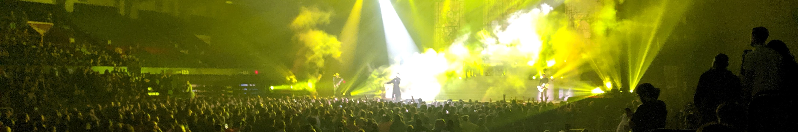
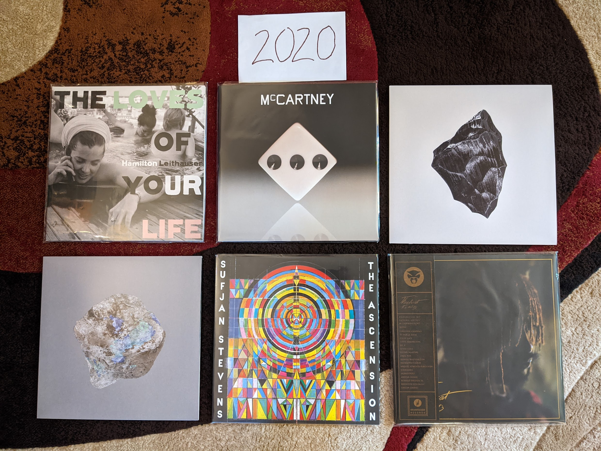
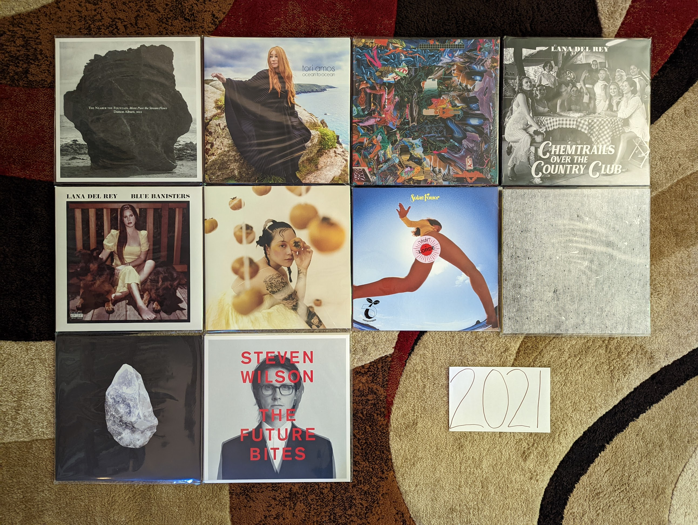
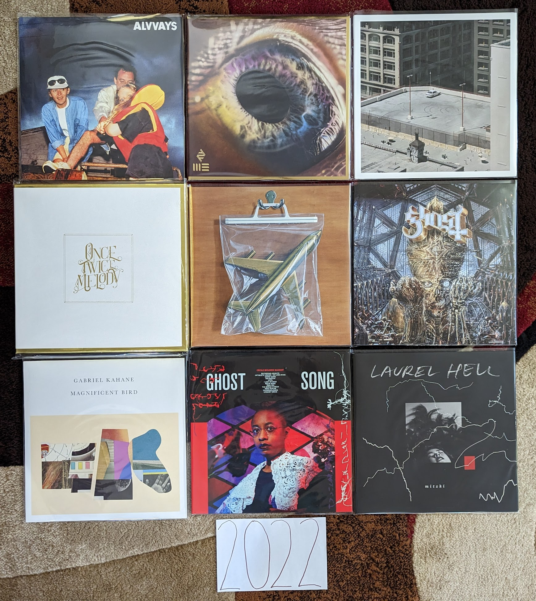

2020s
=====

Still a work in progress. The decade started with a pandemic that put a huge
damper on everything, and music was't immune. Artists weren't able to tour and
album releases have been far fewer. The isolation and extra time created some
fairly introspective records. It also gave me the time to make serious progress
on this project.

2020
----

The lost year. The most historic year most people now living will experience. A
massive pandemic that impacted everything. A relationship ended, an exciting new
one began. I changed jobs from one I loved, to a new one I loved more. I had
more free time that I have ever had as an adult. I didn't hear a whole lot of
new music I loved, though I certainly tried. I'm still mostly getting into
albums by artists I already know well.

.. raw:: html
  
  <iframe
  src="https://open.spotify.com/embed/playlist/7zbFoEgDbk3hQOWQfDg6mS?theme=0"
  width="100%" height="380" frameBorder="0" allowtransparency="true"
  allow="encrypted-media"></iframe>
  

- *The Loves of Your Life* by **Hamilton Leithouser** - I've enjoyed each of his three
  solo records released to date, but each one sounds more and more like his old
  band *The Walkmen* and I'm not going to complain. I loved *The Walkmen*.
  [*Memory*: Being excited there was any new music to listen to during the pandemic]

- *McCartney III* by **Paul McCarney** - In the depths of early pandemic anxiety I
  was really excited to hear about the third in the series of McCarney's self
  titled records. I and II had been some of Paul's most experimental and
  groundbreaking work. I pre-ordered on vinyl the day it was announced. It
  managed to be better than I thought it could be. I listened again when I wrote
  this, and realize I am still liking it more with each listen. It is remarkable
  that he can make music like this at his age and career state. [*Memory*: Hearing
  that this existed was welcome good news in one of the roughest periods of my life]

- *Tomorrows I* by **Son Lux** - [**2020 FAVORITE**] - Another welcome
  distraction in the lost year was the three part epic by Ryan Lott and band.
  The albums play out more like films in a trilogy than a multi-movement musical
  piece. This one does a great job setting up the themes and concepts of the
  whole work. [*Memory*: This was released right after I moved back to
  Rochester] 

- *Tomorrows II* by **Son Lux** - If part one was A New Hope, this definitely is
  Empire Strikes Back. Everything is shaken up and broken apart. The reviews I
  saw didn't like this one. I don't think we were supposed to be comfortable. This is the
  middle act in the trilogy when things get harsh and difficult. [*Memory*:
  Being very disappointed with this until part III resolved everything]

- *The Ascension* by **Sufjan Stevens** - I'm glad that Sufjan is back to making weird
  music, that is when he is at his best. [*Memory*: For some reason I listened
  to my vinyl copy of this  for the first time while watching a video of my high 
  school class Promenade on Facebook]

- *It is What it Is* by **Thundercat** - Not as perfect at his previous record *Drunk* but
  still an amazing record on the boundaries of R&B and jazz. [*Memory*: I spent
  a really long time deciding if I really needed a copy of this on vinyl,
  apparently I did]

2021
----
This is the first year that was compiled with this project in progress, and in
mind. How did this impact my listening? The impact is subtle, but I'm sensing an
effort to branch out and hear new things (that aren't just random things I'm
hearing on NPR). By the time 2021 ended, I had been working from home for
almost two years. I'm also seeing the kind of introspective music that fit in
well with that kind of isolation. I also feel the effect the pandemic on a sense
of isolation and self reflection in many of the records I was listening to.

.. raw:: html

  <iframe
  src="https://open.spotify.com/embed/playlist/4hfNbM2di8sEjAnzMkylDm?theme=0" 
  width="100%" height="380" frameBorder="0" allowtransparency="true" 
  allow="encrypted-media"></iframe>

- *The Nearer the Fountain, More Pure the Stream Flows* by **Damon Albarn** - I
  really didn't like this the first time I heard it, but it really grew on me.
  Such a pretty, subtle record. [*Memory*: I liked this record well enough to
  seek out a vinyl copy, and it was really only after the first listen that way
  that I really connected with this one, especially the last few tracks.]

- *Ocean to Ocean* by **Tori Amos** - Another really strong record, from an
  artist who keeps making them. Probably not as good as *Native Invader* but the
  song "Spies" is her best in a decade or more. [*Memory*: Tori came to
  Rochester for the first time in about 20 years on this tour and played a great
  show to a very engaged audience.]

- *Cavalcade* by **Black Midi** - My favorite artist discovery in some years.
  (More than a decade maybe?). Some serious prog/math rock made with an indie spirit.
  So pretty, so dense, so much to wrap your head around. The kind of music that
  only makes sense to people with hundreds of favorite records, and hand craft a
  website to talk about them. [*Memory*: buying the LP online before I had even
  heard half the album because I was so taken]

- *Jubilee* by **Japanese Breakfast** - We are now getting to the point where
  music is starting to sound like a retro throwback to the indie music I
  listened to in my college days. This is the kind of semi-twee indie pop that I
  loved 20 years ago, updated with the electronic sounds of our current age.
  [*Memory*: Around this time, It felt like every time Spotify radio took over
  after the music I actually chose to play, it played me the song "Paprika". Did
  this make me like the album by brute force?]

- *Chemtrails Over the Country Club* by **Lana Del Rey** - *NFR* wasn't a fluke,
  but the beginning of a career on a whole new level. This is another extraordinary
  album filled with the old Lana tricks and a killer folk soul. The songwriting
  is top notch, and the performances are first rate. My favorite artist working
  today. [*Memory*: It had been about five years since I had heard an album on
  vinyl for my first listen, and I was glad I saved this one]

- *Blue Banisters* by **Lana Del Rey** - How is this even better than her first
  album from 2021. How is she the most consistent artist of the current
  generation? What is the next album going to be like? Is it coming out this
  year too? [*Memory*: Being extremely confused about what this was when it was
  announced a few weeks after *Chemtrails*]
  
- *Solar Power* by **Lorde** - Yes, this is a much subtler record with less lofty
  themes and goals. We live in an age where subtlety doesn't get the credit it
  deserves. This is a great record. Don't worry, I'm sure she will be back to
  some real melodrama someday soon. [*Memory*: For the second straight record I
  hated the lead single when I heard it, but I love the album (and ended up
  liking the lead single in time)]

- *Hey What* by **Low** - [**2021 FAVORITE**] - When I became aware that these
  guys were making somewhat avant garde electronic music now, I had to hear it.
  Sure enough the beautiful harmonies were now backed by a super interesting and
  downright pretty interpretation of minimalist industrial. Are they really
  Mormons? Surely music this good must be sinful? [*Memory*: In a repeating
  theme this year, I bought a vinyl copy of this midway through my first listen]

- *Tomorrows III* by **Son Lux** - Continuing my Star Wars analogy from last
  year, this is most definitely "Return of the Jedi" and "Embrace" is "Yub Nub"
  brining the whole thing home with a positive vibe, looking back on the themes
  that run through this amazing trilogy. [*Memory*: Streaming this first thing
  the morning it was released and feeling so satisfied by how the trilogy ended]

- *The Future Bites* by **Steven Wilson** - I dig the sterile, anxious vibe of
  this record, even if the songs aren't universally brilliant. Certainly music
  for our current age. The singles "KING GHOST" and "PERSONAL SHOPPER" are
  killer. Who here is surprised that this guy has changed sounds again?
  [*Memory*: The creepy video for "PERSONAL SHOPPER" is all I can think of when
  I hear this album]

2022
----

Again, I feel like this project has had a significant impact on my listening for
the year. In this case, I wasn't seeking out new music as much as I focused on
assembling my favorites into as comprehensive of a vinyl collection as possible.
This was the year where I crossed the threshold of owning 80% of the records
captured here (82.3% and 848/1030 as I write this on 1 January 2023). That total
includes each of the nine records I enjoy from the year in question. I had a
really tough time picking a top favorite this year, and probably four of the
albums below are in a virtual tie.

.. raw:: html

  <iframe style="border-radius:12px" 
  src="https://open.spotify.com/embed/playlist/5lGPs8K0b03NqikVaEhloJ?utm_source=generator&theme=0" 
  width="100%" height="380" frameBorder="0" allowfullscreen="" allow="autoplay; 
  clipboard-write; encrypted-media; fullscreen; picture-in-picture"></iframe>

- *Blue Rev* by **Alvvays** - So much of the best indie that is coming out today
  sounds like it is from ten years ago. It is too soon for this kind of thing to
  be nostalgia, so I assume that this kind of shoegazy, quasi-electronic indie
  is a genre unto itself now. They have done a great job with it here.
  [*Memory*: This year I did something I haven't done for the last few years,
  when I checked what the various music blogs and review sites were picking as
  the best albums of the year. I tried out a few things that sounded
  interesting, and this was the only thing that stuck.]

- *WE* by **The Arcade Fire** - Now this is more like it! I'm not sure what was
  going on during their prior record, but this is a massive improvement. Yes,
  there is some truth to the favorite joke that this sounds like the band trying
  to pay homage to their younger selves, but they are doing a great job! Best
  case scenario continues to be this band slowly morphing into Bruce
  Springsteen in the decades to come. [*Memory*: The first time I streamed the
  "Lightning I" single it was an exciting moment. Not quite like hearing
  "Sprawl II" for the first time, but the kind of joy only these guys can bring
  up.]

- *The Car* by **Arctic Monkeys** - [**2022 FAVORITE**] - The progression into
  more subtle, artier music has continued. So has my growing appreciation for
  their work. I had to spend some time with it, but I think this might be my
  favorite of theirs so far. A fascinating collection of lounge/soul inspired
  tracks, with several of their very best, especially the stunning "Body Paint".
  I can't wait to see where they go next. [*Memory*: I was more excited about
  the release of this record than any other in 2022. I really liked the last
  one, even if it went over most folks heads. With this album it looks like
  their maturing sound is starting to catch on.]

- *Once Twice Melody* by **Beach House** - It has become clear that all their
  records will be great, but some are greater than others. This is one of the
  top tier releases. More dreamy dream pop than we have seen since *Teen Dream*
  but with the crisp, first rate song-craft of a veteran who have mastered their
  art. [*Memory*: This was released in four 4-5 song increments, I ordered the
  deluxe vinyl box after the first play of the first batch.]

- *Ants From Up There* by **Black Country, New Road** - I'm always a little
  suspicious when something is so universally loved. Everyone from Amazon to
  RateYourMusic seems to think this is the consensus album of the year. When I
  listened to it, I was shocked that something like this was getting such wide
  acclaim. It reminds me of **Black Midi**, **Frightened Rabbit**, and **Thee
  Silver Mt Zion** (?!). I guess this is what the kids like now. [*Memory*: I
  really connected with this album for the first time on a walk around the Park
  Avenue neighborhood, particularly the song "Snow Globes".]

- *Imperium* by **Ghost** - They have changed the sound a bit again, but still a
  great record. Not as long lasting as their last two releases, but I still had
  a great time with this. "Darkness at the Heart of My Love" is a particularly
  interesting new direction for these guys. [*Memory*: I ordered a vinyl copy of
  this record before I heard a single song off of it. That is the faith I have
  at this point.]

- *Magnificent Bird* by **Gabriel Kahane** - The stellar folk song-craft we have
  seen in the prior records, with some interesting new elements and instruments.
  "Linda & Stuart" reminds me of Owen Pallett in a very favorable way. The title
  track feels like Gabe's take on the Sufjan formula, and it really works out.
  [*Memory*: I heard this record for the first time on vinyl, and I listened to
  it three times in a row.]

- *Ghost Song* by **Cecile McLorin Salvant** - I generally don't like vocal
  jazz, but I really like this. A great record of originals with a striking
  cover of **Kate Bush**'s "Wuthering Heights". [*Memory*: In 2022 I
  resubscribed to SiriusXM for the first time in about 15 years. Early on in the
  pandemic they offered free streaming, and it eventually made me join back up
  again. I heard the title track from this album on their jazz station and was
  really struck by it. ]

- *Laurel Hell* by **Mitski** - I had enjoyed several of her prior records,
  particularly *Puberty 2* but they were never consistent enough to make my
  list of favorites. I seem to like this one more than most folks. There is
  something about the use of piano and the dense arrangements that really speak
  to me. This is still a bit front loaded, but that first side is amazing.
  [*Memory*: This was another discovery on the satellite radio. The Indie
  channel was playing "Stay Soft" about every half hour and I was glad to hear
  it.]

- *And In the Darkness, Hearts Aglow* by **Weyes Blood** - Her albums keep
  getting brighter and more upbeat, though this one almost feels like it is
  doing it an a very tongue in cheek way. Really solid modern folk, with some
  really interesting indie electronic touches. One of the best artists active
  today. [*Memory*: This didn't do it for me the first time I listened, but it
  really, really grew on me. I didn't even include it in my original list of the
  best albums of the year. Now I'm questioning if it is my favorite from the year.]
  
2023
----

For the first time, I find myself a full year behind in adding to the modern day
releases here. Partially, this is because I have been distracted with other
hobbies (most notably a return to both running and bowling) but also because I
kept hoping that additional releases might join those listed below. It seems
like things have lost momentum a bit from the pandemic years, but that might be
just because I have more going on my life now, and less time to focus on Animal
Crossing and pop music like some sort of teenager. Every one of the albums comes
from an artist that already had one (or more) in my lists of past years. Have I
permanently slipped into the backward focussed attention of middle age? Or is
this just a dry spell before a go in a totally new direction. Since I am a year
behind on this project, I already know the answer, and can now say it is a bit
of both.

.. image:: images/image_forthcoming.jpg
  :width: 900
  :alt: My favorite albums from 2023

.. raw:: html

  <iframe style="border-radius:12px" 
  src="https://open.spotify.com/embed/playlist/0VF3v2DL8WMAFVDkW4pITE?utm_source=generator&theme=0" 
  width="100%" height="352" frameBorder="0" allowfullscreen="" allow="autoplay; clipboard-write; 
  encrypted-media; fullscreen; picture-in-picture" loading="lazy"></iframe>

- *Did You Know There's A Tunnel Under Ocean Blvd* by **Lana Del Rey** - Not
  quite as amazing as the last three records, but that is a fairly high
  standard. The weird interludes break up the album in a way that detracts from
  the songs, and there are a couple weaker than usual tunes. That said, the
  title song, "Paris, Texas", and "Peppers" stand among her finest work. The
  biggest surprise is the return of the hip hip inclinations of her debut in a
  way that we haven't heard in some time. This isn't the full album statement we
  have come to expect, but is still way above what most artists are producing
  today. [*Memory*: In February/March of 2024 I was walking before work, working
  my way back from a prolonged knee injury. This album fit well with the chilly
  pre-dawn mornings.]

- *i/o* by **Peter Gabriel** - A theme of the last few years has been
  unexpectedly strong releases from legacy artists that have done very little
  for the last decade or two. In the case of this record, the artist has
  returned to doing exactly what they have always done, and did it extremely
  well. This fits in cleanly with the sound of the records that preceded it, and
  manages to be his best work since the third of the self-titled albums. I hope
  he makes more music, but if not, the strangely positive "Live and Let Live" is
  the perfect note for one of the all time greats to say goodbye on. [*Memory*:
  There are two different mixes of this albums, and I needed to pick my favorite
  when I bought my vinyl copy. It was tough but I went with the dark-side mix
  that I prefer by the thinnest of margins.]

- *I Inside the Old Year Dying* by **PJ Harvey** - Polly's transition to and
  English folk musician, combined with 21st century Kate Bush dance technique is
  complete. In all seriousness, this a very different place from where she
  started, but amazing in its own unique way. We continue to get a combination
  of the latter day "church voice" vocals and the old-school growling
  techniques. The music also seems to pull from the full history of her catalog.
  The mood of the record is however very consistent from start to finish with a
  haunting, claustrophobic sound. Her only other record that sounds anything
  like this is *White Chalk* but even that connection is tenuous and brief. One
  thing she will never do is repeat herself. [*Memory*: I saw her in concert in
  Toronto in September of 2024. The performance included the entirety of this
  record played in sequence, followed by a selection of back catalog material.
  It was delightful and somewhat shocking to hear this wonderful album played
  side by side with the older material which for the most part, felt like the
  work of an entirely different artist.]

- *Fantasy Something* by **Hooray for Earth** - [**2023 FAVORITE**] - Even though
  this is essentially the work of a single person, I was still shocked by the
  sudden revival of this project. I thought for sure that Noel Heroux had moved
  on from this kind of thing, and I was overjoyed to hear the most complex and
  accomplished work thus far released under this name. This isn't easy music,
  and it almost demands that someone has been listening since the first release
  of the project, but for those of us who have been, the combination of glitchy
  samples and churchlike melodies is the perfect next step. Let's hope it's not
  the last. [*Memory*: He did a bandcamp fundraiser for a vinyl physical release
  of this, which unfortunately didn't succeed. For a moment I considered
  offering to front the remaining needed funds to make the pressing happen.]

- *The Land is Inhospitable and So Are We* by **Mitski** - A scaling back after
  the big, risk-taking of the last album was inevitable. The public had decided
  the last release was a bit much, and the artist obliged with a more
  straightforward, but still very enjoyable alt-folk record. The strong
  songwriting ensures that it still works, even if I would prefer a bit more of
  the risks from the last record. [*Memory*: I bought this on physical media not
  knowing a thing about it since I enjoyed the last album so much. I learned to
  appreciate this more subtle statement after time. Would I have done so if I
  only streamed it?]

- *Personal Duty* by **Space Art** - These guys went from zero to one of my
  all-time favorites in the space of a few weeks (more on this when I get to the
  70s/80s). Then the last original member passed away leaving this last album as
  a final statement. The same wonderful combination of vintage synths and drums
  as the classic records, this time with some modern production values that
  sound a little like **Daft Punk** and the other artists that obviously owe a
  great debt to their work. It all works amazingly well, except for the strange
  "Goree Island" which feels a little too unserious for the very serious subject
  matter it is taking on. [*Memory*: I imported this on vinyl directly from the
  French label that put it out. I only wish I had done it a bit earlier to get
  an autograph by the artist, who isn't around to sign further copies.]

- *Javelin* by **Sufjan Stevens** - My favorite record of his since the
  legendary *Illinois*, now we are back to the kind of experimentation that he
  does best. The first song "Evergreen" almost seems to lure in the more casual
  listeners who came onboard with the more straightforward folk of *Carrie and
  Lowell*, and then takes an abrupt left turn that makes the glitchiness of *The
  Age of Adz* seem tame. From there it feels like a summary of why Sufjan is one
  of the greatest musicians working today. [*Memory*: Sufjan had always kept the
  issue of his sexuality ambiguous. This album and the accompanying promotional
  tour changed that in the very saddest way possible.]

2024
----

OK, I'm definitely getting old. Two of my favorites are live albums by legacy
acts, and half the records are jazz. It is very modern jazz though...I'm hip! Oh
and yeah...my top favorite is by a band in the sixth decade of their career. Of
course I had to throw one new band in there to keep things fresh. Things were
more organic than that, but definitely I have a different relationship with new
music at age 44.

.. image:: images/image_forthcoming.jpg
  :width: 900
  :alt: My favorite albums from 2023

.. raw:: html

  <iframe style="border-radius:12px"
  src="https://open.spotify.com/embed/playlist/1LI7N9jgYhAb9AYPCSkiBU?utm_source=generator&theme=0"
  width="100%" height="352" frameBorder="0" allowfullscreen="" allow="autoplay;
  clipboard-write; encrypted-media; fullscreen; picture-in-picture"
  loading="lazy"></iframe>
  
- *Diving Deep Live* by **Tori Amos** - After the pandemic you can tell that
  Tori was very happy to be back on the road playing shows. We were very happy
  to have her back as well. It felt like an especially important tour, and it
  deserved a live release. The mix of songs is the perfect mix of new and old,
  popular favorites and deep album cuts, and artist and backing band are in top
  form. The title is accurate, some of these go way deep like "Lady in Blue" and
  "Sister Janet". A definitive live document of one of the all time great live
  performers. [*Memory*: I saw Tori on this tour at the Kodak Center. It was an
  amazing show, and even though the playlist was very different, I'm glad to
  have this as a reminder of that fantastic evening.]

- *Songs of a Lost World* by **The Cure** - [**2024 FAVORITE**] - This took us
  all by surprise. This is an amazing record from a band that formed in the late
  70s and hasn't really had a quality release yet this century. It almost feels
  like it is part of a dark, atmospheric trilogy with *Pornography* and
  *Disintegration*. The moody instrumentals that start and end the record set
  the perfect mood. No one else can make being miserable sound so beautiful.
  [*Memory*: I had heard the hype before my first listen, and I really wish I
  could have gone in without any indication of what I was in store for.
  Regardless, I was still blown away by this the first time. It is still early
  days, but I really think this is an all-time favorite.]

- *GOOD BOY* by **Daoud** - The perfect blend of hip-hop and jazz (rapidly
  becoming a genre favorite of mine), and some outstanding trumpet playing. I
  really like the way they recorded the leader, leaving some imperfect but
  engaging textures that really make for an exciting listen. Whoever is playing
  piano on this is playing out of their mind. This is a a really cool,
  futuristic jazz sound. More of this please! [*Memory*: I'm fairly certain that
  someone has used the song "Ford Focus 1999" as background music in VRChat.
  Well if that isn't actually true, it should be.]

- *Vision is the Identity* by **Chrisopher Hoffman** - This is some very modern
  jazz if there ever was such a thing. The combination of upright bass and
  electronics is already a strange combination, but when you add in the moments
  of harmonic experimentation, you have a very unique kind of jazz. I think the
  audience for this kind of thing is small, but I am solidly in it. [*Memory*:
  I'm very fuzzy on how I found out about this, but I think it was Spotify radio
  after listening to the new **Kamasi Washington** record. I was blown away to
  find out they actually did a vinyl pressing of this unique album, and even
  more surprised to hear it played on SiriusXM later that year!]

- *Imaginal Disk* by **Magdalena Bay** - This album gets off to a slow start,
  but by the time of "Death & Romance" it reveals itself as a unique combination
  of electronic dance and psychedelic art music. The biggest accomplishment is
  the way the whole thing manages to strike a balance between structural
  experimentation and massive pop hooks. It is also an amazing sounding record
  with top rate production from start to finish. I can't wait to see what these
  guys do in the year ahead. [*Memory*: A completely artificial discovery, I
  found this record when I went to RateYourMusic with the expressed goal of
  finding some truly new music in 2024. A forced discovery, but a great one.
  This deserves its spot at #1 on the RYM chart for the year.]

- *From the Fire* by **Audrey Powne** - Another fantastic record at the
  intersections of jazz and popular music (this time R & B). I really enjoyed
  this before I understood that the artist was both the trumpeter and vocalist.
  What a talent! I really look forward to hearing more of those soulful vocals
  like we got on "Indigo". [*Memory*: During the 2024 holiday break I listened
  to this record first thing in the morning probably more than half of the days
  I was off work. Such a great vibe to start the day on.]

- *Songs for a Nervous Planet* by **Tears for Fears** - A fantastic four song EP
  followed by a first rate live set that gives a fresh take on the highlights of
  their career to date. I think this album made me realize how much I like
  pretty much everything this band has ever done. The new songs are all good,
  especially "Astronaut" which is my favorite song of the year. [*Memory*: The
  first time I listened to this record I was sad when the new music stopped
  after only four songs. That didn't last long, when I realized how great the
  live portion was.]

- *Fearless Movement* by **Kamasi Washington** - Another fantastic collection of
  songs from the soloist and his very talented backing band. Things are a little
  more fast moving and focused here, and I like it even more than his prior work
  as a result. The funk and hip-hop influences feel even stronger this time,
  especially on the standout track "Asha The Fist". [*Memory*: This was a bit of
  a gateway record for me. When I listened to it on Spotify radio I would be
  introduced to the other jazz records on my 2024 list, and some other ones that
  I enjoyed, but didn't quite make the cut.]
