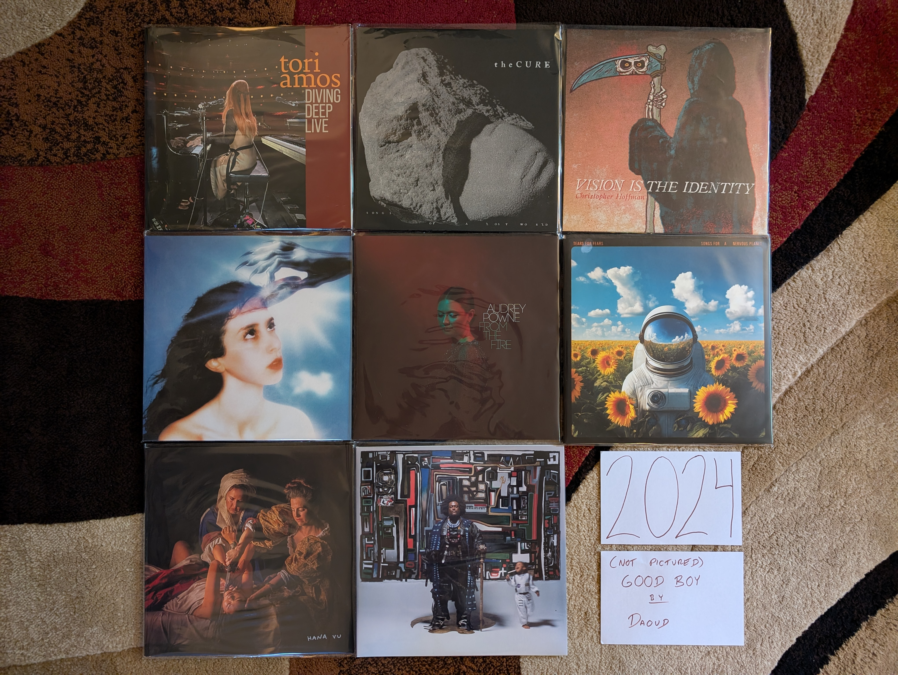

2024 Albums
-----------

OK, I'm definitely getting old. Two of my favorites are live albums by legacy
acts, and half the records are jazz. It is very modern jazz though...I'm hip! Oh
and yeah, my top favorite is by a band in the sixth decade of their career. Of
course I had to throw one new band in there to keep things fresh. Things were
more organic than that, but definitely I have a different relationship with new
music at age 44.

.. raw:: html

  <iframe style="border-radius:12px"
  src="https://open.spotify.com/embed/playlist/1LI7N9jgYhAb9AYPCSkiBU?utm_source=generator&theme=0"
  width="100%" height="352" frameBorder="0" allowfullscreen="" allow="autoplay;
  clipboard-write; encrypted-media; fullscreen; picture-in-picture"
  loading="lazy"></iframe>
  
- *Diving Deep Live* by **Tori Amos** - After the pandemic you can tell that
  Tori was very happy to be back on the road playing shows. We were very happy
  to have her back as well. It felt like an especially important tour, and it
  deserved a live release. The mix of songs is the perfect mix of new and old,
  popular favorites and deep album cuts, and artist and backing band are in top
  form. The title is accurate, some of these go way deep like "Lady in Blue" and
  "Sister Janet". A definitive live document of one of the all time great live
  performers. [*Memory*: I saw Tori on this tour at the Kodak Center. It was an
  amazing show, and even though the playlist was very different, I'm glad to
  have this as a reminder of that fantastic evening.]

- *Songs of a Lost World* by **The Cure** - [**2024 FAVORITE**] - This took us
  all by surprise. This is an amazing record from a band that formed in the late
  70s and hasn't really had a quality release yet this century. It almost feels
  like it is part of a dark, atmospheric trilogy with *Pornography* and
  *Disintegration*. The moody instrumentals that start and end the record set
  the perfect mood. No one else can make being miserable sound so beautiful.
  [*Memory*: I had heard the hype before my first listen, and I really wish I
  could have gone in without any indication of what I was in store for.
  Regardless, I was still blown away by this the first time. It is still early
  days, but I really think this is an all-time favorite.]

- *GOOD BOY* by **Daoud** - The perfect blend of hip-hop and jazz (rapidly
  becoming a genre favorite of mine), and some outstanding trumpet playing. I
  really like the way they recorded the leader, leaving some imperfect but
  engaging textures that really make for an exciting listen. Whoever is playing
  piano on this is playing out of their mind. This is a a really cool,
  futuristic jazz sound. More of this please! [*Memory*: I'm fairly certain that
  someone has used the song "Ford Focus 1999" as background music in VRChat.
  Well if that isn't actually true, it should be.]

- *Vision is the Identity* by **Chrisopher Hoffman** - This is some very modern
  jazz if there ever was such a thing. The combination of upright bass and
  electronics is already a strange combination, but when you add in the moments
  of harmonic experimentation, you have a very unique kind of jazz. I think the
  audience for this kind of thing is small, but I am solidly in it. [*Memory*:
  I'm very fuzzy on how I found out about this, but I think it was Spotify radio
  after listening to the new **Kamasi Washington** record. I was blown away to
  find out they actually did a vinyl pressing of this unique album, and even
  more surprised to hear it played on SiriusXM later that year!]

- *Imaginal Disk* by **Magdalena Bay** - This album gets off to a slow start,
  but by the time of "Death & Romance" it reveals itself as a unique combination
  of electronic dance and psychedelic art music. The biggest accomplishment is
  the way the whole thing manages to strike a balance between structural
  experimentation and massive pop hooks. It is also an amazing sounding record
  with top rate production from start to finish. I can't wait to see what these
  guys do in the year ahead. [*Memory*: A completely artificial discovery, I
  found this record when I went to RateYourMusic with the expressed goal of
  finding some truly new music in 2024. A forced discovery, but a great one.
  This deserves its spot at #1 on the RYM chart for the year.]

- *From the Fire* by **Audrey Powne** - Another fantastic record at the
  intersections of jazz and popular music (this time R & B). I really enjoyed
  this before I understood that the artist was both the trumpeter and vocalist.
  What a talent! I really look forward to hearing more of those soulful vocals
  like we got on "Indigo". [*Memory*: During the 2024 holiday break I listened
  to this record first thing in the morning probably more than half of the days
  I was off work. Such a great vibe to start the day on.]

- *Songs for a Nervous Planet* by **Tears for Fears** - A fantastic four song EP
  followed by a first rate live set that gives a fresh take on the highlights of
  their career to date. I think this album made me realize how much I like
  pretty much everything this band has ever done. The new songs are all good,
  especially "Astronaut" which is my favorite song of the year. [*Memory*: The
  first time I listened to this record I was sad when the new music stopped
  after only four songs. That didn't last long, when I realized how great the
  live portion was.]

- *Romanticism* by **Hana Vu** - There is a bit of a renaissance for young women
  with a guitar making arty, indie pop. I think **Vu** is my favorite of this
  movement. There are elements of the best 2010s indie pop here, but she brings
  something fresh that her peers seem to lack. This is subtle music that seems
  pleasant on first listen, but only fully reveals itself after repeated plays.
  [*Memory*: I discovered the artist when she opened for **Soccer Mommy** as a
  part of the 2025 Noise Pop Festival. In my opinion, she outperformed the
  headliner by a fair margin and I was a new fan. In the old days I would have
  gone right to the merch booth to buy a vinyl copy of her latest work, but I
  can't be bothered to transport records on airplanes at this point. So I
  ordered a copy of her latest record, which was on my porch when I got back.]

- *Fearless Movement* by **Kamasi Washington** - Another fantastic collection of
  songs from the soloist and his very talented backing band. Things are a little
  more fast moving and focused here, and I like it even more than his prior work
  as a result. The funk and hip-hop influences feel even stronger this time,
  especially on the standout track "Asha The Fist". [*Memory*: This was a bit of
  a gateway record for me. When I listened to it on Spotify radio I would be
  introduced to the other jazz records on my 2024 list, and some other ones that
  I enjoyed, but didn't quite make the cut.]